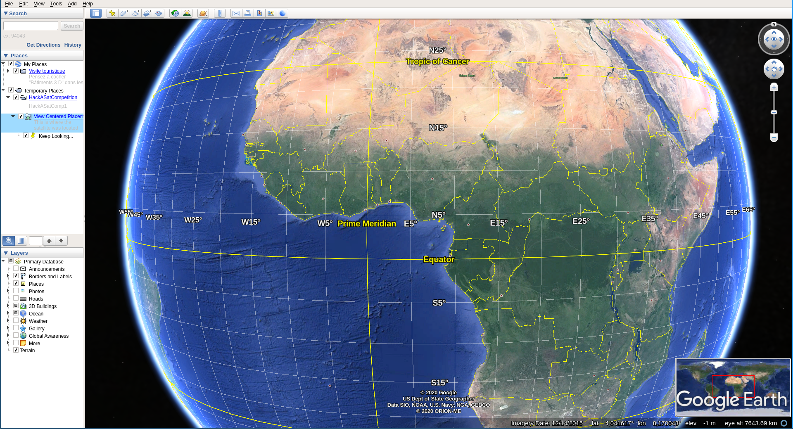
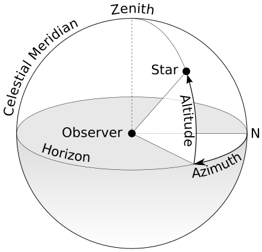
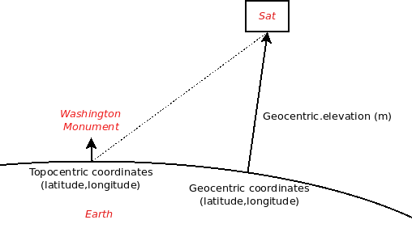
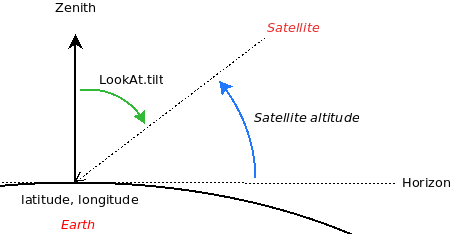
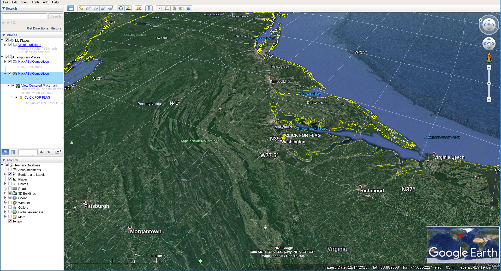
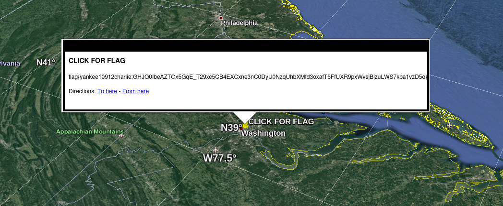

# SPACE SECURITY CHALLENGE 2020 HACK-A-SAT: I Like to Watch

* **Category:** Astronomy, Astrophysics, Astrometry, Astrodynamics, AAAA
* **Points:** 35
* **Solves:** 128
* **Description:**

> Fire up your Google Earth Pro and brush up on your KML tutorials, we're going to make it look at things!

## Write-up

_Write-up by Solar Wine team_

The challenge starts with a TCP connection to the given address:

```
nc watch.satellitesabove.me 5011
```

We get instructions about what to do:

```
ticket{yankee10912charlie:GIO7DtdysFjNn49QYFCvVunVLkBhmSoCBbYqmkqw0-Sjv8bbs1AmtXx-P_WbIYX7TQ}
We've captured data from a satellite that shows a flag located at the base of the Washington Monument.
The image was taken on March 26th, 2020, at 21:52:55
The satellite we used was:

REDACT
1 13337U 98067A   20087.38052801 -.00000452  00000-0  00000+0 0  9995
2 13337  51.6460  33.2488 0005270  61.9928  83.3154 15.48919755219337

Use a Google Earth Pro KML file to 'Link' to http://18.191.77.141:10472/cgi-bin/HSCKML.py
and 'LookAt' that spot from where the satellite when it took the photo and get us that flag!
```

A satellite in space took a photo of a place located on Earth at a given time. The goal is to use Google Earth Pro software with a special file to place the camera exactly **where** the satellite was and with the right **orientation**.

## Google Earth Pro

First, we need to install and understand what to do with Google Earth. We can either:

1. Use the web interface : <https://earth.google.com/web/>
2. Install the native client

During the CTF, the Linux client has been used. It can be downloaded here: [https://www.google.fr/earth/download/gep/agree.html](https://www.google.fr/earth/download/gep/agree.html)

Google Earth Pro allows displaying additional data and controlling the camera in the software using a **KML** file. This file format documentation is online: [https://developers.google.com/kml/documentation/kmlreference](https://developers.google.com/kml/documentation/kmlreference).

On the challenge page, an example file is given:

```xml
<?xml version="1.0" encoding="UTF-8"?>
<kml xmlns="http://www.opengis.net/kml/2.2">
  <Folder>
    <name>HackASatCompetition</name>
    <visibility>0</visibility>
    <open>0</open>
    <description>HackASatComp1</description>
    <NetworkLink>
      <name>View Centered Placemark</name>
      <visibility>0</visibility>
      <open>0</open>
      <description>This is where the satellite was located when we saw it.</description>
      <refreshVisibility>0</refreshVisibility>
      <flyToView>0</flyToView>
      <LookAt id="ID">
        <!-- specific to LookAt -->
        <longitude>FILL ME IN</longitude>            <!-- kml:angle180 -->
        <latitude>FILL ME IN TOO</latitude>          <!-- kml:angle90 -->
        <altitude>FILL ME IN AS WELL</altitude>      <!-- double -->
        <heading>FILL IN THIS VALUE</heading>        <!-- kml:angle360 -->
        <tilt>FILL IN THIS VALUE TOO</tilt>          <!-- kml:anglepos90 -->
        <range>FILL IN THIS VALUE ALSO</range>       <!-- double -->
        <altitudeMode>clampToGround</altitudeMode>
      </LookAt>
      <Link>
        <href>http://FILL ME IN:FILL ME IN/cgi-bin/HSCKML.py</href>
        <refreshInterval>1</refreshInterval>
        <viewRefreshMode>onStop</viewRefreshMode>
        <viewRefreshTime>1</viewRefreshTime>
        <viewFormat>BBOX=[bboxWest],[bboxSouth],[bboxEast],[bboxNorth];CAMERA=[lookatLon],[lookatLat],[lookatRange],[lookatTilt],[lookatHeading];VIEW=[horizFov],[vertFov],[horizPixels],[vertPixels],[terrainEnabled]</viewFormat>
      </Link>
    </NetworkLink>
  </Folder>
</kml>
```

The example file shows how to place the camera at a given position using the **LookAt** element. The example also uses a *NetworkLink* to define which server is providing the data about the *placemark* we are looking at.

The documentation explains very well:

* How `Link` works: [https://developers.google.com/kml/documentation/kmlreference#link](https://developers.google.com/kml/documentation/kmlreference#link)
* What is expected for `LookAt` values: [https://developers.google.com/kml/documentation/kmlreference#lookat](https://developers.google.com/kml/documentation/kmlreference#lookat)

In the challenge, the URI used for `Link` is provided on the TCP connection and **changes** every new connection. Also, the TCP connection has a timeout which also terminates the CGI used in the `Link`. So, solving the challenge requires the following sequence:

1. Open the TCP connection with `nc watch.satellitesabove.me 5011` and get the URI for `Link`
2. Replace the URI in the KML file
3. Load the KML and check data in the *placemark* data. The data is refreshed every second until the TCP connection timeout

To load a KML file in Google Earth Pro, click on *File*, *Import* and choose your KML file.

This is what we get when loading the example:



We can see at the left panel the new *placemark* and the server returned the text "Keep Looking...".

## Satellite position

Before trying to place correctly the camera, we need to know the satellite position when the photo was taken. The initial description gives:

1. A satellite *two-line element* set (TLE): [https://www.space-track.org/documentation#/tle](https://www.space-track.org/documentation#/tle)
2. The time of the photo

With this data, we can retrieve the position of the satellite. There are a few existing software libraries allowing to parse TLE data and even to compute the location of the satellite.

During the CTF, we used:

1. A Perl script `tracker.pl` from [https://github.com/ttfnrob/SatelliteTracking.git](https://github.com/ttfnrob/SatelliteTracking.git)
2. And then Skyfield, as we prefer Python: [https://rhodesmill.org/skyfield/earth-satellites.html](https://rhodesmill.org/skyfield/earth-satellites.html)

The Skyfield library was used to compute:

1. The **geocentric** position of the satellite: this is the Earth coordinates (longitude and latitude) of the satellite and its elevation (in meters) from the ground.
2. The **topocentric** position of the satellite relative to a location on the Earth. In our case, we compute the position with the Washington Monument as the center.

A topocentric position can be expressed with angles (azimuth and altitude) as described in this image ([https://commons.wikimedia.org/wiki/File:Azimuth-Altitude_schematic.svg](https://commons.wikimedia.org/wiki/File:Azimuth-Altitude_schematic.svg)):

{ width=60% }

Here the *Observer* is the Washington Monument and the *Star* is the satellite. Both positions are described below:

{ width=70% }

The following Python script use `EarthSatellite` and `Topos` objects:

```Python
from skyfield.api import EarthSatellite
from skyfield.api import load
from skyfield.api import Topos

# Parse TLE
ts = load.timescale()
t1 = '1 13337U 98067A   20087.38052801 -.00000452  00000-0  00000+0 0  9995'
t2 = '2 13337  51.6460  33.2488 0005270  61.9928  83.3154 15.48919755219337'
satellite = EarthSatellite(t1, t2, 'REDACT', ts)
print(satellite)

# March 26th, 2020, at 21:52:55
t = ts.utc(2020, 3, 26, 21, 52, 55)
geocentric = satellite.at(t)

print('')
print('>> Geocentric position : ')
subpoint = geocentric.subpoint()
print('Latitude:', subpoint.latitude.degrees)
print('Longitude:', subpoint.longitude.degrees)
print('Elevation (m):', int(subpoint.elevation.m))

# Washington Monument
photo = Topos('38.8894838 N', '77.0352791 W')
difference = satellite - photo
topocentric = difference.at(t)

print('')
print('>> Topocentric position : ')
alt, az, distance = topocentric.altaz()
print('Altitude (deg) : %f' % alt.degrees)
print('Azimuth (def) : %f' % az.degrees)
print('Range (m) : %d' % int(distance.m))
```

If executed, it gives all the required information to fill the `LookAt` element:

```
python3 coord_sat.py
```
```
EarthSatellite 'REDACT' number=13337 epoch=2020-03-27T09:07:58Z

>> Geocentric position :
Latitude: 36.79272627446013
Longitude: -81.40746841373799
Elevation (m): 419126

>> Topocentric position :
Altitude (deg) : 40.033412
Azimuth (def) : 240.186614
Range (m) : 625347
```

We now have the satellite position and its position relative to the Washington Monument.

## Camera position and orientation in Google Earth

As described in the Google Earth's documentation, the `LookAt` element takes several values to place correctly the camera:

* `latitude` and `longitude`: this is the Earth coordinates the camera is targeting. So in our case, this is the Washington Monument coordinates. These values have been taken from Google Maps.
* `altitudeMode`: the value `clampToGround` is given in the example. This means the camera is looking at the *ground* and the value of `altitude` is not used (so we set '0').
* `heading`, `tilt` and `range` are the topological position of the satellite we computed above.

However, the angles `heading` and `tilt` have not the same meaning as `azimuth` and `altitude`. For `tilt`, this is the angle between the satellite and the *Zenith* whereas `altitude` is the angle between the *Horizon* and the satellite.

{ width=70% }

The `heading` is the rotation of the earth from the *South-North* axis whereas `azimuth` is the rotation to locate the satellite for the same axis.

So we need to adapt the angles:

```Python
azimuth = 240.186614
heading = (180 + azimuth) % 360
print('Heading is %f' % heading)
altitude = 40.033412
tilt = 90 - altitude
print('Tilt is %f' % tilt)
```

We get the values:

```
Heading is 60.186614
Tilt is 49.966588
```

Final `LookAt` is: 

```xml
      <LookAt id="ID">
          <longitude>-77.0352791</longitude>
          <latitude>38.8894838</latitude>
          <altitude>0</altitude>
          <heading>60.186613703</heading>
          <tilt>49.966588303</tilt>
          <range>625347</range>
          <altitudeMode>clampToGround</altitudeMode>
      </LookAt>
```

Note that the **geocentric position** of the satellite can help to debug as the camera should be placed right above (Lat:36.79272627446013, Long:-81.40746841373799).

When loading the KML file, we can check that the camera is looking at the Washington Monument from the right location:



Click on the *placemark* to see the flag:


