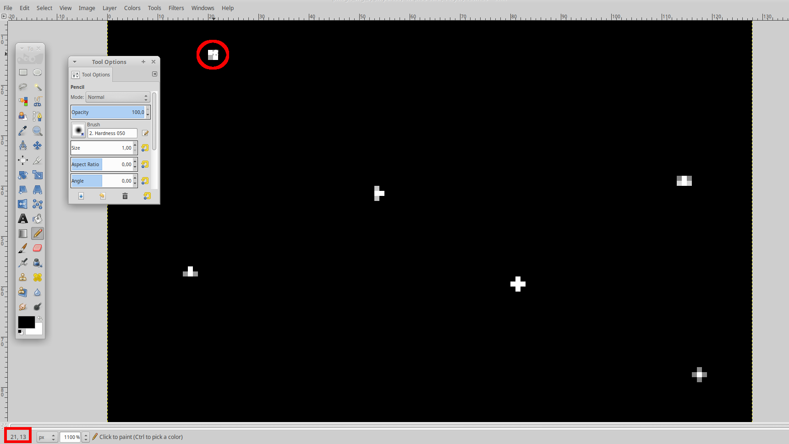

# SPACE SECURITY CHALLENGE 2020 HACK-A-SAT: Seeing Stars

* **Category:** Astronomy, Astrophysics, Astrometry, Astrodynamics, AAAA
* **Points:** 23
* **Solves:** 216
* **Description:**

> Here is the output from a CCD Camera from a star tracker, identify as many stars 
> as you can! (in image reference coordinates)
> 
> Note: The camera prints pixels in the following order (x,y): (0,0), (1,0), (2,0)... (0,1), (1,1), (2,1)...
> Note that top left corner is (0,0)

## Write-up

_Write-up by Solar Wine team_


Here is what the challenge initially looks like:
```console
Connection to stars.satellitesabove.me 5013 port [tcp/*] succeeded!
Ticket please:
ticket{november52005bravo:GCTwRab6ncBxptGtFhtCSUX1l0zgUXBhBu633gxpQf2qIhBNsSC2A3GKG9trwq6fPQ}
4,5,3,0,7,2,8,6,8,7,2,9,3,3,7,2,8,0,7,0,1,5,4,1,0,7,0,6,0,4,5,1,4,1,9,6,8,[...]
1,2,3,5,5,6,3,3,4,7,6,2,23,255,175,9,7,0,5,5,3,2,6,3,5,7,5,7,9,7,7,9,4,7,7[...]
2,8,0,2,4,2,2,1,7,4,2,1,44,255,255,15,7,5,0,7,1,9,1,3,8,4,4,7,9,0,7,1,2,6,[...]
2,0,1,8,8,7,6,0,7,1,2,5,4,39,21,1,2,4,3,7,2,4,1,5,7,2,6,0,9,4,8,4,6,5,1,8,[...]
4,0,5,0,1,2,4,7,2,4,2,0,1,3,3,9,7,3,8,3,0,9,1,2,3,2,9,0,7,6,0,2,6,8,0,0,3,[...]
[... snipped for clarity ...]
2,2,0,2,9,9,4,5,7,1,3,0,1,9,0,6,7,8,2,7,1,2,5,5,2,3,2,0,8,9,8,7,0,2,5,9,4,[...]
2,6,1,4,9,0,9,6,2,4,3,0,1,8,9,1,3,2,5,2,1,9,8,5,8,6,5,4,4,5,8,1,7,6,4,7,2,[...]

Enter your answers, one 'x,y' pair per line.
(Finish your list of answers with an empty line)
```

Note: Several connections provide the same challenge, this is an important information.

It is quite straightforward to understand that the array of numbers is a description of all the pixels
of the image. More precisely since each number may only take values between 0 and 255 then we have
a greyscale image and the number itself is the intensity.

Additionally we observe that:

* The number of alleged pixels is 128 per line
* 128 lines of pixels are provided
* It is possible to locate somewhat the stars using our own eyes (a group of pixels around 255 or slightly less
creates a pattern very visible).

We conclude from these observations that we can directly translate the matrix of pixels into a very 
simple 128x128 BMP file. Using some very simple python code we dumped a first BMP and had a first glance at it
using GIMP. We then decided to improve the quality of the image by removing noise. A very simple way
to do this is to add a trivial filtering layer by setting all the pixels below 128 to 0. This value is
empirical and is a tradeoff between removing enough information to gain clarify and removing too much
and potentially loosing accuracy.

Using the filtered version of the BMP we located the center (thus the position) of each of the 10 stars
using the pencil tool (Brush size set to 1) in GIMP after verifying that the top left corner was indeed
(0,0) otherwise it would have implied some change of coordinates.

{ width=100% }

As mentioned before, the image provided by the server is always the same (at least
for a given ticket) so this method was possible and was allowing us to perform faster
testing.

Since there was a timer on the server side, we had to write quickly some code to perform the test and
observed the following:
```
[...]
Enter your answers, one 'x,y' pair per line.
(Finish your list of answers with an empty line)
16,57
21,14
21,93
35,121
53,41
63,122
80,59
80,116
114,38
117,77
4 Left...
9,6,6,0,6,7,1,1,3,7,9,7,0,7,6,5,4,6,9,4,3,0,0,[...]
```

At this point it seemed that our coordinates were accepted and that a second image was sent. This probably 
meant that there was a tolerance for the lack of precision which was consistent with the challenge level.
By performing extra testing (such as sending less coordinates or slightly wrong ones) we confirmed that the 
first round was indeed solved.

At this point we had to choose between two strategies to quickly retrieve the flag:

* Detecting automatically the positions of the stars within the matrix of intensities.
* Using a script to dump any new BMP while providing hardcoded coordinates during the previous rounds.

Since there was only 5 rounds and since the 2nd picture looked fairly identical to the first one, we used the 
second method. Our fear was that there could be corner cases (such as two stars being too close) that would
make the script fail and make us lose a lot of time with the debugging (also we were tired as we had been up 
all night).

Obviously this was a bit of a gamble and should the number of stars increase the second method would not 
have been usable at all.

The final script is very simple:

``` Python
#!/usr/bin/env python
from pwn import * # https://github.com/Gallopsled/pwntools
from PIL import Image
import os
import time

save_image = True
TICKET='ticket{november52005bravo:GCTwRab6ncBxptGtFhtCSUX1l0zgUXBhBu633gxpQf2qIhBNsSC2A3GKG9trwq6fPQ}\n'

conn = remote('stars.satellitesabove.me',5013)
l = conn.recvline()
print(l.rstrip('\n'))
conn.send(TICKET)
print("Ticket sent...")

def get_pic(index):

	if save_image:
		print("Creating image")
		img = Image.new('RGB', (128, 128))
		pixels = img.load()

	for i in xrange(128):
		line = conn.recvline()
		#print("[%d] %s" % (i, line.rstrip('\n')))
		pixs = line.rstrip('\n').split(',')
		if save_image:
			for j in xrange(128):
				val = int(pixs[j])
				if val < 128:
					val = 0
				pixels[i,j] = (val, val, val)

	if save_image:
		print("Saving image")
		img.save("image_orig_%d.bmp" % index)

sol0 = [ (16,57), (21,14), (21,93), (35,121), (53,41), 
         (63,122), (80,59),(80,116), (114,38), (117,77) ]
sol1 = [ (34,6), (74,8), (51,15), (114,13), (28,32), 
         (65,39), (20,60),(95,88), (59,95), (28,105) ]
sol2 = [ (81,6), (12,15), (60,20), (41,24), (91,50),
         (61,89), (8,101),(80,102), (32,112), (54,114) ]
sol3 = [ (54,12), (81,22), (39,32), (20,37), (86,38),
         (94,58), (88,81),(65,86), (80,105), (116,102) ]
sol4 = [ (14,13), (30,14), (77,29), (58,40), (120,43),
         (41,54), (50,73),(87,92), (6,92), (60,118) ]
sols = [ sol0, sol1, sol2, sol3, sol4 ]

nr_rounds = 5
for rnd in xrange(nr_rounds):
	get_pic(rnd)

	line = conn.recvline()
	print(line.rstrip())

	line = conn.recvline()
	print(line.rstrip())

	line = conn.recvline()
	print(line.rstrip())

	time.sleep(0.5)

	for sol in sols[rnd]:
		l = "%d,%d" % (sol[0],sol[1])
		#print(l)
		conn.send(l+"\n")
		time.sleep(0.1)

	conn.send("\n")

	line = conn.recvline()
	print(line.rstrip())


line = conn.recvline()
print(line.rstrip())

conn.close()
```

So initially `sol1` to `sol4` are equal to `sol0`. Running a first time the script allow us to dump the
2nd picture and thus quickly fix `sol1`. We run again the script and this time we can make it to the
next round thus dumping another BMP. After a couple of rounds, the final flag was finally provided 
by the server.

