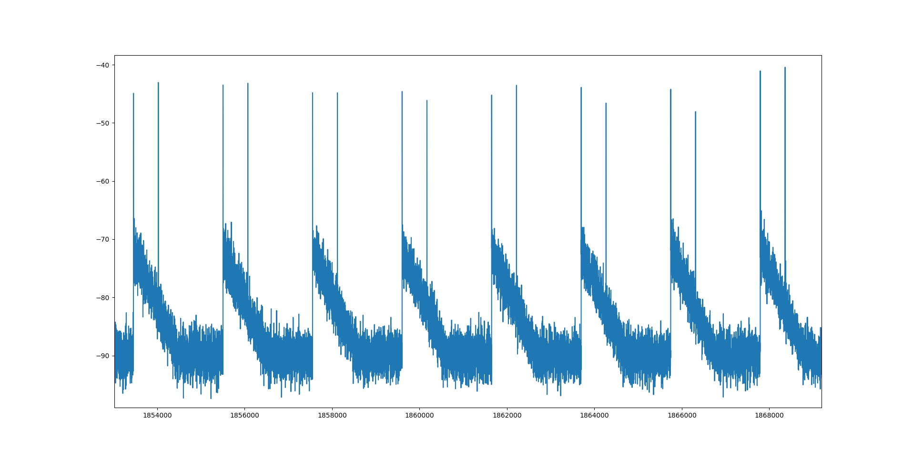

# SPACE SECURITY CHALLENGE 2020 HACK-A-SAT: I see what you did there

* **Category:** Ground Segment
* **Points:** 146
* **Solves:** 23
* **Description:**

Your rival seems has been tracking satellites with a hobbiest antenna, and it's causing a lot of noise on my ground lines. Help me figure out what he's tracking so I can see what she's tracking

## Write-up

_Write-up by Solar Wine team_

Then challenge starts using a TCP connection to `antenna.satellitesabove.me` :

```
nc antenna.satellitesabove.me 5034
```
```
Ticket please:
ticket{papa53488november:GOsyvHzovVNi7RPtLHAfwhVlIrIWqHyAhw3j6yjXkHsfK39pUefalMTYSoDz3RkUKA}
Track-a-sat RF side channel detector
Groundstation location: latitude 60.1756, longitude 24.9341
Observation start time GMT: 1586004726.057656
Observation length (seconds): 120
Challenge file 1: signal_0.bin
Challenge file 2: signal_1.bin
Challenge file 3: signal_2.bin
Please submit 3 satellite names as listed in active.txt (one per line, followed by a blank line)
```

The goal of this challenge is to **find three satellite names**.

In the challenge page, we can download the three signal files in an archive dedicated to our team and also an *example* archive which contains :

* The three signal files (which are different from the ones given in our dedicated archive)
* A `README.txt` giving instructions
* A `README_examples.txt` giving the solution
* A Python script converting signal files to CSV format

The README explains how this signal files were made :

```
Track-a-Sat RF Side Channel Detector
====================================

We lost our direct access to control the Track-a-Sat groundstation antenna (see earlier challenge), but we have a new source of information on the groundstation. From outside the compound, we have gathered 3 signal recordings of radio emissions from the cables controlling the antenna motors. We believe the azimuth and elevation motors of each antenna are controlled the same way as the earlier groundstation we compromised, using a PWM signal that varies between 5% and 35% duty cycle to move one axis from 0 degrees to 180 degrees. We need to use these 3 recordings to determine where each antenna was pointing, and what satellite it was tracking during the recording period.

To help you in your calculations, we have provided some example RF captures from a different groundstation with a similar antenna system, where we know what satellites were being tracked. You will want to use that known reference to tune your analysis before moving on to the unknown signals. The example files are in a packed binary format. We have provided a script you can use to translate it to a (large) CSV if you like. The observations are sampled at a rate of 102400Hz and there are two channels per sample (one for azimuth, the other for elevation).
```

The solution of the example is given :

```
These 3 signal captures record the RF emitted from the azimuth and elevation PWM control lines for 3 satellite observations.
All were recorded from latitude 32.4907 N, longitude 45.8304 E at 2020-04-07 08:57:43.726371 GMT (1586249863.726371)
signal_1.bin is tracking CANX-7
signal_2.bin is tracking STARLINK-1113
signal_3.bin is tracking SORTIE
```

So we have to identify which satellite is tracked from the electromagnetic radiation of the signal controlling the antenna. And repeat the operation three times with different signal file as input.


To solve this challenge, we have done these two steps :

1. Using the location of the ground station and the time, every known satellite positions relative to this station is computed
2. From one signal file, the **azimuth** and **altitude** of the tracked satellite have been extracted
3. Then, the result is used to match the position of a satellite

### Compute the position of all satellites

We know the time of the records and the position of the ground station as this is given in the TCP connection :

```
Groundstation location: latitude 60.1756, longitude 24.9341
Observation start time GMT: 1586004726.057656
```

The *epoch* timestamp is converted into a human-readable date using the online tool : https://www.epochconverter.com/. We got the UTC time "Saturday, April 4, 2020 12:52:06.057 PM".

We used the file `active.txt` given in another challenge but we could also use the one available on Internet : http://www.celestrak.com/NORAD/elements/active.txt. As TLE records are updated regularly, we preferred using the one provided in the CTF. This file contains public satellites TLE allowing to know their position at a given time.

We used the Python3 library **Skyfield** to compute the localization of one satellite from its TLE and to compute its position relative to the ground station :

```Python
from skyfield.api import EarthSatellite
from skyfield.api import load
from skyfield.api import Topos

planets = load('de421.bsp')
earth = planets['earth']
ts = load.timescale()

# All signals were recorded from latitude 60.175 N, longitude 24.9341 E E
# Saturday, April 4, 2020 12:52:06.057 PM (1586004726.057656)
station = Topos('60.1756 N', '24.9341 E')
t = ts.utc(2020, 4, 4, 12, 52, 6)

f = open("active.txt", "r")

while True:
  sat_name = f.readline()
  if not sat_name:
    break

  t1 = f.readline()
  t2 = f.readline()
  satellite = EarthSatellite(t1, t2, sat_name, ts)
  geocentric = satellite.at(t)

  difference = satellite - station
  topocentric = difference.at(t)
  alt, az, distance = topocentric.altaz()
  print("%f %f : %s" % (az.degrees, alt.degrees, sat_name))
```

The `altitude` and `azimuth` relative to the ground station of every satellites is computed and stored in the file `all_position.txt` :

```
python3 sat_pos.py | tee all_position.txt
```

The file contains lines like :

```
148.110094 -82.143594 : CALSPHERE 1
218.934754 2.477133 : CALSPHERE 2
46.673672 -37.271401 : LCS 1
183.635482 -40.389292 : TEMPSAT 1
170.965778 -73.186265 : CALSPHERE 4A
...
```

### Extract satellite azimuth and altitude from signal files

First, the three input signal files are converted in CSV format using the provided script :

```
python3 signal_file_converter.py signal_0
python3 signal_file_converter.py signal_1
python3 signal_file_converter.py signal_2
```

The generated CSV files have three columns : `timestamp`, `azimuth_amplitude` and `elevation_amplitude`. Using *matplotlib*, we can draw the signals :



The `README` in the example archive tells us that the original control signal is a PWM (https://en.wikipedia.org/wiki/Pulse-width_modulation) with duty cycle varying from 5% to 35% of a period.

If sampling period of electromagnetic emission measure is small compared to the PWM period, and if **PWM period is not too high**, we can split a PWM into two kind of signals :

1. The constant signal where the signal keeps its value (either *high* or *low*) : during this time, no EM radiation is emitted.
2. The transitions between *low* and *high* and between *high* to *low* : during this time, an impulse of EM radiation is recorded.


So the *peaks* we see in the signals are transitions of the PWM signal. We can guess what peak is the end of the duty cycle because :

1. It is between 5% and 35%, no error is possible
2. It varies over the time, which is not the case of a period


The Python script [extract_pwm_values.py](extract_pwm_values.py) compute the duty cycle using the following function :

```Python
def get_duty_cycle(pwm_cem):
  estim_period=2000
  min_period=estim_period*5/100
  last_pic = -min_period
  first=True
  pwm = list()
  for i in range(len(pwm_cem)):
    if (i-last_pic) < min_period: # Hysteresis
      continue
    if pwm_cem[i] > -60:
      if first:
        last_pic = i
        first = False
      else:
        pwm.append(i-last_pic)
        first = True
        if (i-last_pic) > 1000:
          print('Bug at %d' % i)
          sys.exit(0)
        last_pic = i

  period=len(pwm_cem)*1.0/len(pwm)
  print('Period is %f samples %d %d' % (period, len(pwm), len(pwm_cem)))

  duty_cycles=list()
  for val in pwm:
    duty_cycles.append(val*1.0/period)

  return duty_cycles
```

As the capture last 120 seconds, we have a lot of periods. The function compute the duty cycle for each period but we only use the first one because the satellite is already tracked correctly during the record.

```Python
timestamps = list()
pwm_az = list()
pwm_el = list()
valids = list()
for line in open('signal_' + sys.argv[1] + '.csv'):
  (ts, az, el) = line.split(',')
  timestamps.append(float(ts))
  pwm_az.append(float(az))
  pwm_el.append(float(el))

# 0 and 180 degrees with 5% to 35%
az = get_duty_cycle(pwm_az)[0]
az = (az - 0.05) * 180 / 0.30

el = get_duty_cycle(pwm_el)[0]
el = (el - 0.05) * 180 / 0.30

if el > 90:
  el = 180 - el
  az = (az+180)%360

print('AZ at timestamp 0 is %f deg' % az)
print('EL at timestamp 0 is %f deg' % el)
```

The satellite positions were previously computed with elevation (or altitude) between 0 and 90 degrees and with azimuth from 0 to 360 degrees. Here, the orientation of the antenna have greater range in elevation and smaller range in azimuth. This can be adapted considering that the elevation superior to 90 can be changed by something less than 90 by rotating the antenna by 180 degrees around the Ground-Zenith axis.

Using our signal files as input, we get the following values :

```
python3 extract_pwm_values.py 0

AZ at timestamp 0 is 138.748352 deg
EL at timestamp 0 is 31.815803 deg
```

```
python3 extract_pwm_values.py 1

AZ at timestamp 0 is 319.041318 deg
EL at timestamp 0 is 25.138524 deg
```

```
python3 extract_pwm_values.py 2

AZ at timestamp 0 is 12.773020 deg
EL at timestamp 0 is 20.390133 deg
```

### Get the flag

The closest match for these positions in our file `all_position.txt` are :

```
138.668871 31.631912 : COSMOS 2451
318.936574 25.358119 : BUGSAT-1 (TITA)
12.664736 20.251449 : EROS B
```

Note that the digits after the decimal point may not correspond but rounding the values to the closest integer remove any ambiguity.

Providing the name of these three satellites in the TCP connection gives us the flag :

```
nc antenna.satellitesabove.me 5034
Ticket please:
ticket{papa53488november:GOsyvHzovVNi7RPtLHAfwhVlIrIWqHyAhw3j6yjXkHsfK39pUefalMTYSoDz3RkUKA}
Track-a-sat RF side channel detector
Groundstation location: latitude 60.1756, longitude 24.9341
Observation start time GMT: 1586004726.057656
Observation length (seconds): 120
Challenge file 1: signal_0.bin
Challenge file 2: signal_1.bin
Challenge file 3: signal_2.bin
Please submit 3 satellite names as listed in active.txt (one per line, followed by a blank line)
COSMOS 2451
BUGSAT-1 (TITA)
EROS B

Success! Flag: flag{papa53488november:GAx3_HN9f5ogfagzRYRNHA9NKnJAwIEpiXNH71aP6ok12BL0_dt7_vMUksEFz7M6ioRzpzR32pSHql4wb15-tK0}
```
