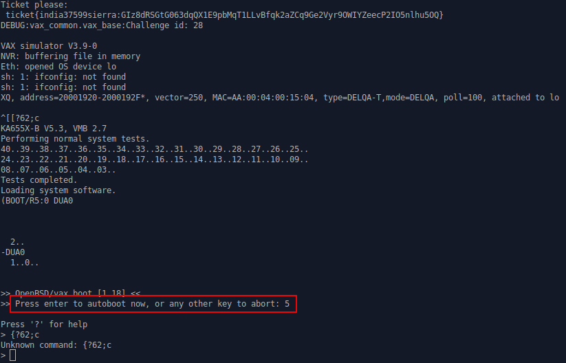
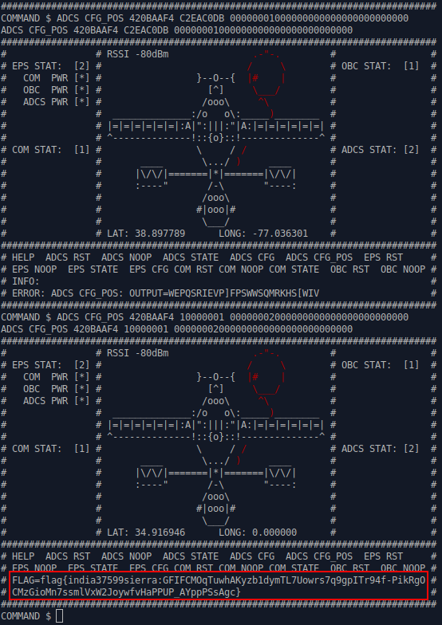

# SPACE SECURITY CHALLENGE 2020 HACK-A-SAT: Vax the Sat

* **Category:** Ground Segment
* **Points:** 304
* **Solves:** 5

> It's still the 70's in my ground station network, login to it and see if you can get a flag from it.
> 
> Connect to the challenge on vax.satellitesabove.me:5035. Using netcat, you might run nc vax.satellitesabove.me 5035
> 
>  You'll need these files to solve the challenge.
>
>  https://generated.2020.hackasat.com/vaxthesat/vaxthesat-india37599sierra.tar.bz2     
>  https://static.2020.hackasat.com/2282d39c1d30b59739733d5f0751a2c81e080796/VAXtheSAT.zip

## Write-up

_Write-up by Solar Wine team_

Inside both tarballs we got:

* _server.s_ which is the _objdump_ output of a VAX application, presumably our target server.
* _VAXtheSAT.md_ which is a set of additional instructions.

In particular we can read:

> Your mission is to hijack a satellite by pointing it to *34.916944*, *-117.376667*, 
> an abandoned USAF radio station in the middle of the desert.

It is worth mentioning that:

* Credentials are provided to connect to a client machine.
* Both the client's and the server's internal IP are provided, the ASCII art 
  telling us that the antenna can only be controlled through the server.
* The path to the _client_ application is provided and the aforementioned _server.s_
  is certified to be the server application disassembly.

## Exploration of the client machine 

The client machine, which is in fact a virtual machine, starts whenever a user 
connects to _vax.satellitesabove.me:5035_. Thanks to the socket we have a visual
of the booting process within the VAX simulator and we can even interact with the 
booting mechanism using keystrokes. Once the OS is fully booted, we can use the 
credentials to login.

The OS itself is an OpenBSD 5.8 running on VAX:

```
login: root
root
Password:vaxthesat!

Last login: Wed May  6 22:14:14 on console
OpenBSD 5.8 (GENERIC) #117: Sun Aug 16 06:42:12 MDT 2015

Welcome to OpenBSD: The proactively secure Unix-like operating system.

Please use the sendbug(1) utility to report bugs in the system.
Before reporting a bug, please try to reproduce it with the latest
version of the code.  With bug reports, please try to ensure that
enough information to reproduce the problem is enclosed, and if a
known fix for it exists, include that as well.

You have mail.
# ls                                                                    
ls
.Xdefaults .cvsrc     .profile   rename.sh
.cshrc     .login     client     start.sh
# cd client
cd client
# ls -la
ls -la
total 5236
drwxr-xr-x  2 root  wheel      512 May 26 16:11 .
drwx------  3 root  wheel      512 May  6 21:42 ..
-r-xr-xr-x  1 root  wheel    64650 May 26 16:11 client
-r-xr-xr-x  1 root  wheel   735953 May 26 16:11 client.s
-r-xr-xr-x  1 root  wheel   119305 May 26 16:11 server
-r-xr-xr-x  1 root  wheel  1718835 May 26 16:11 server.s
```

We dug around a little bit, looking for juicy files amongst other things but failed
to find anything really interesting on the disk.

Starting the client initiates an unauthenticated connection to the server:

```
# client 10.0.0.20                                                      
client 10.0.0.20
Socket successfully created.
connected to the server..
##############################################################################
#                # RSSI -80dBm               .-"-.         #                 #
# EPS STAT:  [1] #                          /     \        # OBC STAT:  [1]  #
#   COM  PWR [*] #                 }--O--{  |#    |        #                 #
#   OBC  PWR [*] #                   [^]     \___/         #                 #
#   ADCS PWR [ ] #                  /ooo\     ^\           #                 #
#                #  ______________:/o   o\:_____)________  #                 #
#                # |=|=|=|=|=|=|:A|":|||:"|A:|=|=|=|=|=|=| #                 #
#                # ^--------------!::{o}::!--------------^ #                 #
# COM STAT:  [1] #                 \     / /               # ADCS STAT: [3]  #
#                #       ____       \.../ )     ____       #                 #
#                #      |\/\/|=======|*|=======|\/\/|      #                 #
#                #      :----"       /-\       "----:      #                 #
#                #                  /ooo\                  #                 #
#                #                 #|ooo|#                 #                 #
#                #                  \___/                  #                 #
#                # LAT: 38.897789      LONG: -77.036301    #                 #
##############################################################################
# HELP  ADCS RST  ADCS NOOP  ADCS STATE  ADCS CFG  ADCS CFG_POS  EPS RST     #
# EPS NOOP  EPS STATE  EPS CFG COM RST COM NOOP COM STATE  OBC RST  OBC NOOP #
# INFO:                                                                      #
# ERROR:                                                                     #
##############################################################################
```

The GUI provides the (seemingly) current latitude and longitude of the satellite.
It also provides the ability to type commands whose names are hinted at the 
bottom of the interface.

However the client does not seem completely functional at first since none of the
issued command seem to be accepted and the _HELP_ command seems broken. 

## Course of action

At this point we thought about several possible courses of action:

1. We could attempt to hijack the boot process since it is possible to interact 
   with the VM at an early stage. After all the mission could be a decoy and
   some out of the box thinking might be required.

2. There could be a setup problem within the client or we could need to learn
   how to use it properly to communicate with the server. _LAT_, _LONG_ and _CFG\_POS_
   are potential hints that the application can indeed configure the position 
   of the satellite. Perhaps completing the mission and configuring the satellite 
   is enough to unlock the flag?

3. There could be a vulnerability within the server and we would need to exploit
   it either by using the client or by rewriting one and running it on the client
   machine.

### Hijacking the boot

When you connect to the service you are greeted with the following:

{ width=100% }

One can interrupt the boot process and run something else than the traditional 
_bsd_ kernel. However there was nothing obvious to run and even if we could,
where would that lead us? Since the CTF is satellite and communications oriented
it actually made little sense for us to spend too much time on this possibility.

### The client configuration

The GUI strongly hints that it should be used to complete the challenge yet
focusing too much on the client seems a bad idea because _server.s_ is explicitly
provided to us. However understanding how the client work is not entirely decorrelated
from the attack of the server.

### A vulnerability within the server

This seems the most logical choice since the flag would be protected by being stored
on a distant host. This would also explain why _server.s_ was provided. However
the problem is that _server.s_ itself is the output of an _objdump_ command and,
as such, is not extremely practical from a reverse engineering point of view.

We thus decided to exfiltrate both the client and the server binaries and then to 
reproduce the installation locally.

To download the binaries, being too lazy to write a proper client to fetch them, 
we decided to simply use the good old base64 and manually copy the blobs.

``` bash
# b64encode foo < server
b64encode foo < server
begin-base64 644 foo
f0VMRgEBAQAAAAAAAAAAAAIASwABAAAAeAEBADQAAADcnwEAAAAAADQAIAAHACgAEAANAAEAAAAA
AAAAAAABAAAAAQB8ywAAfMsAAAUAAAAAEAAAAQAAAHzLAAB8ywIAfMsCALgiAAC4IgAABAAAAAAQ
AAABAAAANO4AADTuAwA07gMACAAAAAgAAAAGAAAAABAAAAEAAAA87gAAPO4EADzuBAAQAAAAEAAA
[...]
# b64encode foo < client
b64encode foo < client
begin-base64 644 foo
f0VMRgEBAQAAAAAAAAAAAAIASwABAAAAeAEBADQAAADczgAAAAAAADQAIAAHACgAEAANAAEAAAAA
AAAAAAABAAAAAQBUqQAAVKkAAAUAAAAAEAAAAQAAAFSpAABUqQIAVKkCAEQWAABEFgAABAAAAAAQ
AAABAAAAmL8AAJi/AwCYvwMACAAAAAgAAAAGAAAAABAAAAEAAACgvwAAoL8EAKC/BAAQAAAAEAAA
[...]
```

At this point we split the work:

* One of us would start reverse engineering the binaries.
* The other one would work on creating a cloned environment. 

Assuming a memory corruption within the server could be found, we could definitely
use a local VM to write the exploit quicker. The remote shell was not exactly the 
most practical to do that being extremely unstable and even dropping the connection 
after a couple of minutes.

## Cloning the OpenBSD target

By Googling the string "VAX simulator V3.9-0" we quickly found that _simh_ was the
emulator in place. You can download it [here](http://simh.trailing-edge.com/sources/archive/simtools_v39-0.zip).
There is a newer version (3.11) but we decided to use the same one as the challenge.
Building _simh_ from the source is straightforward and it is recommended to install 
first _libpcap_ to enable the network emulation support.

Unfortunately OpenBSD 5.8 installation files for the VAX do not seem to be hosted 
anymore by the officials mirrors. However you can still find them [here](http://mirrors.sohu.com/OpenBSD/5.8/vax/).

Then we found the [lovely notes](http://cvs.afresh1.com/~andrew/o/vax-simh.html)
from the same location explaining how to setup _simh_ to install OpenBSD on a VAX.
We followed the instructions to boot OpenBSD and start an installation. The only
pitfall is that when it comes to downloading the OpenBSD sets, _simh_ is too slow 
to download them from the Chinese mirrors (at least from Europe). The connections 
stall, then abort. In a CTF context we could not afford to lose such a precious time 
so we downloaded _install58.iso_ and used it as a local image. You can expose it 
to the VM with the followings lines in your configuration file

```
set rq1 cdrom
at rq1 install58.iso
```

Once everything is installed and configured you only have to transfer the server 
and client and Voila!. You now have a _smooth_ local environment with the ability 
to debug the server in gdb.

## Reverse engineering of the binary

As surprising at it may seem, none of the typical reverse engineering tools
that we used (_IDA_, _guidra_) were able to open and disassemble the binary let alone
decompile it.

_radare2_ was the only exception but we were not familiar with its quite unusual
set of commands and the disassembly itself did not look any better than the _objdump_
output we already had. As a result we decided to only use _server.s_.

The first thing we noticed with the _objdump_ paste was that the disassembler was
confused and would attempt to disassemble most of the strings of the binary.

This is illustrated with this example. One can see that `printf̀()` is called using
`2d7b8` as the address of its format string but at this address one can only see
instructions.

```objdump
   11e88:	9f ef 2a b9 	pushab 2d7b8 <__fini+0x10c46>  ; 2d7b8 is the address 
                                                           ; of a format string
   11e8c:	01 00 
   11e8e:	fb 01 ef 49 	calls $0x1,129de <printf>
   11e92:	0b 00 00 
   11e95:	31 97 00    	brw 11f2f <func+0x135>
   11e98:	d4 7e       	clrf -(sp)
[...]
   ; the disassembler was confused
   2d7b0:	6f 64 65 20 	acbd (r4),(r5),$0x20 [d-float],33bdb <_sys_siglist+0x5027>
   2d7b4:	25 64 
   2d7b6:	0a 00 44 69 	index $0x0,(r9)[r4],-(r3),(r3),(pc),(sp)
   2d7ba:	73 63 6f 6e 
   2d7be:	6e 65 63    	cvtld (r5),(r3)
   2d7c1:	74 69 6e 67 	emodd (r9),(sp),(r7),$0x2e,$0x20 [d-float]
```

Fortunately this can easily be fixed using the following code:

``` Python
import sys

f=open(sys.argv[1])
lines = f.readlines()
f.close()

L = []
for i in xrange(len(lines)):
    line = lines[i].rstrip().split('\t')
    if not line or line[0] == '':
        continue
    addr = line[0]
    if i == 0:
        first_addr = addr
    opcodes = line[1].rstrip().split()
    L.append(''.join(opcodes).decode('hex'))
    print "%s\t%s" % (addr, repr(''.join(opcodes).decode('hex')))


total = ''.join(L).split('\0')

for line in total:
    print '\"%s\"' % line
```

The (mandatory) argument of this script is a file in which is copy pasted the data
section that needs to be displayed as strings.

```
$ cat strings.2 
   2d481:	00          	halt
   2d482:	00          	halt
   2d483:	00          	halt
   2d484:	41 44 43 53 	addf3 r3[r3][r4],$0x20 [f-float],pc[r7][r6][r3]
   2d488:	20 43 46 47 
   2d48c:	5f 
   2d48d:	50 4f 53 3a 	movf r3[pc],$0x3a [f-float]
   2d491:	20 4f 55 54 	addp4 r5[pc],r4,r0,r5
   2d495:	50 55 
   2d497:	54 3d 00 00 	emodf $0x3d [f-float],$0x0,$0x0 [f-float],$0x0,$0x0 [f-float]
   2d49b:	00 00 
foo@foo-VirtualBox:~/vax$ python2 parser.py strings.2
   2d481:	'\x00'
   2d482:	'\x00'
   2d483:	'\x00'
   2d484:	'ADCS'
   2d488:	' CFG'
   2d48c:	'_'
   2d48d:	'POS:'
   2d491:	' OUT'
   2d495:	'PU'
   2d497:	'T=\x00\x00'
   2d49b:	'\x00\x00'
```

This quick and dirty script could easily be improved but at this point we already 
had enough information and decided to quickly replace all the incorrect disassembly,
effectively speeding up the understanding of the code.


## Our first observations


First of all, a quick look at the code allows to find the following crypto functions:

* `chacha_keysetup()`, `chacha_ivsetup()` and `chacha_encrypt_bytes()`
* `arc4random_uniform()` (called by ``omalloc_init()``)

However none of these functions seemed related to the client/server communication.

We also isolated three logging functions : `error()`, `info()` and `flag()`, the latter
being the function responsible for outputting the flag.

The list of VAX instructions could be found [here](http://h30266.www3.hpe.com/odl/vax/opsys/vmsos73/vmsos73/4515/4515pro_index_001.html).
After some time spent reading the code and using the previous document we were able to 
isolate a couple of patterns:

* The arguments passed to a function are pushed on the stack.
* `0x4(ap)`, `0x8(ap)`, etc. are the 1st, 2nd etc. calling arguments.
* `clrf -(sp)` means pushing 0 on the stack

With this information in mind, reverse engineering of the server's code goes fast. 
For each command typed within the GUI (such as _ADCS_ or _EPS_), there is a function
handler called on the server side though not all of them seem entirely implemented
as `help()` (_HELP_'s handler) for example is quite empty.

We find a bunch of interesting strings used within `ADCS_module()`:

---

"USAGE: ADCS RST"  
"USAGE: ADCS NOOP"  
"USAGE: ADCS STATE [ACTIVE/CONFIG/DISABLED]"  
"USAGE: ADCS CFG"  
"USAGE: ADCS CFG_POS [4 BYTES LAT] [4 BYTES LON] [16 BYTES CHECKSUM]"  

---

In particular it seems interesting to call _ADCS CFG\_POS_ since we can provide
(seemingly) arbitrary data for the latitude and the longitude. We also observe
that several validation operations are performed on the three parameters. If the
validation is a success then the flag is displayed using `flag()`.

However there is a problem, _ADCS CFG\_POS_ cannot be used by default, being initially
prohibited. Reverse engineering the `EPS_module()` and the `ADCS_module()` taught
us that the following steps had to be performed before:

* The EPS module should be put in configuration mode which is done by calling _EPS STATE CONFIG_
  (On the GUI _EPS STAT_ changes the display ``[1]`` into ``[2]``.

* The ADCS module which is initially disabled must be enabled by calling _EPS CFG ADCS ON_.
  (On the GUI _ADCS PWR_ changes the display ``[ ]`` into ``[*]``.

* The ACDS must be in configuration mode by calling _ADCS STATE CONFIG_.
  (On the GUI _ADCS STATE CONFIG_ changes the display ``[3]`` into ``[2]``.

Finally, _ADCS CFG_POS_ must also satisfy some constraints, namely the size of its
argument and the corresponding charset (``testHex()`` being the corresponding filter).


## Dumping the flag


`ADCS_module()` is the main function and can be described with the following pseudo 
C code:

``` C
int ADCS_module(...)
{

    [...] // Flag checking + Parsing

    LATITUDE_UINT = strtoul(LATITUDE_HEX_STR, 0, 16);
    LONGITUDE_UINT = strtoul(LONGITUDE_HEX_STR, 0, 16);

    memset(cksum_stack, 0, 32);
    strncpy(&cksum_stack[0], &checksum[0], 8);
    strncpy(&cksum_stack[9], &checksum[8], 8);
    strncpy(&cksum_stack[18], &checksum[16], 8);
    strncpy(&cksum_stack[27], &checksum[24], 8); // Overflow ? Unclear.

    INTEGER_1 = strtoul(&cksum_stack[0], 0, 16);
    INTEGER_3 = strtoul(&cksum_stack[9], 0, 16);
    INTEGER_2 = strtoul(&cksum_stack[18], 0, 16);
    INTEGER_4 = strtoul(&cksum_stack[27], 0, 16);

    breakdown_coordinates(BUF_OUT_1, LONGITUDE_UINT, LATITUDE_UINT, INTEGER_1);
    // BUF_OUT_1 is a 64 bytes buffer

    execute_operation(INTERNAL_MEMORY, BUF_OUT_2, BUF_OUT_1, 44, 64, 0xa264);
    // BUF_OUT_2 is a 44 bytes buffer

    fp = fopen("passphrase.txt", "r");
    if(!fp) {
        [...]
    }
    nr_bytes_received = fread(passphrase_buffer, 1, 44, fp);

    if(!strncmp(local_buffer_fread, BUF_OUT_2, strnlen(BUF_OUT_2, 44))) {
        fp = fopen("flag.txt", "r");
        nr_bytes2 = fread(flag_buffer, 1, 130, fp);
        if ( ) {
            [...]
        }
        memcpy(final_flag_buffer, "FLAG=\x00", 6);
        memset(final_flag_buffer+6, 0, 134);
        memcpy(final_flag_buffer+5, flag_buffer, 130);
        flag(buff, final_flag_buffer);
        // At this point the flag is displayed
        [...]
    }
}
```

* Once the parsing and flag checking performed, a first operation is performed
  within `breakdown_coordinates()` and `BUF_OUT_1` is produced. This is entirely
  user controlled.

* `execute_operation()` produces the 44 bytes buffer `BUF_OUT_2`. `INTERNAL_MEMORY`
  is the address `5ee5c` and is an array of signed int (4 bytes) prefilled within
  the _.data_ section of the ELF.

  * We did not reverse entirely the `execute_operation()` including `executor()` 
    which is a subfunction called upon `INTERNAL_MEMORY`.

* If the passphrase and `BUF_OUT_2` are equal according to `strncmp()` then the flag
  is read and displayed using `flag()`.

At this point we struggled, banging our heads with `execute_operation()`, trying to
understand what we were missing. We knew the `LONGITUDE_UINT` and `LATITUDE_UINT`
thanks to the initial conditions (i.e. `420BAAF4` and `C2EAC0DB`) therefore the only
parameter we should mess with was the checksum. Only the first part seemed to
be used to compute `execute_operation()`.

## The light

It then occurred to us that there had to be something extremely simple behind
all this and that we were missing the big picture. Indeed reverse engineering all
the functions definitely takes time. At this point two teams had scored the challenge
rather quickly. Even considering stronger reverse engineer skills in these teams, 
and even if they were using a proper disassembler using some trick, it was still
hard to imagine that these people would be order of magnitude faster. On top of that,
we knew that these teams were CTF veterans and as such would be used to CTF tricks.

At this point it was Sunday night, a few hours before the end of the Quals and
we had to make a move. So our solution was to test semi random values. If there 
was something that we had completely missed then perhaps the challenge was far 
easier than we thought.

So we decided to test random values within a netcat session, using mostly 0.
Starting with the second test we used a non expected longitude. 

---

EPS STATE CONFIG  
EPS CFG ADCS ON  
ADCS STATE CONFIG  
ADCS CFG_POS 420BAAF4 C2EAC0DB 00000001000000000000000000000000  
ADCS CFG_POS 420BAAF4 10000001 00000002000000000000000000000000  

---

Had this test failed with more than 10 attempts, we would have written a script
to test several dozens of values. 

And stunned, not knowing exactly why, we scored!

{ width=80% }


## The truth

A couple of days later, because winning out of sheer luck is extremely frustrating,
we investigated a bit. With a decent amount of sleep it was extremely easy to see
the origin of the confusion.

The bug lies within the call to `strncmp()`:

``` C
    if(!strncmp(local_buffer_fread, BUF_OUT_2, strnlen(BUF_OUT_2, 44))) {
```

Contrary to the content of `local_buffer_fread` which is constant,
the content of `BUF_OUT_2` depends on `LONGITUDE_UINT`, `LATITUDE_UINT` and `INTEGER_1`.
If we assume that `execute_operation()` behaves like a random function then it makes
sense for the first byte of `BUF_OUT_2` to be 0 every 256 calls to the function 
(on average and with different parameters). In such a situation, `strnlen()` returns 0
and `strncmp()` returns 0 as well, exposing the flag. 

Practically speaking, `execute_operation()` does not behave at all like a random
function as observed with the following _(lat,lon,cksum)_ tests and the flag leaks
quite easily, as expected.

---

420BAAF4 00000003 00000002000000000000000000000000 (flag leaks)  
420BAAF4 00000003 00000003000000000000000000000000 (no output)  
420BAAF4 10000001 00000007000000000000000000000000 (no output)  
420BAAF4 C2EAC0DB 0000000C000000000000000000000000 (some random output)  
420BAAF4 C2EAC0DB 00000009000000000000000000000000 (some random output)  
420BAAF4 10000003 00000003000000000000000000000000 (flag leaks)  
420BAAF4 10000007 00000007000000000000000000000000 (no output)  
420BAAF4 10000008 00000008000000000000000000000000 (no output)  
420BAAF4 10000004 00000004000000000000000000000000 (flag leaks)  
420BAAF4 10000006 00000006000000000000000000000000 (no output)  
420BAAF4 00000006 00000001000000000000000000000000 (no output)  
420BAAF4 00000003 00000003000000000000000000000000 (no output)  
420BAAF4 1000000C 00000003000000000000000000000000 (no output)  
420BAAF4 1000000D 0000000D000000000000000000000000 (no output)  
420BAAF4 1000000E 0000000E000000000000000000000000 (no output)  
420BAAF4 1000000F 0000000F000000000000000000000000 (no output)  

---


### Bonus!

This is theoretical since we didn't have a chance to test it but an attacker should
be able to leak the passphrase as well using a side channel analysis with a complexity
linear in the number of characters within the passphrase.

To leak the first character, the attacker sends inputs (possibly precomputed offline)
such as:

* The first byte within `BUF_OUT_2` is arbitrarily chosen by the attacker.
* The second byte within `BUF_OUT_2` must be `\x00`.

By iterating over all the possible ASCII values of the first byte (less than 127 candidates,
`\x00` being excluded), the attacker is able to observe the flag only one time when his
guess is correct (`strncmp()` is called with its third argument set to 1).

The attacker may then run again the attack, this time fixing the first and third 
characters, attempting to guess the second one.

On average an attacker should be able to leak the full passphrase with less than
127 \times 44 attempts which is not fast yet definitely doable. However there is 
a catch. We do make a strong assumption on the ability of the attacker to
control the output buffer very precisely when, practically speaking some outputs might
not be possible at all. This would make the attack more complex and possibly unpractical.
