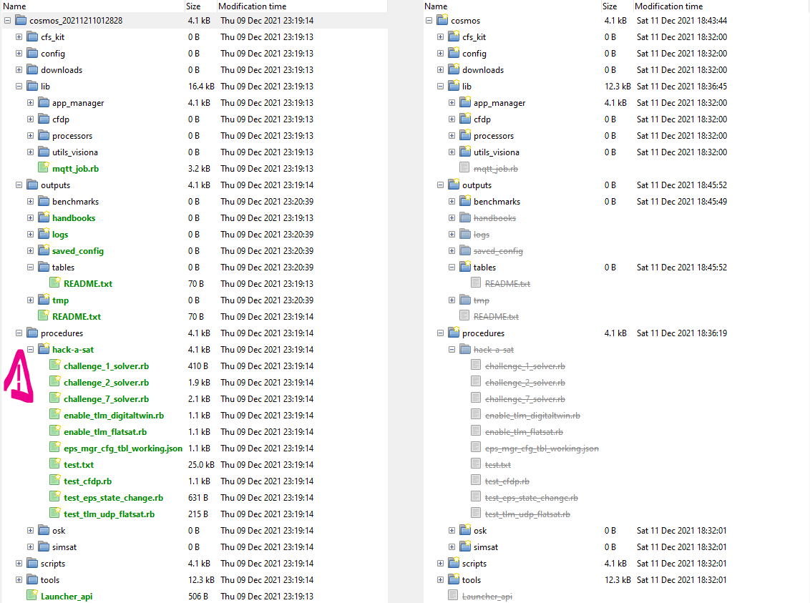

# HACK-A-SAT 2021: Challenges 1 and 2

As usual in this kind of competition, we were given a "pivot" public box to which we could connect through SSH, and which had access to the internal CTF network through SSH. Not much is to be said on this system, except its ``known_host``:

```
[team7@ip-10-50-50-17 ~]$  cat .ssh/known_hosts
10.0.72.100 ecdsa-sha2-nistp256 AAAAE2VjZHNhLXNoYTItbmlzdHAyNTYAAAAIbmlzdHAyNTYAAABBBB8EbIVCd1VolBBQw83xGPOVu/n80jzPQ0K7TVDCCOdZp2Ft/oo5UDBrbNk1fEyRUYjIkrzqpl2sZlQcW+f8Nts=
```

Not too long after the start of the CTF, we were given access to 10.0.72.100, which is the box with COSMOS installed and which could communicate with the flatsat.

While a part of the team was occupied setting up the infrastructure needed to talk to the satellite and get its bearings, some of us did an audit of the box as there usually are hints dropped in ``known_hosts``, access logs, previous logons, etc.

And, oh boy! What was our surprise when we stumbled upon the following folders in ``/tmp``:

```
d-----         12/9/2021  11:19 PM                /tmp/cosmos_20211211012828
d-----        12/11/2021   7:29 AM                /tmp/cosmos_20211211115624
d-----        12/11/2021   5:56 PM                /tmp/cosmos_20211211123140
```

So we have 3 folders of cosmos configurations in ``/tmp``, created respectively 23, 14, and 6 hours before the official start of the event!

When you want to do 3-way diff of folders, [Meld](https://meldmerge.org/) is definitively the right tool to use:


Unfortunately, the diff is pretty big and difficult to analyze. However, a diff between one of the three configurations and the current configuration is much more telling:




We honestly didn't believe at first that the solution to the first two challenges (as well as the solution to the last challenge 7) was given to us on a platter, but like any good pentester, we had to try. And, lo and behold, when we input the command in ``challenge_1_solver.rb`` and in ``challenge_2_solver.rb``, our ADCS turned green and we started to score some SLA points!


We then quickly told the organizers about the issue, who then promptly deleted the folder in ``/tmp`` and gave the same scripts to every team in order to level the playing field. Challenge 7 also was never released, probably in order not to give us any more advantage over the other teams.


So what were challenges 1 & 2?


## Challenge 1

```ruby
puts "Challenge 1 Recover Satellite Solver"
puts "Mode to SAFE since SEPERATION doesn't have wheels on"

display("EPS_MGR EPS_MGR_FSW_TLM")

cmd("EPS_MGR SET_MODE with CCSDS_STREAMID 6416, CCSDS_SEQUENCE 49152, CCSDS_LENGTH 2, CCSDS_FUNCCODE 4, CCSDS_CHECKSUM 0, MODE SAFE")

wait_check("EPS_MGR FSW_TLM_PKT WHEEL_SWITCH == 'ON'", 5)

puts "Let spacecraft attitude recover and settle for 60 seconds"
wait(60)
```

Based on the solving script, challenge 1 consisted of recovering the attitude of the satellite by sending a ``"MODE_SAFE"`` command.


## Challenge 2

```ruby
puts "Dump Current EPS Configuration Table"

cmd("EPS_MGR DUMP_TBL with CCSDS_STREAMID 6416, CCSDS_SEQUENCE 49152, CCSDS_LENGTH 67, CCSDS_FUNCCODE 3, CCSDS_CHECKSUM 0, ID 0, TYPE 0, FILENAME '/cf/eps_cfg_tbl_d.json'")
wait_time=15
wait(wait_time)

puts "Playback Dumped EPS Config File to Ground"

# if(File.file?("/cosmos/downloads/eps_cfg_tbl_d.json"))
#   puts "Delete old downlinked table file"
#   File.delete("/cosmos/downloads/eps_cfg_tbl_d.json")
# end
filetime = Time.now.to_i
filedl = "/cosmos/downloads/eps_cfg_tbl_d_#{filetime}.json"
cmd("CF2 PLAYBACK_FILE with CCSDS_STREAMID 6339, CCSDS_SEQUENCE 49152, CCSDS_LENGTH 149, CCSDS_FUNCCODE 2, CCSDS_CHECKSUM 0, CLASS 2, CHANNEL 0, PRIORITY 0, PRESERVE 0, PEER_ID '0.21', SRC_FILENAME '/cf/eps_cfg_tbl_d.json', DEST_FILENAME '#{filedl}'")
puts "Wait  #{wait_time} seconds for file playback to finish"
wait(wait_time)

puts "Teams analyze dumped table, fix then prep new table for upload"

puts "Upload Corrected File to Spacecraft"
cmd("CFDP SEND_FILE with CLASS 2, DEST_ID '24', SRCFILENAME '/cosmos/procedures/hack-a-sat/eps_mgr_cfg_tbl_working.json', DSTFILENAME '/cf/eps_cfg_up.json', CPU 2")
puts "Wait #{wait_time} seconds for file upload to finish"
wait(wait_time)

puts "Load new EPS Configuration Table"
cmd("EPS_MGR LOAD_TBL with CCSDS_STREAMID 6416, CCSDS_SEQUENCE 49152, CCSDS_LENGTH 67, CCSDS_FUNCCODE 2, CCSDS_CHECKSUM 0, ID 0, TYPE 0, FILENAME '/cf/eps_cfg_up.json'")

puts "Wait  #{wait_time} for table load to complete"
wait(wait_time)

puts "Mode spacecraft into nominal mode and let the packets flow"
cmd("EPS_MGR SET_MODE with CCSDS_STREAMID 6416, CCSDS_SEQUENCE 49152, CCSDS_LENGTH 2, CCSDS_FUNCCODE 4, CCSDS_CHECKSUM 0, MODE NOMINAL_OPS_PAYLOAD_ON")
wait_check("EPS_MGR FSW_TLM_PKT COMM_PAYLOAD_SWITCH == 'ON'", 3)
wait(1)
wait_check("EPS_MGR FSW_TLM_PKT COMM_PAYLOAD_SWITCH == 'ON'", 1)
```

Challenge 2 was solved by manipulating the EFS configuration table:

```diff
 {
    "name": "EPS Configuration Table",
-   "description": "Configuration for EPS MGR dumped at 1980-012-17:13:14.75560",
+   "description": "Configuration for EPS MGR",
    "mode-table": {
-      "startup-mode": 0,
-      "mode-array": [
+      "startup-mode": 1,
+      "mode-array": [
          {
             "mode": {
                "name": "SEPERATION",
                "mode-index": 0,
                "enabled": 1,
-               "mode-switch-mask": 91
+               "mode-mask": 79
             }
          },
          {
@@ -17,41 +17,41 @@
                "name": "SAFE",
                "mode-index": 1,
                "enabled": 1,
-               "mode-switch-mask": 95
+               "mode-mask": 95
             }
          },
          {
             "mode": {
                "name": "STANDBY",
                "mode-index": 2,
-               "enabled": 0,
-               "mode-switch-mask": 95
+               "enabled": 1,
+               "mode-mask": 95
             }
          },
          {
             "mode": {
                "name": "NOMINAL_OPS_PAYLOAD_ON",
                "mode-index": 3,
-               "enabled": 0,
-               "mode-switch-mask": 351
-         }
+               "enabled": 1,
+               "mode-mask": 351
+            }
          },
          {
             "mode": {
                "name": "ADCS_MOMENTUM_DUMP",
                "mode-index": 4,
-               "enabled": 0,
-               "mode-switch-mask": 127
+               "enabled": 1,
+               "mode-mask": 127
             }
          },
          {
             "mode": {
                "name": "ADCS_FSS_EXPERIMENTAL",
                "mode-index": 5,
-               "enabled": 0,
-               "mode-switch-mask": 159
+               "enabled": 1,
+               "mode-mask": 159
             }
          }
       ]
    }
 }
```

Challenge 2 consisted of activating C&DH modules, namely ``STANDBY``, ``NOMINAL_OPS_PAYLOAD_ON``, ``ADCS_MOMENTUM_DUMP``, ``ADCS_FSS_EXPERIMENTAL``, although the last module wasn't useful at all for the duration of the CTF, which probably meant it was tied to the canceled challenge 7.
