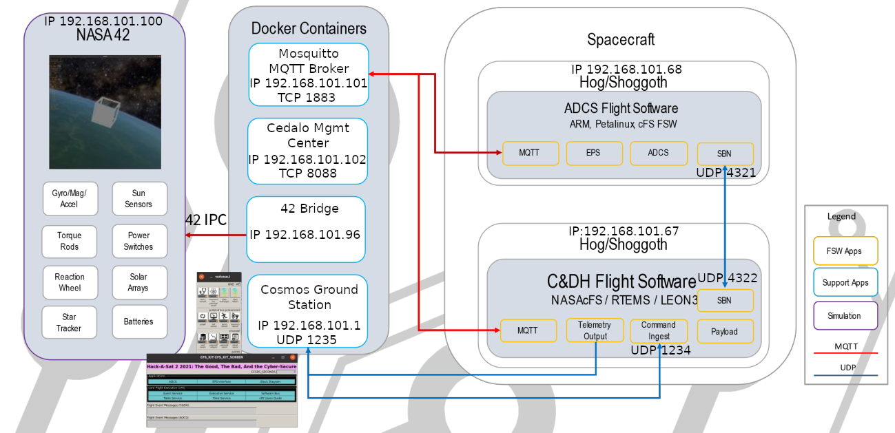

# HACK-A-SAT 2021: Digital Twin analysis

## A new virtual machine

A few days before the launch of Hack-A-Sat 2 finals, we received a virtual machine named "Digital Twin".
This machine contained a PDF document with instructions related to a virtual environment that was provided.
Indeed, when running the command `./run_twin.py` in `/home/digitaltwin/digitaltwin/`, several windows were spawned and after a few minutes, we were able to interact with a fake satellite.

As the machine was quite slow at first, we spent some time optimizing the command line parameters used to launch it.
In the end, we used:

```sh
qemu-system-x86_64 \
  -enable-kvm -cpu host -smp 4 -m 8192 \
  -object iothread,id=io1 \
  -device virtio-blk-pci,iothread=io1,drive=disk0 \
  -drive 'if=none,id=disk0,cache=none,format=vmdk,discard=unmap,aio=native, file=digitaltwin_has2-disk1.vmdk' \
  -object rng-random,filename=/dev/urandom,id=rng0 \
  -device virtio-rng-pci,rng=rng0 \
  -snapshot
```

With this, we were greeted by a Ubuntu login screen asking to authenticate for user `digitaltwin`.
The password was the same as the user name.

The documented command `./run_twin.py` launched several programs:

- Cosmos (<https://cosmosc2.com/>), a graphical user interface to interact with the satellite
- 42 (<https://sourceforge.net/projects/fortytwospacecraftsimulation/>), a physics simulation program published by NASA
- Hog (<https://cromulence.com/hog>), a virtual machine emulator which was launched twice: to simulate the ADCS (Attitude Determination and Control System) and the C&DH (Command and Data Handling System)
- Mosquitto (<https://mosquitto.org/>), a message broker using MQTT protocol
- Cedalo Management Center (<https://docs.cedalo.com/management-center/>), a web user interface to configure Mosquitto

{width=70%}

{width=70%}

These programs were launched either through Docker containers or from running pre-recorded commands in a new terminal.

The architecture of Digital Twin's components is quite complex.
Thankfully the documentation PDF contains a block diagram, which we annotated with network information (each container and embedded virtual machine used a different IP address).



These IP addresses are defined in `run_twin.py` by setting the following environment variables:

```sh
HOST_IP=192.168.101.2
SHIM_IP=192.168.101.3
FORTYTWO_IP=192.168.101.100
MQTT_IP=192.168.101.101
MQTT_GUI_IP=192.168.101.102
ADCS_IP=192.168.101.68
CDH_IP=192.168.101.67
PDB_IP=192.168.101.64
COMM_IP=192.168.101.65
DOCKER_NETWORK=digitaltwin1
FLATSAT_GATEWAY=192.168.101.1
FLATSAT_SUBNET_MASK=192.168.101.0/24
```

We used the Docker command-line interface to query the IP addresses associated with each container:


```console
digitaltwin@ubuntu:~$ docker ps --format '{{.ID}}' | xargs docker inspect -f "{{.Name}}  {{.NetworkSettings.Networks.digitaltwin1.IPAddress}}"
/digitaltwin_management-center_1  192.168.101.102
/digitaltwin_fortytwo-bridge_1  192.168.101.96
/digitaltwin_fortytwo_1  192.168.101.100
/digitaltwin_mosquitto_1  192.168.101.101
/digitaltwin_cosmos_1  <no value>
```


The simulated satellite contains two boards (ADCS and C&DH), even though several files contain references to two other boards, COMM and PDB.
We supposed that COMM (probably from "Communication") and PDB (probably "Power Distribution Board") were extra boards on the real satellite which would be used in the final event, but not in the Digital Twin.

Let's study the provided boards!

## ADCS (Attitude Determination and Control System)

The ADCS is implemented using NASA's cFS (Core Flight Software System) on a classical Linux system running on ARM.
The disk image is named `petalinux-image.vmdk`, probably as a reference to the PetaLinux distribution, but the system appears to be running Ubuntu 18.04.5 LTS (according to its `/etc/apt/sources.list`).
In this image, the file `/apps/cpu1/core-cpu1` contains the main code of the ADCS and the directory `/apps/cpu1/cf/` contains several modules and configuration files:

```console
$ ls /apps/cpu1/cf
adcs_ctrl_tbl.json  cs_memorytbl.tbl  hs.so                 mqtt_ini.json
adcs_io_lib.so      cs.so             hs_xct.tbl            osk_app_lib.so
adcs.so             cs_tablestbl.tbl  kit_ci.so             osk_to_pkt_tbl.json
cf_cfgtable.tbl     ephem.so          kit_sch_msg_tbl.json  sb2mq_tbl.json
cfe_es_startup.scr  fm_freespace.tbl  kit_sch_sch_tbl.json  sbn_lite.so
cfs_lib.so          fm.so             kit_sch.so            sbn_pkt_tbl.json
cf.so               hs_amt.tbl        kit_to.so             tle.txt
cs_apptbl.tbl       hs_emt.tbl        mq2sb_tbl.json        uplink_wl_tbl.tbl
cs_eepromtbl.tbl    hs_mat.tbl        mqtt_c.so
```

With cFS, it was interesting to read the startup configuration `cfe_es_startup.scr`, which describes which modules are loaded and which tasks are spawned:

```text
CFE_LIB, /cf/cfs_lib.so,         CFS_LibInit,             CFS_LIB,      0,      0, 0x0, 0;
CFE_LIB, /cf/osk_app_lib.so,     OSK_APP_FwInit,          OSK_APP_FW,   0,   8192, 0x0, 0;
CFE_LIB, /cf/adcs_io_lib.so,     ADCS_IO_LibInit,         ADCSIO_LIB,   0,  16384, 0x0, 0;
CFE_APP, /cf/kit_sch.so,         KIT_SCH_AppMain,         KIT_SCH,     10,  16384, 0x0, 0;
CFE_APP, /cf/sbn_lite.so,        SBN_LITE_AppMain,        SBN_LITE,    20,  81920, 0x0, 0;
CFE_APP, /cf/mqtt_c.so,          MQTT_AppMain,            MQTT,        20,  131072, 0x0, 0;
CFE_APP, /cf/adcs.so,            ADCS_AppMain,            ADCS,        30,  81920, 0x0, 0;
CFE_APP, /cf/ephem.so,           EPHEM_AppMain,           EPHEM,       90,  81920, 0x0, 0;
CFE_APP, /cf/cf.so,              CF_AppMain,              CF,         100,  81920, 0x0, 0;
CFE_APP, /cf/fm.so,              FM_AppMain,              FM,          80,  16384, 0x0, 0;
```

This list contains standard cFS and OpenSatKit libraries and applications, including:

- `ephem.so`: an application which emitted Ephemeris from the content of `cf/tle.txt`
- `cf.so`: a CFDP server (CCSDS File Delivery Protocol), enabling file uploads and downloads
- `fm.so`: a file manager, enabling listing directory contents, removing files, etc.

The two most specific modules seem to be:

- `adcs.so`: an application managing the ADCS
- `mqtt_c.so`: a custom MQTT library that relays MQTT messages to the internal software bus and vice-versa
- `sbn_lite.so`: a custom application that relays messages received from the network to the internal software bus and vice-versa

To better understand the communications between the components of the Digital Twin, the two last modules are the ones we studied the most. Our analysis started by reading the event logs, in the Terminator window, looking for the words `MQTT` and `SBN`:

```text
1980-012-14:03:24.26508 ES Startup: Loading file: /cf/sbn_lite.so, APP: SBN_LITE
1980-012-14:03:24.42797 ES Startup: SBN_LITE loaded and created
EVS Port1 42/1/SBN_LITE 317: SBN-LITE Startup. TX PEER IP: 192.168.101.67 TX PEER PORT: 4322, RECV PORT: 4321
EVS Port1 42/1/SBN_LITE 317: Sbn-lite Rx Socket bind success. Port: 4322
1980-012-14:03:24.97765 ES Startup: Loading file: /cf/mqtt_c.so, APP: MQTT
1980-012-14:03:25.10844 ES Startup: MQTT loaded and created
EVS Port1 42/1/MQTT 4: Successfully configured 25 initialization file attributes
Starting MQTT Receive Client
EVS Port1 42/1/MQTT 180: Setup MQTT Reconnecting Client to MQTT broker 192.168.101.101:1883 as client adcs_cfs_client
EVS Port1 42/1/MQTT 181: MQTT Client Connect Error for 192.168.101.101:1883
MQTT Child Task Init Status: 0
Finished MQTT Client Constructors
EVS Port1 42/1/MQTT 41: Child task initialization complete
EVS Port1 42/1/MQTT 140: Successfully loaded new table with 1 messages
EVS Port1 42/1/MQTT 25: Successfully Replaced table 0 using file /cf/mq2sb_tbl.json
EVS Port1 42/1/MQTT 183: MQTT Client Subscribe Successful (topic:qos) SIM/42/ADCS/SENSOR:2
EVS Port1 42/1/MQTT 183: Subscribed to 1 MQ2SB table topics with 0 errors
EVS Port1 42/1/MQTT 158: SB2MQ_RemoveAllPktsCmd() - About to flush pipe
EVS Port1 42/1/MQTT 158: SB2MQ_RemoveAllPktsCmd() - Completed pipe flush
EVS Port1 42/1/MQTT 170: Removed 0 table packet entries
EVS Port1 42/1/MQTT 160: Successfully loaded new table with 1 packets
EVS Port1 42/1/MQTT 25: Successfully Replaced table 1 using file /cf/sb2mq_tbl.json
EVS Port1 42/1/MQTT 100: MQTT App Initialized. Version 1.0.0
EVS Port1 42/1/SBN_LITE 312: Removed 0 table packet entries
EVS Port1 42/1/SBN_LITE 302: Successfully loaded new table with 32 packets
EVS Port1 42/1/SBN_LITE 25: Successfully Replaced table 0 using file /cf/sbn_pkt_tbl.json
EVS Port1 42/1/SBN_LITE 100: SBN_LITE Initialized. Version 1.0.0
```

This confirmed that the `SBN_LITE` module is communicating with the C&DH through UDP, and gave the ports which are used (which are hard-coded in function `SBNMGR_Constructor`).
Nevertheless, analyzing the code revealed an error: even though the event messages said `Rx Socket bind success. Port: 4322`, the UDP socket was actually bound to UDP port 4321!

Moreover, analyzing the code made us understand that any UDP packet received on port 4321 was transmitted as-is to the internal software bus:

```c
void SBNMGR_ReadPackets(int param_1) {
    // ...
    size = recvfrom(
        *(int *)(SbnMgr + 0x18),                // socket
        (void *)(SbnMgr + iVar5 + 0x20ca0),     // reception buffer
        0x800,0x40, (sockaddr *)(SbnMgr + 0x2c),&local_30);
    // ...
    CFE_EVS_SendEvent(0x13d,1,"SBNMGR Rx: Read %d bytes from socket\n",size);
    // ...
    CFE_SB_SendMsg(SbnMgr + iVar4 + 0x20ca0); // Send the buffer as-is
}
```

Calling `CFE_SB_SendMsg` directly on the received data was very dangerous for many reasons: it enabled forging arbitrary packets on the internal bus (possibly breaking some assumptions or bypassing checks), but more importantly it enabled leaking stack data!
Indeed, when sending a small packet that internally sets its length to 4096 bytes, we observed that the ADCS sent back to the C&DH a 4-KB packet.
This can be triggered for example with the following Python code:

```python
import socket
sock = socket.socket(socket.AF_INET, socket.SOCK_DGRAM, 0)
sock.connect(("192.168.101.68", 4321))
# Send: Telemetry, MID 0x2f (CFE_ES2_SHELL_TLM_MID), packet length 0xff9
sock.send(bytes.fromhex("082fc0000ff900000000"))
```

This could be interesting when hunting vulnerabilities in the final event.

In the provided architecture diagram, there are `SBN_LITE` modules in both ADCS and C&DH.
If both are forwarding all messages on their internal bus to the other system, some messages could possibly loop forever between these two systems, as there is no filtering on the UDP reception side.
Thankfully there is some filtering done in the "bus to network" direction, configured in `cf/sbn_pkt_tbl.json`:

```javascript
{
   "name": "SBN Lite Packet Table",
   "description": "Define default packets that are forwarded by SBN_LITE",
   "packet-array": [
      "packet": {
         "name": "ADCS_TLM_HK_MID",
         "stream-id": "\u09E5",
         "dec-id": 2533,
         "priority": 0,
         "reliability": 0,
         "buf-limit": 4,
         "filter": { "type": 2, "X": 1, "N": 1, "O": 0}
      },
// ...
```

The file configures the module to forward messages with the following identifiers to the C&DH:

```text
0x0811 = CFE_EVS2_HK_TLM_MID
0x0818 = CFE_EVS2_EVENT_MSG_MID
0x0820 = CFE_ES2_HK_TLM_MID
0x082B = CFE_ES2_APP_TLM_MID
0x082F = CFE_ES2_SHELL_TLM_MID
0x0830 = CFE_ES2_MEMSTATS_TLM_MID
0x084A = FM2_HK_TLM_MID
0x084B = FM2_FILE_INFO_TLM_MID
0x084C = FM2_DIR_LIST_TLM_MID
0x084D = FM2_OPEN_FILES_TLM_MID
0x084E = FM2_FREE_SPACE_TLM_MID
0x08C0 = CF2_HK_TLM_MID
0x08C1 = CF2_TRANS_TLM_MID
0x08C2 = CF2_CONFIG_TLM_MID
0x08C3 = CF2_SPARE0_TLM_MID
0x08C4 = CF2_SPARE1_TLM_MID
0x08C5 = CF2_SPARE2_TLM_MID
0x08C6 = CF2_SPARE3_TLM_MID
0x08C7 = CF2_SPARE4_TLM_MID
0x08FF = SBN_LITE2_HK_TLM_MID
0x0902 = TFTP2_HK_TLM_MID
0x0903 = SBN_LITE2_PKT_TBL_TLM_MID
0x0910 = EPS_TLM_HK_MID
0x0911 = EPS_TLM_FSW_MID
0x09E2 = EPHEM_TLM_HK_MID
0x09E3 = EPHEM_TLM_EPHEM_MID
0x09E5 = ADCS_TLM_HK_MID
0x09E6 = ADCS_FSW_TLM_MID
0x09EB = ADCS_HW_XADC_TLM_MID
0x09ED = ADCS_HW_FSS_TLM_MID
0x0F52 = MQTT2_TLM_FSW_MID
0x0FFC = CF2_SPACE_TO_GND_PDU_MID
```

The fact that all identifiers start with a zero nibble (i.e. their 4 most significant bits are zeros) identifies them as "Telemetry" messages, going from the satellite to the ground.
And this is logical: as the C&DH is responsible for the communications between the ground and the satellite, the only way for the ADCS system to send telemetry messages down to the ground is to transmit them to the C&DH!

The other module which receives and transmits messages from/to the external world is the MQTT module.
Its configuration is in 3 files:

- `cf/mqtt_ini.json` contains information about the MQTT broker (IP address, port number, login and password)
- `cf/mq2sb_tbl.json` configures the module to subscribe to MQTT topic `SIM/42/ADCS/SENSOR` and to forward messages to the internal bus with command ID `ADCS_SIM_SENSOR_DATA = 0x19E3`
- `cf/sb2mq_tbl.json` configures the module to receive telemetry messages with ID `ADCS_ACTUATOR_SIM_DATA = 0x09E7` (from the internal bus) and to publish their content to MQTT topic `SIM/42/ADCS/ACTUATOR`

So the MQTT module seems to act as a bridge between the ADCS module and the 42 simulation system.

By the way, last year we found that the `CFE_ES` module enabled the ground station to send arbitrary system commands through a message named `SHELL`.
This year, it seems that the `CFE_ES` commands are duplicated, as the Cosmos configuration contained references to the `CFE_ES` and `CFE_ES2` modules.
By testing these modules, we understood that `CFE_ES` targets the C&DH system while `CFE_ES2` targets the ADCS system.
When running the command with ID `CFE_ES2_CMD_MID = 0x1826` and function code 3 (`SHELL`), we were able to run arbitrary Linux shell commands on the ADCS and to retrieve their output.

## C&DH (Command and Data Handling System)

The C&DH system consists of a cFS environment (Core Flight Software System) built on the RTEMS operating system and running on a Sparc/LEON3 processor architecture.
This is similar to the system which was used in the first edition of Hack-A-Sat finals, so we already had some tools to interact with it.

In the Digital Twin virtual machine, the directory `digitaltwin/cdh_sparc_emu/` contains several files related to emulating devices used by the C&DH:

```console
$ ls -F digitaltwin/cdh_sparc_emu/
Makefile         cdh_board_image/  grlib_rvb_arch.so*  leon3.c
README.md        eth/              i2c/                leon3.o
bridge_down.sh*  grlib_eth.so*     imager.so*          log.txt
bridge_up.sh*    grlib_i2cmst.so*  imager_payload/     sparc_helper.h
```

There seem to be drivers for three devices:

- `eth/` (and `grlib_eth.so`) contains code for an Ethernet network interface
- `i2c/` (and `grlib_i2cmst.so`) contains code for an I2C bus interface
- `imager_payload/` (and `imager.so`) contains code for an I2C device able to drive a (fake) camera

When launching the Digital Twin software (with `./run_twin.py`), a terminal titled "C&DH Hog Emulation" appears.
This terminal contains the logs of the C&DH, as well as an RTEMS console.

The logs contain information such as:

```text
 --- BUS TOPOLOGY ---
  |-> DEV  0x405bff28  GAISLER_LEON3
  |-> DEV  0x405bff90  GAISLER_ETHMAC
  |-> DEV  0x405bfff8  GAISLER_APBMST
  |-> DEV  0x405c0060  ESA_MCTRL
  |-> DEV  0x405c00c8  GAISLER_IRQMP
  |-> DEV  0x405c0130  GAISLER_GPTIMER
  |-> DEV  0x405c0198  GAISLER_APBUART
  |-> DEV  0x405c0200  GAISLER_APBUART
  |-> DEV  0x405c0268  GAISLER_APBUART
  |-> DEV  0x405c02d0  GAISLER_APBUART
  |-> DEV  0x405c0338  GAISLER_I2CMST
  |-> DEV  0x405c03a0  GAISLER_GPIO
```

... which could be useful to help debug device drivers, if needed (as well as RTEMS commands `drvmgr topo`, `drvmgr buses`, `drvmgr devs`, etc.).

Moreover, `ls` can be used in the RTEMS console to list some files and `cat` to display their content:

```text
SHLL [/] # ls
bin    dev    eeprom etc    ram    usr

SHLL [/] # ls dev
console   console_b console_c console_d

SHLL [/] # ls eeprom
cf.obj                    hs.obj                    md_dw3_tbl.tbl
cf_cfgtable.tbl           hs_amt.tbl                md_dw4_tbl.tbl
cfe_es_startup.scr        hs_emt.tbl                mm.obj
cfs_lib.obj               hs_mat.tbl                mq2sb_tbl.json
cs.obj                    hs_xct.tbl                mqtt.obj
cs_apptbl.tbl             io_lib.obj                mqtt_ini.json
cs_eepromtbl.tbl          kit_ci.obj                mqtt_lib.obj
cs_memorytbl.tbl          kit_sch.obj               osk_app_lib.obj
cs_tablestbl.tbl          kit_sch_msg_tbl.json      osk_to_pkt_tbl.json
ds.obj                    kit_sch_sch_tbl.json      pl_if.obj
ds_file_tbl.tbl           kit_to.obj                sb2mq_tbl.json
ds_filter_tbl.tbl         lc.obj                    sbn_lite.obj
expat_lib.obj             lc_def_adt.tbl            sbn_pkt_tbl.json
fm.obj                    lc_def_wdt.tbl            sc.obj
fm_freespace.tbl          md.obj                    sc_ats1.tbl
hk.obj                    md_dw1_tbl.tbl            sc_rts001.tbl
hk_cpy_tbl.tbl            md_dw2_tbl.tbl            uplink_wl_tbl.tbl

SHLL [/] # cat eeprom/cfe_es_startup.scr
CFE_LIB, /cf/cfs_lib.obj,      CFS_LibInit,        CFS_LIB,      0,       0, 0x0, 0;
CFE_LIB, /cf/osk_app_lib.obj,  OSK_APP_FwInit,     OSK_APP_FW,   0,    8192, 0x0, 0;
CFE_LIB, /cf/expat_lib.obj,    EXPAT_Init,         EXPAT_LIB,    0,    8192, 0x0, 0;
CFE_LIB, /cf/io_lib.obj,       IO_LibInit,         IO_LIB,       0,    8192, 0x0, 0;
CFE_LIB, /cf/mqtt_lib.obj,     MQTT_LibInit,       MQTT_LIB,     0,   81920, 0x0, 0;
CFE_APP, /cf/kit_sch.obj,      KIT_SCH_AppMain,    KIT_SCH,     10,   16384, 0x0, 0;
CFE_APP, /cf/kit_to.obj,       KIT_TO_AppMain,     KIT_TO,      20,   81920, 0x0, 0;
CFE_APP, /cf/kit_ci.obj,       KIT_CI_AppMain,     KIT_CI,      20,   16384, 0x0, 0;
CFE_APP, /cf/ds.obj,           DS_AppMain,         DS,          70,   16384, 0x0, 0;
CFE_APP, /cf/fm.obj,           FM_AppMain,         FM,          80,   16384, 0x0, 0;
CFE_APP, /cf/hs.obj,           HS_AppMain,         HS,         120,   16384, 0x0, 0;
CFE_APP, /cf/hk.obj,           HK_AppMain,         HK,          90,   16384, 0x0, 0;
CFE_APP, /cf/md.obj,           MD_AppMain,         MD,          90,   16384, 0x0, 0;
CFE_APP, /cf/mm.obj,           MM_AppMain,         MM,          90,   16384, 0x0, 0;
CFE_APP, /cf/sc.obj,           SC_AppMain,         SC,          80,   16384, 0x0, 0;
CFE_APP, /cf/cs.obj,           CS_AppMain,         CS,          90,   16384, 0x0, 0;
CFE_APP, /cf/lc.obj,           LC_AppMain,         LC,          80,   16384, 0x0, 0;
CFE_APP, /cf/sbn_lite.obj,     SBN_LITE_AppMain,   SBN_LITE,    30,   81920, 0x0, 0;
CFE_APP, /cf/mqtt.obj,         MQTT_AppMain,       MQTT,        40,   81920, 0x0, 0;
CFE_APP, /cf/cf.obj,           CF_AppMain,         CF,         100,   81920, 0x0, 0;
```

Like last year, there is an "Operating System Abstraction Layer" (OSAL) in cFS which maps `/cf` to `/eeprom`.
Looking at the content of `/eeprom/cfe_es_startup.scr`, this mapping seems to also be present this year.
We extracted the files in this directory using `binwalk -e` on `digitaltwin/cdh_sparc_emu/cdh_board_image/core-cpu1.exe`, and there was a TAR archive at offset `0x121FF8`, which was also the ELF symbol `eeprom_tar`.
The startup configuration file `eeprom/cfe_es_startup.scr` contains more modules than the ADCS, as there were also the Memory Dwell module `md.so`, the Memory Manager module `mm.so`, the Checksum module `cs.so`, etc.

Like the ADCS, the C&DH contains a `SBN\_LITE` and a `MQTT` module, which bridge the internal bus with either UDP or the MQTT broker.
Nevertheless, they are configured differently (of course).

The `SBN\_LITE` configuration file `eeprom/sbn_pkt_tbl.json` configures the module to forward messages with the following identifiers to the ADCS through a UDP connection:

```text
0x1812 = CFE_EVS2_CMD_MID
0x1826 = CFE_ES2_CMD_MID
0x1826 = CFE_ES2_CMD_MID
0x184C = FM2_CMD_MID
0x18C3 = CF2_CMD_MID
0x18C5 = CF2_WAKE_UP_REQ_CMD_MID
0x18C6 = CF2_SPARE1_CMD_MID
0x18C7 = CF2_SPARE2_CMD_MID
0x18C8 = CF2_SPARE3_CMD_MID
0x18C9 = CF2_SPARE4_CMD_MID
0x18CA = CF2_SPARE5_CMD_MID
0x18FB = SBN_LITE2_CMD_MID
0x1902 = TFTP2_CMD_MID
0x1910 = EPS_MGR_CMD_MID
0x19DF = ADCS_CMD_MID
0x19E2 = ADCS_RW_CMD_MID
0x1FFC = CF2_INCOMING_PDU_MID
```

This seems logical: all commands sent by the ground station are first received by the C&DH before being transmitted to the ADCS, through the two `SBN\_LITE` modules and UDP packets.

The MQTT configuration files are made to:

- connect to the MQTT broker
- subscribe to MQTT topic `COMM/PAYLOAD/SLA`, forwarding payloads as messages with command ID `COMM_PAYLOAD_SLA = 0x19E4`
- subscribe to MQTT topic `COMM/PING/STATUS`, forwarding payloads as messages with command ID `SLA_PAYLOAD_KEY = 0x19E5`
- subscribe to MQTT topic `COMM/PAYLOAD/TELEMETRY`, forwarding payloads as messages with command ID `COMM_PAYLOAD_TELEMETRY = 0x19E6`

By the way, like last year, running the `CFE_ES/SHELL` function from the ground station (with the command `CFE_ES_CMD_MID = 0x1806`) did not enable running RTEMS commands aside from "built-in cFS commands" such as `ES_ListApps`.
But the MM module is loaded in the C&DH, enabling arbitrary read/write access to its memory from the ground station :) This could be an interesting primitive in an Attack/Defense CTF contest.

## MQTT configuration

The Digital Twin runs a Mosquitto service, used as an MQTT broker by several components.
It is launched using a `docker-compose.yml` configuration file in `digitaltwin/mosquitto/`.
This file defines two containers:

- one for the Mosquitto service, exposing TCP port 1883 on IP 192.168.101.101
- one for the Cedalo Management Center, exposing TCP port 8088 on IP 192.168.101.102

The file also contains some account credentials:

```yaml
CEDALO_MC_BROKER_USERNAME: cedalo
CEDALO_MC_BROKER_PASSWORD: S37Lbxcyvo
CEDALO_MC_USERNAME: cedalo
CEDALO_MC_PASSWORD: mmcisawesome
```

The management center on <http://127.0.0.1:8088/> requires a login and password.
It accepted `cedalo` and `mmcisawesome` :)


In the web user interface it is possible to list the used MQTT topics as well as the users and roles which are configured on the server.

This last configuration is also available in \linebreak `digitaltwin/mosquitto/mosquitto/data/dynamic-security.json`, with entries such as:

```javascript
"clients": [
// ...
    {
        "username": "cedalo",
        "textname": "Admin user",
        "roles": [
            { "rolename": "dynsec-admin" },
            { "rolename": "sys-observe" },
            { "rolename": "topic-observe" }],
        "password": "vnCzwko9tYKQOvDbKNzZnHkY0Udh2KIRxgWKpW+HrS0mHDdVvEjpbrItqcDhl3GI9WoVWV7/Y0ubs7akMt50IA==",
        "salt": "l+sBXmogLrCRqKD9",
        "iterations": 101
    },
// ...
],
"groups": [],
"roles": [{
    "rolename": "client",
    "textdescription": "Read/write access to the full application topic hierarchy.",
    "acls": [{
            "acltype": "publishClientSend",
            "topic": "#",
            "priority": 0,
            "allow": true
        }, {
            "acltype": "publishClientReceive",
            "topic": "#",
            "priority": 0,
            "allow": true
        }, {
            "acltype": "subscribePattern",
            "topic": "#",
            "priority": 0,
            "allow": true
        }, {
            "acltype": "unsubscribePattern",
            "topic": "#",
            "priority": 0,
            "allow": true
        }]
    },
// ...
```

Passwords are hashed using the PBKDF2-SHA512 algorithm (implemented in <https://github.com/eclipse/mosquitto/blob/v2.0.14/plugins/dynamic-security/auth.c#L146-L148>).

Here is a Python script that can be used to compute the above password digest:

```python
import base64
import hashlib

password = "S37Lbxcyvo"
salt = "l+sBXmogLrCRqKD9"
iterations = 101
raw_digest = hashlib.pbkdf2_hmac("sha512", password.encode(), base64.b64decode(salt), iterations)
b64_digest = base64.b64encode(raw_digest).decode()
print(b64_digest)
# vnCzwko9tYKQOvDbKNzZnHkY0Udh2KIRxgWKpW+HrS0mHDdVvEjpbrItqcDhl3GI9WoVWV7/Y0ubs7akMt50IA==
```

Using this algorithm, we found out that almost all user accounts defined in `dynamic-security.json` used passwords which were the same as the user names:

- `42` (with role `client`)
- `42_bridge` (with role `client`)
- `cfs_adcs` (with role `game_with_sim`)
- `cfs_cdh` (with role `game`)
- `comm` (with role `comm`)
- `cosmos` (with role `cosmos`)

The last account is `hasadmin` and has a password hash which we did not reverse:

```javascript
    {
        "username": "hasadmin",
        "textname": "",
        "textdescription": "",
        "roles": [{ "rolename": "client" }],
        "password": "321G4JZNmTtnZxMj38ddoD4jMci+4Ya+fbRwGbFNYiFiKr+RSxdUb4F62l1CjVT0O+4z/xaNdMELmuBf4TOyMQ==",
        "salt": "dLtuoqqWLfh1x+zH",
        "iterations": 101
    }
```

As we were preparing for an Attack/Defense CTF event, we thought that it was an account reserved for the organisers on the real system, so that they could connect to the MQTT broker and receive messages from system.
In this context, we thought we were not supposed to know the password of this account, but if it was an easy one, it would be bad not to know it.
So we unleashed a small instance of John The Ripper on a file containing the password digest in hexadecimal:

```text
hasadmin:$pbkdf2-hmac-sha512$101.74bb6ea2aa962df875c7ecc7.df6d46e0964d993b67671323dfc75da03e2331c8bee186be7db47019b14d6221622abf914b17546f817ada5d428d54f43bee33ff168d74c10b9ae05fe133b231
```

As expected it did not find the password.

We also prepared some commands which could be used to quickly inspect the Mosquitto configuration.
The idea was to be able to find out whether another team messed with it, in the final event.
For this, we used commands in the Mosquitto container such as:

```sh
# Run these commands in: docker exec -ti digitaltwin_mosquitto_1 sh
mosquitto_ctrl -u cedalo -P S37Lbxcyvo dynsec getDefaultACLAccess
mosquitto_ctrl -u cedalo -P S37Lbxcyvo dynsec listClients
mosquitto_ctrl -u cedalo -P S37Lbxcyvo dynsec listRoles
mosquitto_ctrl -u cedalo -P S37Lbxcyvo dynsec getClient 42
mosquitto_ctrl -u cedalo -P S37Lbxcyvo dynsec getRole client

mosquitto_sub -u cedalo -P S37Lbxcyvo -t '#' -F '%I %t id=%m len=%l retained=%r'
```

When looking at the roles associated with users, we found out that the `client` role used by users `42` and `42_bridge` is too permissive: it enables the 42 simulator access to all MQTT topics.
The other roles are more restrictive.
For example, the role `game` restricts the C&DH to publish and subscribe to topics under the `COMM/` hierarchy and the role `game_with_sim` restricts the ADCS to publish and subscribe to topics under the `COMM/` and `SIM/42/` hierarchies.

At this point of the preparation, we thought that we would have network access to the MQTT broker of other teams in the final event, and that our competitors would have access to our MQTT broker.
Therefore we prepared a hardened configuration of MQTT, by replacing the passwords with non-trivial ones and by setting more restricted roles on users.

Some work was done to better understand how 42 and the 42 bridge used MQTT:

- 42 subscribes to the topic `SIM/42/RECV` and publishes data to topic `SIM/42/PUB`
- The 42 bridge is a Python script that subscribes to the topic `SIM/42/PUB` and forwards its data to both `SIM/DATA/JSON` and `SIM/42/ADCS/SENSOR`. It also subscribes to the topic `SIM/42/ADCS/ACTUATOR` and forwards its data to `SIM/42/RECV`

Therefore the 42 bridge forwards messages between topics used by the ADCS and by 42.

In the final event, this work was completely useless as the MQTT broker was completely unreachable: we had no way to reconfigure our own broker and not access to the broker of other teams.

## Extra unintended files

When we first booted the Digital Twin virtual machine, we wanted to copy files outside, to better analyze them.
We ran the command `du` (Disk Usage) to find how much space the home directory takes and which directories are the largest:

```console
digitaltwin@ubuntu:~$ du -h --max-depth=2 /home/digitaltwin | sort -h
...
568M     /home/digitaltwin/digitaltwin
5.5G     /home/digitaltwin/.cache/vmware
5.7G     /home/digitaltwin/.cache
6.5G     /home/digitaltwin
```

The machine image uses 17.6 GB of storage, among them only 568 MB were actually located in `digitaltwin` directory.
And next to this directory, there is a `.cache/vmware` directory with 5.7 GB worth of content!

```console
digitaltwin@ubuntu:~$ du -h --max-depth=2 .cache/vmware | sort -h
120K     .cache/vmware/drag_and_drop/2C1HAs
120K     .cache/vmware/drag_and_drop/u9degr
128K     .cache/vmware/drag_and_drop/ylGx5r
300K     .cache/vmware/drag_and_drop/CC3wmp
552K     .cache/vmware/drag_and_drop/aH9mqA
1.3M     .cache/vmware/drag_and_drop/rFHYbs
1.4M     .cache/vmware/drag_and_drop/9cjzVn
13M      .cache/vmware/drag_and_drop/qXxaDC
194M     .cache/vmware/drag_and_drop/EmV3zp
204M     .cache/vmware/drag_and_drop/5q3xhs
541M     .cache/vmware/drag_and_drop/oBf7Ns
744M     .cache/vmware/drag_and_drop/G8DsUn
761M     .cache/vmware/drag_and_drop/NnILxs
3.1G     .cache/vmware/drag_and_drop/hvmL8y
5.5G     .cache/vmware/drag_and_drop
5.5G     .cache/vmware
```

These directories contain `.tar` files with the container images for some software, several versions of 42's configuration files, and a new version of Cosmos configuration files in \linebreak `.cache/vmware/drag_and_drop/NnILxs/cosmos/config`.
Comparing it with the configuration files in `digitaltwin/opensatkit/cosmos/config` revealed some removed files and the existence of two new modules, named `COMM` and `SLA_TLM`, which we did not have on the simulated satellite. These modules were present in the Cosmos configuration used in the final event.


Why were these files in the virtual machine? We did not know but we assumed that the organizers used VMware extensions to copy-paste files in the machine instead of using a "clean" provisioning method (such as Ansible, Kickstart, Packer, virt-install, etc.) and they were not aware that the copied files could be kept in `.cache/vmware` afterward.

While reviewing whether other files could have been "hidden", we found out that the source code of 42 was available in some Docker layers.
More precisely, 42 is open-source software (hosted on <https://github.com/ericstoneking/42>) but we were provided with a version compiled with MQTT support, which is not present in the public code.
So we looked at the provided container, first by extracting it:

```console
$ docker save registry.mlb.cromulence.com/has2/finals/42/42 | tar x
$ jq . < manifest.json 
[
  {
    "Config": "67c2300bd50becc21b37940d506cf388871554b6169b75d039b85d5ec32aa1dd.json",
    "RepoTags": [
      "registry.mlb.cromulence.com/has2/finals/42/42:latest"
    ],
    "Layers": [
      "e0e27e8a1e1e285f0c8a7c49395dfd9a4c84fa9c1e760a35ad9f656403b330a5/layer.tar",
      "638f5427a776cbc3db1117a1c6709b43d741a4771b081bd5752509934a953ed8/layer.tar",
      "8a39a93ed208cfe80697f4667548f70dfcdb631c348936154a349623ef22e1d3/layer.tar",
      "bacac01e075bb8b51b8818c3c0d2759cf91015ef74c929159a5ed16d3e58314c/layer.tar",
      "e72311e4da3f4f7356286f6830ac764daf61f0d3345476834bcccb98dc5fec42/layer.tar",
      "7bbda5957b85e8356398d6819f84ee0bb18cc4eb1cfb16c97a94b176024706c0/layer.tar",
      "6b4e91a92a0a0a02d9d9787c200527a4af02a07d1caa876a4295f1d672996201/layer.tar",
      "4f25ed878cdf0bb1d8df139bbd27e5b35cba3863af9131c1e3a899b155ba9d77/layer.tar",
      "3fd62ada9bf99d205d74cdb75d53eb57475b6742367c596bc30988a2c5221ddf/layer.tar",
      "0d7293898ffec018962f631ad61ba23827dc5ab585f73be8f3c26714480f553a/layer.tar",
      "194d8b7106bb02b2145163d89a336c91a2562bb3f3fc5acf4908ee3b270e2611/layer.tar",
      "0411c0c75442903075910fa8c3ef7a5d0769def9b4d8bfc1cabc37caec7734d2/layer.tar",
      "6d7067b08ac4a109f03edad0e6e5fd56af8658e539b50b271009e974756e748f/layer.tar",
      "62617b808978eed638c9a3b68c7cd260c1654b5434e2d7fe2c39981c5eec4220/layer.tar",
      "635e9addf32f1e2a112e5a5a6426285b43472881f62214f7b48954a52d133589/layer.tar",
      "15a5d1ed8efb426d5f95649465fffc037de40dc3ed6b21077787e2d70775045a/layer.tar",
      "1390a7bfcf95d5ec044b120d0028113a9b5db483ffb3dcf4fd4e052d1dd7c67d/layer.tar"
    ]
  }
]
```

Having many layers could be a sign that the container has not been optimized.
All the build commands are available in `67c2300bd50becc21b37940d506cf388871554b6169b75d039b85d5ec32aa1dd.json`.
Among them, we identified:

```text
make
rm -rf ${BUILDDIR}/build ${BUILDDIR}/Source ${BUILDDIR}/Kit ${BUILDDIR}/Include ${BUILDDIR}/CMakeLists.txt ${BUILDDIR}/Makefile ${BUILDDIR}/FlatSatFswApp
```

So container built 42's source code and removed it later.
The issue is that "removing files and directories" in Docker layers does not remove the files from the previous layers.
So extracting every layer (for example with `ls -1 ./*/layer.tar | xargs -L1 tar xvf`) gave the full source code of 42!
For example `home/has/42/Kit/Include/iokit.h` contains these additional lines, compared to the latest public release of 42 (version 20211011):

```c
#ifdef _ENABLE_MQTT_
#define MQTT_QOS         1
// #define MQTT_TIMEOUT_CNT 6
#define MQTT_RECV_TIMEOUT_MSEC 2000
#define MQTT_RECV_TIMEOUT_MAX  30000
#define MQTT_TIMEOUT           10000L
#define MQTT_TOPIC_PUB         "SIM/42/PUB"
#define MQTT_TOPIC_RECV        "SIM/42/RECV"
#define MQTT_CLIENT_NAME       "MqttClient42"
#define MQTT_USER              "42"
#define MQTT_PASS              "42"
MQTTClient InitMqttClient(const char* Host, int Port, const char* clientName, void* context);
int StartMqttClient(MQTTClient client, const char* username, const char* password, const char* topicRecv);
int MqttPublishMessage(MQTTClient client, char* data, unsigned int dataLen, const char* topic);
void CloseMqttClient(MQTTClient client);
int MqttMsgRecv(MQTTClient client, void* context);
#endif
```

So if we needed to modify the password for 42's MQTT account, we now knew enough to rebuild the container :)
The source code also contains several other modifications, probably related to the specific setup used in Hack-A-Sat 2 event.

# HACK-A-SAT 2021: Scapy integration

## Scapy classes

We updated last year's [tool](https://github.com/solar-wine/tools-for-hack-a-sat-2020/tree/master/scapy-space-packets) that generated [scapy](https://scapy.net/) classes from Cosmos configuration files so that it supported features that were not used last year:

- 64-bit integers
- Quaternions data type
- IP address data type
- `POLY_WRITE_CONVERSION` directives that scale values that are input in the Cosmos UI
- `POLY_READ_CONVERSION` directives that scale received telemetry before display
- Endianness support: unlike last year, some of the commands require Little Endian encoding (as the ADCS used a Little Endian CPU)
- Handle downloads from ADCS
- Handle duplicate field names

This scapy tooling was first generated during the preparation phase from Cosmos files from the Digital Twin VM. It was then updated using Cosmos files from the VM that was made available during the final event.

For example, to send the command enabling to switch the state of a satellite component on the EPS (Electrical Power Supply), the following class was generated from the Cosmos configuration:

```python
class EPS_MGR_SET_SWITCH_STATE_CmdPkt(Packet):
    """EPS MGR Set EPS Set Switch State Command

    app = EPS_MGR
    command = SET_SWITCH_STATE
    msg_id = EPS_MGR_CMD_MID = 0x1910 = 0x1800 + 0x110
    cmd_func_code = 5
    data_len = 2 bytes
    """
    name = "EPS_MGR_SET_SWITCH_STATE_CmdPkt"
    fields_desc = [
        # APPEND_PARAMETER COMPONENT_IDX   8 UINT 0 8 0 "EPS Component Index"
        ByteField("COMPONENT_IDX", 0),
        # STATE TT&C_COMM 0
        # STATE ADCS 1
        # STATE ADCS_REACTION_WHEEL 2
        # STATE ADCS_IMU 3
        # STATE ADCS_STAR_TRACKER 4
        # STATE ADCS_MTR 5
        # STATE ADCS_CSS 6
        # STATE ADCS_FSS 7
        # STATE PAYLOAD_COMM 8
        # APPEND_PARAMETER COMPONENT_STAT 8 UINT 0 1 1 "EPS Component State"
        ByteField("COMPONENT_STAT", 1),
        # STATE OFF 0
        # STATE ON 1
    ]


bind_layers(CCSDSPacket, EPS_MGR_SET_SWITCH_STATE_CmdPkt, pkttype=1, apid=272, cmd_func_code=5)
```

## Scapy shell

Once we had the classes defining the packets, we were able to run shell commands on the ADCS using:

```python
pkt = CCSDSPacket() / CFE_ES2_SHELL_CmdPkt(
    CMD_STRING=b"id", OUTPUT_FILENAME=b"/cf/cmd.tmp")
codec.high_push(pkt)
```

Our client running with Scapy Pipes then displayed the result of this command:

```text
<CFE_ES2_SHELL=0x2f <CFE_ES2_SHELL_TLM_PKT_TlmPkt SHELL_OUTPUT=
    'uid=1000(adcs) gid=1000(adcs) groups=1000(adcs),4(adm),15(kmem),' |>
<CFE_ES2_SHELL=0x2f <CFE_ES2_SHELL_TLM_PKT_TlmPkt  SHELL_OUTPUT=
    '20(dialout),24(cdrom),25(floppy),29(audio),30(dip),44(video),46(' |>
<CFE_ES2_SHELL=0x2f <CFE_ES2_SHELL_TLM_PKT_TlmPkt  SHELL_OUTPUT=
    'plugdev),100(users),101(systemd-journal),104(input),109(i2c),111' |>
<CFE_ES2_SHELL=0x2f <CFE_ES2_SHELL_TLM_PKT_TlmPkt  SHELL_OUTPUT=
    '(netdev),987(remoteproc),988(eqep),989(pwm),990(gpio),991(cloud9' |>
<CFE_ES2_SHELL=0x2f <CFE_ES2_SHELL_TLM_PKT_TlmPkt  SHELL_OUTPUT=
    'ide),992(bluetooth),993(xenomai),994(weston-launch),995(tisdk),9' |>
<CFE_ES2_SHELL=0x2f <CFE_ES2_SHELL_TLM_PKT_TlmPkt  SHELL_OUTPUT=
    '96(docker),997(iio),998(spi),999(admin)\n                     \n$' |>
```

To interact with the satellite modules quicker, we implemented some functions to list directory contents, read and upload files (using CFDP protocol), enable and disable the telemetry, etc.
We also added some functions which enabled us to interact with the Memory Manager module of the C&DH to decode symbols and read and write memory:

```python
def dlsym_cdh(symbol):
    """Resolve a symbol using OS_SymbolLookup()"""
    codec.high_push(CCSDSPacket() / MM_LOOKUP_SYMBOL_CmdPkt(SYMBOL_NAME=symbol))

def mem_read32_cdh(addr):
    codec.high_push(CCSDSPacket() / MM_PEEK_MEM_CmdPkt(
        DATA_SIZE=32,
        ADDR_SYMBOL_NAME='hard_reset',  # hard_reset is always at 0x40001000
        ADDR_OFFSET=(addr - 0x40001000) & 0xfffffffc))

def mem_write32_cdh(addr, data):
    int_data = int.from_bytes(data, 'big')
    codec.high_push(CCSDSPacket() / MM_POKE_MEM_CmdPkt(
        DATA_SIZE=32,
        DATA=int_data,
        ADDR_SYMBOL_NAME='hard_reset',  # hard_reset is always at 0x40001000
        ADDR_OFFSET=(addr - 0x40001000) & 0xfffffffc))
```

This year, we were interested in dumping the configuration of the `SBN_LITE` modules (which configure how packets are filtered between the ADCS and the C&DH). With our Python code, this was easy:

```python
def sbn_dump_cdh(filename=b'/cf/sbn_dump_cdh.tmp'):
    """Download the table of the C&DH SBN_LITE module"""
    codec.high_push(CCSDSPacket() / SBN_LITE_DUMP_TBL_CmdPkt(FILENAME=filename))
    time.sleep(1)
    file_play_cfdp_cdh(filename)

def sbn_dump_adcs(filename=b'/cf/sbn_dump_adcs.tmp'):
    """Download the table of the ADCS SBN2_LITE module"""
    codec.high_push(CCSDSPacket() / SBN_LITE2_DUMP_TBL_CmdPkt(FILENAME=filename))
    time.sleep(1)
    file_play_cfdp_adcs(filename)
```

Another feature that was very useful in the final event was the ability to restart applications:

```python
def start_app_cdh(name, entry, filename, prio, stack_size=8192):
    codec.high_push(CCSDSPacket() / CFE_ES_START_APP_CmdPkt(
        APP_NAME=name,
        APP_ENTRY_POINT=entry,
        APP_FILENAME=filename,
        STACK_SIZE=stack_size,
        PRIORITY=prio,
    ))

def stop_app_cdh(name):
    codec.high_push(CCSDSPacket() / CFE_ES_STOP_APP_CmdPkt(APP_NAME=name))

def info_app_cdh(name):
    codec.high_push(CCSDSPacket() / CFE_ES_SEND_APP_INFO_CmdPkt(APP_NAME=name))
```

Last but not least, we also crafted a Python script that was able to decode recorded packets from a PCAP file.
This enabled debugging network traffic of the Digital Twin by installing `tshark` and running:

```sh
sudo dumpcap -q -P -i tap1 -w - -f udp | ./show_pcap.py /dev/stdin
```

For example, when sending an "ADCS/NOOP" command, this script recorded the packet being forwarded by the C&DH to the ADCS and the response going the other way round:

```text
[Cosmos@192.168.101.1->C&DH@192.168.101.67:1234 ] ADCS.0=0x1df
[C&DH@192.168.101.67 ->ADCS@192.168.101.68:4321 ] ADCS.0=0x1df
[ADCS@192.168.101.68 ->C&DH@192.168.101.67:4322 ] CFE_EVS2_EVENT_MSG=0x18 [ADCS/ADCS/2.102] No operation command received for ADCS version 0.1
[C&DH@192.168.101.67 ->Cosmos@192.168.101.1:1235] CFE_EVS2_EVENT_MSG=0x18 [ADCS/ADCS/2.102] No operation command received for ADCS version 0.1
```

# HACK-A-SAT 2021: Data visualization

## Telemetry exporter

Based on our generated scapy classes, we wrote a Prometheus exporter
that connected to Cosmos and exported received telemetry as Prometheus
Gauges.
This was easy to do in Python:

```python
from prometheus_client import Gauge

metrics = {}

def handle_ccsds_packet(pkt: CCSDSPacket) -> None:
    # ...
    for field in pkt.payload.fields_desc:
        value = getattr(pkt.payload, field.name)
        if f"{apid_name}_{field.name}" not in metrics:
            metrics[f"{apid_name}_{field.name}"] = Gauge(
                f"{apid_name}_{field.name}", f"{apid_name} {field.name}")
        if type(value) == int or type(value) == float:
            metrics[f"{apid_name}_{field.name}"].set(value)
```

This telemetry exporter also dumped all raw received telemetry to files, so we could analyze received packets using additional scapy-based scripts.
We thought that might come in handy should telemetry contain exploits or attacks from other teams.

## Score exporter

When the scoreboard became available, before the start of the final
event, we wrote a Python script that fetched the scoreboard's JSON
file (<https://finals.2021.hackasat.com/scoreboard.json>) every 30 seconds and exported that data to Prometheus.

## Grafana dashboard

We ran a Prometheus instance collecting telemetry data every 15s and scoreboard
every 30s. This data was then represented in a Grafana dashboard using
Prometheus as a data source.


We first reproduced most of the graphs that were present in the Cosmos UI,
and then set up other graphs during the competition to make all the data
available and usable for all team members. This proved quite useful to analyze
battery charge and discharge patterns and to see whether we were gaining
points faster or slower than the other teams.

{width=100%}


## Alerting

We set up some alerting rules to alert team members:

- when connection to Cosmos is lost or telemetry is down, triggered when the ADCS execution count stops incrementing 
(`rate(ADCS_TLM_HK_MID_CTRL_EXEC_COUNT[60s]) < 0.1`)

- when the ADCS (`adcs_happy`), C&DH (`cndh_happy`) or Cosmos (`cosmos_happy`) is red on the scoreboard, triggered using 
our team `metrics` on the scoreboard

- when a power relay is not in the correct state (except MTR and FSS), triggered using EPS switch metrics 
(`EPS_MGR_FSW_TLM_MID_..._SWITCH`)

- when battery charging is stopped, triggered using telemetry from the EPS module (`EPS_MGR_FSW_TLM_MID_SOLAR_ARRAY_X_PLUS_POWER`)
