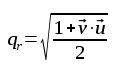
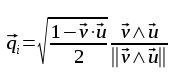

# HACK-A-SAT 2021: Quaternion

* **Category:** Deck 36, Main Engineering
* **Points:** 49
* **Solves:** 92

## Write-up

_Write-up by Solar Wine team_

```
            QUATERNION
            CHALLANGE

               z
               |
             __|____
            /  |   /|
  ______   /______/ |    ______
 |      |==|      | ====|      |---y
 |______|  |  /   | /   |______|
           |_/____|/
            /
           /                    /x
          x               z_ _ /
        Satellite              \
          Body                  \y
         Frame             J2000

A spacecraft is considered "pointing" in the direction of its z-axis or [0,0,1] vector in the "satellite body frame."
In the J2000 frame, the same spacecraft is pointing at [ 0.14129425 -0.98905974  0.04238827].
Determine the spacecraft attitude quaternion.
```

### Computing the quaternion

A rotation quaternion basically holds the information of the rotation axis and the angle of rotation. Obviously they are structured in a such a way that they have useful properties for doing quick computations.

The imaginary part of the quaternion uses the rotation axis. It can be determined using a cross product. Both the real and imaginary part of the quaternion use the arccosine of the rotation angle, it can be determined using the dot product.

The following formulas have been used to compute the quaternion asked:







### Solution

A simple python script will do the computation for us:

```python
import numpy as np

a = [0, 0, 1]
b = [0.14129425, -0.98905974,  0.04238827]

axis = np.cross(a, b)
axis /= np.linalg.norm(axis)
arc = np.dot(a, b)

qr = np.sqrt((1 + arc) / 2)
qi = np.sqrt((1 - arc) / 2) * axis

for e in qi:
    print(e)
print(qr)
```

Filling in the result, we obtain the following flag

```
flag{papa270505oscar2:GCiJZjD3KHSws0niO_Kp7nGGsp4MpXnlzH4Z5C-TP0mKP-uYZtsJtTFXQkiklRzfOC_lU0AWRTq7LAlTjAohwEU}
```
