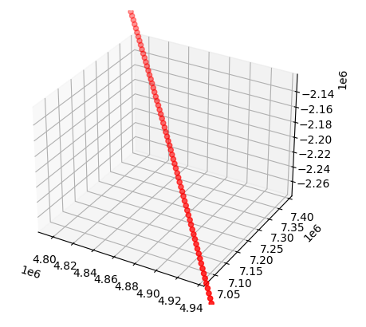
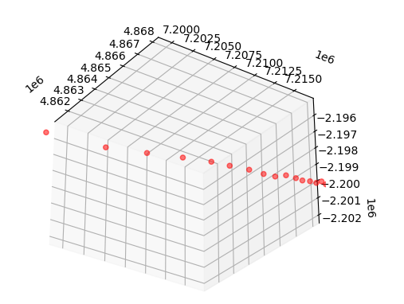
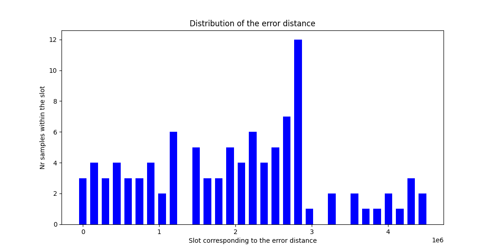

# HACK-A-SAT 2021: Mr. Radar

* **Category:** Guardians of the…
* **Points:** 0 (unsolved in time), 304 otherwise...
* **Solves:** 230
* **Description:**

>Given the radar pulse returns of a satellite, determine its orbital parameters
>(assume two-body dynamics). Each pulse has been provided as:
>
>    t, timestamp (UTC)
>    az, azimuth (degrees) +/- 0.001 deg
>    el, elevation (degrees) +/- 0.001 deg
>    r, range (km) +/- 0.1 km
>
>The radar is located at Kwajalein, 8.7256 deg latitude, 167.715 deg longitude, 35m altitude.
>
>Estimate the satellite's orbit by providing the following parameters:
>
>    a, semi-major axis (km)
>    e, eccentricity (dimensionless)
>    i, inclination (degrees)
>    Ω, RAAN (degrees)
>    ω, argument of perigee (degrees)
>    υ, true anomaly (degrees)
>
>at the time of the final radar pulse, 2021-06-27-00:09:52.000-UTC


## Nota Bene


This was not completed during the challenge, the solution was found after...
Since I had more time to work on this problem afterward, I'm sharing a bit
more than I would have if I had strictly described my solution.


## Requirements


- Having completed `Fiddlin' John Carson`. This is required in order to
know how to generate the Keplerian Elements out of a position vector 
 and
its velocity vector
(ECI).

## Write-up


_Write-up by Solar Wine team_


### About the theory


We are given the `LLA` position of the radar and the horizontal coordinates
of the satellite each seconds `(az,el)` as well as the `range` (distance
to the satellite). We have 100 such samples and from the given positions
we must be able to:

* recover the Keplerian Elements `(a, e, i, Ω, ω)` which are constant
* calculate the `true anomaly` (`υ`) of the last sample which is time dependent.
  This is trivial if you know both the other Keplerian elements and the distance 
  between the center of the earth and the satellite.

How do we complete the first part? The theory states that one can guess 
the orbit based on a couple of position vectors only. In particular:

* `Gibbs’ method of orbit determination from three position vectors`. This
  requires 3 position vectors ,
   and
   and
  outputs . One can then apply the algorithm used in `Fiddlin' John Carson`
  in order to retrieve the Keplerian elements.
* `Lambert’s problem`. This requires only 2 position vectors 
   and
   and
  outputs 
  and . Either of the couple
  can then be used to generate the five constant Keplerian Elements.
* `Solving a non linear equation system` linking the coordinates to the Keplerian Elements.


### Naive application of the methods


Two out of the three methods were implemented (see test_{methods}.py files)
and work well as expected using samples generated out of Julia's Two Body
propagator. However they practically fail with our data.

Plotting the ECI coordinates retrieved using `pymad.aer2eci` API one
may think that the points are perfect.


However this is not the case as stated in the challenge's description and
zooming proves it, revealing obvious position errors.


Therefore applying either of the 3 techniques as-if is not gonna work. In
real life the data is noisy and the `range` is unknown since the samples
are acquired by optical observation. Determining the orbit in such conditions
is known as the Angles-only IOD problem (Initial Orbit Determination) for
which a number of methods exist 
(Laplace, [Gauss](https://en.wikipedia.org/wiki/Gauss%27s_method), 
[double-r](http://www.cjss.ac.cn/CN/10.11728/cjss2014.06.867#1) or 
[Gooding](https://apps.dtic.mil/sti/pdfs/ADA272937.pdf)). All of them have
their own strength and weaknesses and choosing one probably depends
on the samples themselves. For example in [Gooding](https://apps.dtic.mil/sti/pdfs/ADA272937.pdf),
the author observes that Laplace's method performs well when the three 
samples are equally distant in time which is the case in the challenge 
because we have a sample produced every second.

Solving the challenge is likely to be doable very easily using one of 
these methods for which a number of implementations are already available
including in python. However since we are also provided with ranges, we 
have opportunities for experimenting alternate methods as we can easily 
retrieve position vectors in ECI.


### Exploring alternate ideas


#### Tweaking Gibb's


Gibb's method can only work when the 3 position vectors provided are coplanar.
Therefore one of our attempts was to enumerate all the vectors minimizing
the scalar product: 
where the three vectors are the normalized versions of the (almost coplanar) original ones.
Being given the amount of noise mentioned in the challenge's description,
selecting the candidates based on the smallest results makes sense. 

It does not work though! Practically speaking the candidates are far away
from the solution:

```
[...]
Err: 2.08827242187492e-09
Chosen indexes: (5, 30, 80)
Gibbs: {'a': 28066.344373613058, 'e': 0.7509264394472583, 'i': 33.985173335377816, 'OMEGA': 78.01222610160401, 'omega': 272.9571919358383, 'nu': 60.05283768830427}
Err: 1.4877153373633312e-09
Chosen indexes: (10, 60, 78)
Gibbs: {'a': 19813.910741060383, 'e': 0.6565079964778299, 'i': 33.9997541269634, 'OMEGA': 77.99911385340289, 'omega': 266.95570409901075, 'nu': 67.52981283702631}
[...]
```

At the time of writing we already know the solution. Therefore we can 
observe that in each case the method provides terrible candidates (`a` 
should be close to 23000 km for example, `e` close to 0.7, `ω` close to 
270, etc.)


#### A word about the resolution of non linear equations


One can easily generate the ECI coordinates of the points based on the
Keplerian Elements however the opposite is not so trivial because there
is no analytic solution.

One may eventually use this method in the angle-only case, see `test_fsolve.py`
which uses `least_squares` from `scipy.optimize`.

Two observations:

* The initial values of the unknowns were set using the `dR/dt` technique (see below)
* The Jacobian matrix (not always mandatory) was generated using `sage`.

Such an idea is not practical when there is noise so I'm just mentioning
the idea along with code in case of another challenge later.

#### The dR/dt idea

During the final I thought that I could get an idea of what the Keplerian 
parameters could be using a rough estimation of the velocity vectors. Indeed
since we know exactly when the samples were taken then we can compute:

```python
Vx[i] = Rx[i+1]-Rx[i-i]/(t[i+1]-t[i-1]) # dRx/dt
Vy[i] = Ry[i+1]-Ry[i-i]/(t[i+1]-t[i-1]) # dRy/dt
Vz[i] = Rz[i+1]-Rz[i-i]/(t[i+1]-t[i-1]) # dRz/dt
```

Which then provides results such as:
```shell
RES_1 {'a': 23174.37451000072, 'e': 0.7023910819797349, 'i': 33.99952559553115, 'OMEGA': 77.9992422419429, 'omega': 270.01226422080913, 'nu': 61.809839556125176}
RES_1 {'a': 24531.18640299533, 'e': 0.7160419880960976, 'i': 34.01767011078303, 'OMEGA': 77.98110925139868, 'omega': 271.64153929193435, 'nu': 60.24732059269086}
RES_1 {'a': 22549.566892391653, 'e': 0.693113575234027, 'i': 33.61655033141727, 'OMEGA': 78.36868390304653, 'omega': 269.85478093876526, 'nu': 61.76203833172357}
RES_1 {'a': 23330.96731741209, 'e': 0.7037014762256373, 'i': 33.95917612426612, 'OMEGA': 78.03844586669534, 'omega': 270.30501068999484, 'nu': 61.636899064914545}
RES_1 {'a': 21191.225788702228, 'e': 0.6766123848403012, 'i': 34.28108237434424, 'OMEGA': 77.73408679640688, 'omega': 268.6743459665713, 'nu': 63.56968090176843}
RES_1 {'a': 23123.500930602688, 'e': 0.703762154534629, 'i': 34.15599046348085, 'OMEGA': 77.85124001384321, 'omega': 269.34644717937186, 'nu': 62.85001126086443}
RES_1 {'a': 24095.485507537436, 'e': 0.7144660649726506, 'i': 33.62327830579659, 'OMEGA': 78.35858311898943, 'omega': 269.760494027032, 'nu': 62.065653244915616}
RES_1 {'a': 23465.86193415213, 'e': 0.7049705580267742, 'i': 33.98969579849101, 'OMEGA': 78.00966493485491, 'omega': 270.5445988791189, 'nu': 61.62123116246107}
RES_1 {'a': 22682.306158592724, 'e': 0.6950069590075839, 'i': 34.385694377491376, 'OMEGA': 77.63911867750716, 'omega': 270.471329542556, 'nu': 62.051821532567224}
RES_1 {'a': 21534.175781388447, 'e': 0.6817756011240479, 'i': 33.87788835017659, 'OMEGA': 78.1135785541145, 'omega': 268.51571365211447, 'nu': 63.66403871778535}
RES_1 {'a': 23642.471159831708, 'e': 0.7056047467148849, 'i': 33.68953804180887, 'OMEGA': 78.29265017557043, 'omega': 270.98800353770457, 'nu': 61.09277271754643}
RES_1 {'a': 23798.306864850227, 'e': 0.7075506325103335, 'i': 34.28889432096162, 'OMEGA': 77.73154071398083, 'omega': 271.50191252973787, 'nu': 61.09484910609112}
RES_1 {'a': 22936.06171163157, 'e': 0.7013950641807898, 'i': 34.06880569560087, 'OMEGA': 77.9335066915234, 'omega': 269.1927569923355, 'nu': 63.28675508560225}
```

All these orbits are different but clearly all the parameters are within
a specific range. As such using the mean of the parameters one may obtain
an estimation of the expected elements:

```shell
{'e': 0.699988552303596, 'a': 23040.838030745905, 'i': 34.00075549479077, 'omega': 269.99445642468766, 'OMEGA': 78.00035798777579}
```

However validating these parameters (and the corresponding `υ`) does not work
so something has to be improved.


##### Filtering the samples


For each sample we compute the `error distance` which gives us the error
between the coordinates provided and the corresponding set of coordinates
deduced from the equation system. We produce a bar chart for these distances
in order to see if there is some obvious filtering to perform.



There is nothing trivial so we tried different thresholds, cutting off
the samples supposed to be the most noisy from the calculation of the mean.
The results were not conclusive...


##### Improving the stability of the dR/dt


As stated before `dR/dt` was computed for each position using the immediate 
adjacent ones. However thinking about it, this makes it quite vulnerable
to little local variations when the global shape of the curve is ok. As a
result a simple solution to prevent this is to compute 
 from the 
`-d` and `+d̀` samples where d is the distance (the number of samples).

Here are the mean orbits generated using the technique:
```shell
foo@foo-VirtualBox:~/radar$ python3 radar_last.py 
[+] Gen R vectors
[+] Gen V vectors [d=0]
V(d=1) {'e': 0.699988552303596, 'a': 23040.838030745905, 'i': 34.00075549479077, 'omega': 269.99445642468766, 'OMEGA': 78.00035798777579} 66.1754639945974
[+] Gen V vectors [d=1]
V(d=2) {'e': 0.6999798860608811, 'a': 23009.508787529485, 'i': 34.001989364286864, 'omega': 270.0010206095197, 'OMEGA': 77.99738419954544} 66.32840121783514
[+] Gen V vectors [d=2]
V(d=3) {'e': 0.6999669665368206, 'a': 23002.548202616726, 'i': 33.99945407113728, 'omega': 269.9995886981245, 'OMEGA': 77.99962264768438} 66.35851026315859
[+] Gen V vectors [d=3]
V(d=4) {'e': 0.6999513949203399, 'a': 22999.44955692734, 'i': 33.99798022092274, 'omega': 269.9989363487238, 'OMEGA': 78.00093150165843} 66.36847738914042
[+] Gen V vectors [d=4]
V(d=5) {'e': 0.6999010181347656, 'a': 22994.2108514115, 'i': 33.9979187339156, 'omega': 269.9963776989927, 'OMEGA': 78.00092680416759} 66.37691970518685
[+] Gen V vectors [d=5]
V(d=6) {'e': 0.6999588653372849, 'a': 22997.90748453282, 'i': 33.99874172070699, 'omega': 269.99682684852996, 'OMEGA': 78.00031339331156} 66.37876179084175
[+] Gen V vectors [d=6]
```

All the solution for d=2,3,4,5... are valid:

```
What is the satellite's orbit at 2021-06-27 00:09:52 UTC?
   a (km):  23009.508787529485
   e:       0.6999798860608811
   i (deg): 34.001989364286864
   Ω (deg): 77.99738419954544
   ω (deg): 270.0010206095197
   υ (deg): 66.32840121783514

You got it! Here's your flag:
flag{alpha205694golf2:GH1L_95T988ujeZr4Bo1On4Uqb6_OG84kEtih42ZUlEKEX8teuMUn_L_ohmF-G1XRXFyyhENfwFGW7ygQFXe1fE}
```


##### Filtering the dR/dt candidates


Another solution I came up with is a little similar to the coplanar idea
previously described. If we compute two vectors  from samples
`+-d1` and `+-d2` then the two of them should be relatively colinear, more 
specifically the angle 
should be very small. If not then probably there is something wrong with
the current position and it should be dropped.

Practically speaking this works, although it is not as straightforward
as the previous method. It requires some tweaking that could easily be
automatized but would have required a little bruteforce stage:

An example of working parameters is d=3, d=5 and keeping candidates with 
`theta` < 0.2°:

```
What is the satellite's orbit at 2021-06-27 00:09:52 UTC?
   a (km):  22999.245608006047
   e:       0.6999698744301961
   i (deg): 33.998072141410574
   Ω (deg): 78.00120350806587
   ω (deg): 269.9972927142135
   υ (deg): 66.37595655322032

You got it! Here's your flag:
flag{alpha205694golf2:GNhBMzBChCq2ydT4DfM27qffrAB15X1Ke-l1vU1qkiXfLTZ_xkLPa2mgyvy8v621vxRYFVi8C8QDCKI6mX6Q9w4}
```

While the bruteforce might take some time, several candidates are likely
to give the solution.


### A word about the challenge


During the final two things were missing (for me):

* A good `aer2eci` API
* The extension of the `dR/dt` idea using non adjacent samples

The solutions provided are not very elegant but they are enough. What was
expected by the organizers though?

On one hand IOD solutions seems to be the expected method of resolution
but on the other hand the organizers also provided the ranges. Moreover 
performing several tests shows that for example 23100 is still valid for element `a` (despite 
being 100km off). At the same time, `υ` must still be within the (66.3, 66.4)
range which proves that the organizers do not care about the coherency of
the Keplerian Elements (since `υ` depends on `a`). Another way to say it
is that they could have been expecting purely statistical solutions.
