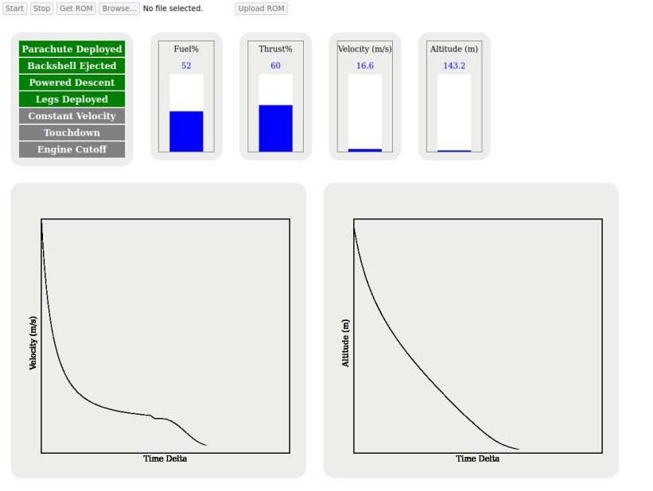
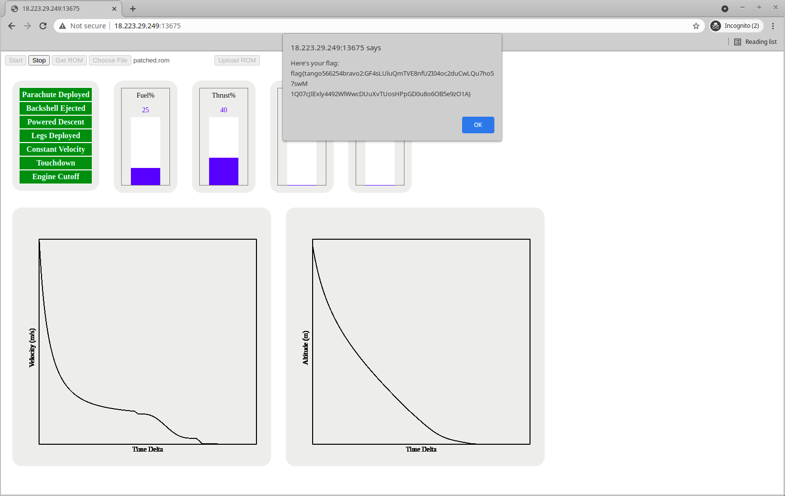

# HACK-A-SAT 2021: Mars or Bust

* **Category:** Rapid Unplanned Disassembly
* **Points:** 146
* **Solves:** 23
* **Description:**

> hope for a soft landing
>
>  Connect to the challenge on:
> living-hazard.satellitesabove.me:5000

When connecting to the TCP server, a single message is displayed:

> Point your browser at http://18.225.11.216:28555

On this web page, an alert pops up:

> You are an engineer supporting the Mars Polar Lander.  The latest simulation
> data shows that the lander is going to crash on landing. Unfortunately, the
> lander launched 8 months ago and is close to the Red Planet already so there's
> not much time to reprogram the flight software. There is a small MIPS
> processor that controls the landing sequence that can be reprogrammed before
> its too late.
>
> Use the simulator to figure out the problem, binary patch the controller
> firmware and resimulate for a successful landing to get your flag.

On this page, it is possible to download a file, `bad.rom`, and to launch a simulation:



## Write-up

_Write-up by Solar Wine team_

The web page mainly connects to a simulator service through WebSocket and displays messages in a nice interface:

```javascript
var url = window.location.href;
var websocket_addr = "ws://" + url.split('/')[2];
let socket = new WebSocket(websocket_addr);

socket.onmessage = function(event) {
  var message = JSON.parse(event.data);

  switch(message['type']) {
    case 'data':
        position = parseFloat(message['altitude']);
        velocity = parseFloat(message['velocity']);
        fuel = parseInt(message['fuel%']);
        thrust = parseInt(message['thrust%']);
        state = parseInt(message['spacecraft_state'], 16);
        delta_time = parseFloat(message['sim_time_delta']);

        touchdown = (state >> 12) & 3;
        parachute = (state >> 10) & 3;
        legs_deployed = (state >> 8) & 3;
        backshell_ejected = (state >> 6) & 3;
        constant_velocity = (state >>4 ) & 3;
        engine_cutoff = (state >> 2) & 3;
        powered_descent = state & 3;

        document.getElementById("legs_deployed").className = indicator_statuses[legs_deployed];
        document.getElementById("backshell").className = indicator_statuses[backshell_ejected];
        document.getElementById("powered_descent").className = indicator_statuses[powered_descent];
        document.getElementById("constant_velocity").className = indicator_statuses[constant_velocity];
        document.getElementById("touchdown").className = indicator_statuses[touchdown];
        document.getElementById("engine_cutoff").className = indicator_statuses[engine_cutoff];

        velocity_chart.add_datapoint(delta_time, Math.abs(velocity));
        velocity_chart.draw_graph();

        altitude_chart.add_datapoint(delta_time, position);
        altitude_chart.draw_graph();

        fuel_bar.update_value(fuel);
        thrust_bar.update_value(thrust);

        altitude_bar.update_value(position.toFixed(1));
        velocity_bar.update_value(Math.abs(velocity.toFixed(1)));

        break;

    case 'result':
        alert(message['message']);
        enableControls();
        break;
  }
};
```

The web page extracts some data from the received `state`, and is otherwise not very interesting.

### The ROM file

What does the provided ROM file contain?
`bad.rom` contains code in 32-bit Little Endian MIPS (also known as "mips32el").
A first analysis pass enables getting how the code is loaded: the ROM code is loaded at `0xbfc00000`, some data is copied to `0xa0180000` (which is the `.data` segment, and the stack pointer is initialized to `0xa00ffffc`).
This looks like the same mapping as the Launch Link challenge from last year's qualifications ([write-up](https://github.com/solar-wine/writeups/blob/master/Payload%20Modules/LaunchLink/launch_link.md)):

```text
0xa0000000...0xa01fffff: RAM (2MB)
  0xa0000000...0xa00fffff: stack (sp initialized to the end of this zone)
  0xa0100000...0xa017ffff: heap (unused here)
  0xa0180000...0xa018059f: initialized data, from challenge.rom[0x8ef8:0x9c8c]
  0xa01805a0...0xa01fffff: uninitialized data (".bss")
0xa1010000             : Clock device
0xa2000000             : SPIM-compatible console device
0xbfc00000...0xbfc0649c: EEPROM (bad.rom)
```

With the 32-bit MIPS architecture, the virtual address space is divided in segments and all these addresses belong to the `kseg1` segment which is documented as "kernel unmapped uncacheable" (see [here](https://devel.rtems.org/browser/rtems/c/src/lib/libbsp/mips/genmongoosev/README?rev=62791499ebf0a6161e1541eb7587c57d88407f8b)): it is directly the physical memory.
The devices are documented in [vmips's documentation](http://www.dgate.org/vmips/doc/vmips.html#Devices): the console provides two "keyboards" (input devices) and "displays" (output devices), and the clock provides real time and simulated time.

* The debug messages are wired to "Display 1 data" (at `0xa200000c`)
* Incoming packets are received from "Keyboard 2 data" (at `0xa2000014`)
* Outgoing packets are transmitted to "Display 2 data" (at `0xa200001c`)

The ROM starts with a usual jump, followed by an interrupt handler at `0xbfc00180`:

```text
    reset_handler:
bfc00000 00 01 f0 0b     j          start   ; jump to address 0xbfc00400
bfc00004 00 00 00 00     _nop
...
    interrupt_handler:
bfc00180 00 70 1b 40     mfc0       k1,EPC  ; read Exception Program Counter
bfc00184 00 00 00 00     nop
...
    start:
bfc00400 25 08 00 00     or         at,zero,zero
bfc00404 25 10 00 00     or         v0,zero,zero
bfc00408 25 18 00 00     or         v1,zero,zero
...
```

In VMIPS documentation for a SPIM-compatible console, the interrupt lines are wired as follows ("Cause bit" refers to bits in the `Cause` register, a special register read using instruction `mfc0 k0,Cause`):

```text
Interrupt line 2 (Cause bit 0x0400) is wired to the Clock
Interrupt line 3 (Cause bit 0x0800) is wired to the #1 Keyboard
Interrupt line 4 (Cause bit 0x1000) is wired to the #1 Display
Interrupt line 5 (Cause bit 0x2000) is wired to the #2 Keyboard
Interrupt line 6 (Cause bit 0x4000) is wired to the #2 Display
```

In `bad.rom`, the Cause bits are used differently in the interrupt handler:

```c
if (Cause & 0x007c) break(0); // halt because an exception was received
if (Cause & 0x1000) receive_from(0xa2000014); // Read Keyboard 2 data
if (Cause & 0x2000) transmit_to(0xa200001c); // Write Display 2 data
if (Cause & 0x8000) *0xa101000c = 3; // set simulated time clock
```

### The main function

Now that the hardware is a little bit clearer, the main function of the ROM can be analyzed.
It is actually quite simple: the program can be in 5 states and runs a loop where some data are first received (from "Keyboard 2"), then processed according to the state, and then some data are transmitted (to "Display 2").

After some analysis, it appears that the input data contains 6 bytes, prefixed by bytes `a5 41 41 41... 5a`:

* The bytes at offsets 0 and 1 contains the current velocity (16-bit big endian signed integer in meters per second)
* The bytes at offsets 2 and 3 contains the current altitude (16-bit big endian signed integer in meters)
* At offset 5 there are 5 bitfields, which could be sensor measurements.

The transmitted data consists in 3 bytes: `5a`, some bits (probably used to trigger switches) and the requests thrust (in percent).

Here is the state machine which is implemented:

* When `state == 0`, the program does not do anything.
  According to the simulator web page, this matches the first phase when the parachute is deployed and the velocity decreases rapidly.
  Once the velocity reaches below 81 m/s (in absolute value), `state` is set to 1.
* When `state == 1`, the programs sets two bits in the transmitted data and set the thrust to 80%.
  This supposedly enables the engine ("Powered Descent") and ejects the backshell ("Backshell Ejected", in the simulator).
  Once bit 4 of the received data is set (probably to acknowledge something?), `state` is set to 2.
* When `state == 2`, a [PID Controller](https://en.wikipedia.org/wiki/PID_controller) is configured to regulate the descent.
  The parameters are located at RAM address `0xa0180560...0xa018056b` (ROM offset `0x645c...0x6467`) and are `P = 0.6, I = 0.005, D = 0.1`.
  Then `state` is always set to 3.
* When `state == 3`, the PID runs in order to regulate the thrust.
  When the altitude reaches below 40 meters, `state` is set to 4.
* When `state == 4`, the thrust is adjusted to maintain a -2.4 m/s speed: if the speed is lower (= faster), the thrust is set to 100% and if it is higher (= slower), it is set to 40%.
  This is the last step of the descent.

Moreover, if bit 3 of the received data is set and one of the first 3 bits (bit 0, bit 1 or bit 2) were set in the past, an unknown bit is set in the transmitted data.

While analyzing the code in Ghidra, the decompiled output seemed to contain strange constant values.
In fact there was a bug in Ghidra's decompiler for 32-bit Little Endian MIPS architecture which disturbed constant `double` values used by the ROM.
We reported this issue and proposed a fix to Ghidra's developers, in <https://github.com/NationalSecurityAgency/ghidra/pull/3212>.

When launching `bad.rom` in the simulator, the lander crashes on Mars.
How could the ROM be patched in order to make the lander lands successfully?

### Patching the firmware

Several modifications were tried to patch the firmware:

* The parameters of the PID Controller were modified in order to make the lander lands more smoothly.
* The altitude threshold (40 meters) and the target velocity (-2.4 m/s) of the last states were modified.
  For example when setting them to 1 meter and -0.5 m/s, "Touchdown" becomes green but this "Engine Cutoff" becomes red, so it is a failure.

After multiple tries, we guessed that the "unknown bit" which was set in the end is the "Engine Cutoff" and we modified the code of the ROM to set it when the velocity becomes higher than 0 m/s (which would mean that the launcher was about to thrust too much).
Also the target velocity of the `state == 4` was changed to -1 m/s, by patching the 8 bytes located at offset `0x6474` to `00 00 00 00 00 00 f0 bf`.
And this worked :)

The MIPS code which was inserted is:

```text
; Replace a complex check by code running at offset 0x10
bfc05cf8  c5 e8 00 10     b          LAB_bfc00010

bfc00010  34 00 c2 c7     lwc1       f2,0x34(s8)
bfc00014  00 00 00 00     nop
bfc00018  00 00 00 00     nop
bfc0001c  00 00 00 00     nop
bfc00020  18 a0 02 3c     lui        v0,0xa018
bfc00024  00 00 00 00     nop
bfc00028  90 05 40 c4     lwc1       f0,offset DAT_a0180590(v0)
bfc0002c  00 00 00 00     nop
bfc00030  3e 00 02 46     c.le.S     f0,f2
bfc00034  00 00 00 00     nop
bfc00038  03 00 00 45     bc1f       LAB_bfc00048
bfc0003c  00 00 00 00     _nop

; If velocity >= *(float*)0xa0180590, set the unknown bit
bfc00040  01 00 02 24     li         v0,0x1
bfc00044  2a 00 c2 a3     sb         v0,0x2a(s8)

; Go back to the main code
bfc00048 35 17 00 10     b          LAB_bfc05d20
bfc0004c 00 00 00 00     _nop
```

The hexadecimal diff of the firmware is:

```diff
--- bad.rom.hex
+++ patched.rom.hex
@@ -1,8 +1,8 @@
 00000000: 0001 f00b 0000 0000 0000 0000 0000 0000  ................
-00000010: 0000 0000 0000 0000 0000 0000 0000 0000  ................
-00000020: 0000 0000 0000 0000 0000 0000 0000 0000  ................
-00000030: 0000 0000 0000 0000 0000 0000 0000 0000  ................
-00000040: 0000 0000 0000 0000 0000 0000 0000 0000  ................
+00000010: 3400 c2c7 0000 0000 0000 0000 0000 0000  4...............
+00000020: 18a0 023c 0000 0000 9005 40c4 0000 0000  ...<......@.....
+00000030: 3e00 0246 0000 0000 0300 0045 0000 0000  >..F.......E....
+00000040: 0100 0224 2a00 c2a3 3517 0010 0000 0000  ...$*...5.......
 00000050: 0000 0000 0000 0000 0000 0000 0000 0000  ................
 00000060: 0000 0000 0000 0000 0000 0000 0000 0000  ................
 00000070: 0000 0000 0000 0000 0000 0000 0000 0000  ................
@@ -1485,7 +1485,7 @@
 00005cc0: 0300 4010 0000 0000 0100 0224 2600 c2a3  ..@........$&...
 00005cd0: 2200 c293 0000 0000 0700 4010 0000 0000  ".........@.....
 00005ce0: 2500 c293 0000 0000 0300 4010 0000 0000  %.........@.....
-00005cf0: 0100 0224 2600 c2a3 2700 c293 0000 0000  ...$&...'.......
+00005cf0: 0100 0224 2600 c2a3 c5e8 0010 0000 0000  ...$&...........
 00005d00: 0700 4010 0000 0000 2600 c293 0000 0000  ..@.....&.......
 00005d10: 0300 4010 0000 0000 0100 0224 2a00 c2a3  ..@........$*...
 00005d20: 5a00 0224 8014 c2a3 2900 c293 0000 0000  Z..$....).......
@@ -1605,6 +1605,6 @@
 00006440: ffff ef7f 0000 0000 0000 0000 7374 6172  ............star
 00006450: 7469 6e67 2075 700a 0000 0000 cdcc cc3d  ting up........=
 00006460: 0ad7 a33b 9a99 193f 0000 2042 0000 00c1  ...;...?.. B....
-00006470: 0000 0000 3333 3333 3333 03c0 feff ffff  ....333333......
+00006470: 0000 0000 0000 0000 0000 f0bf feff ffff  ................
 00006480: 0000 0000 0000 0000 0000 0000 0000 0000  ................
 00006490: 0000 0000 0000 0000 0000 0000            ............
```


