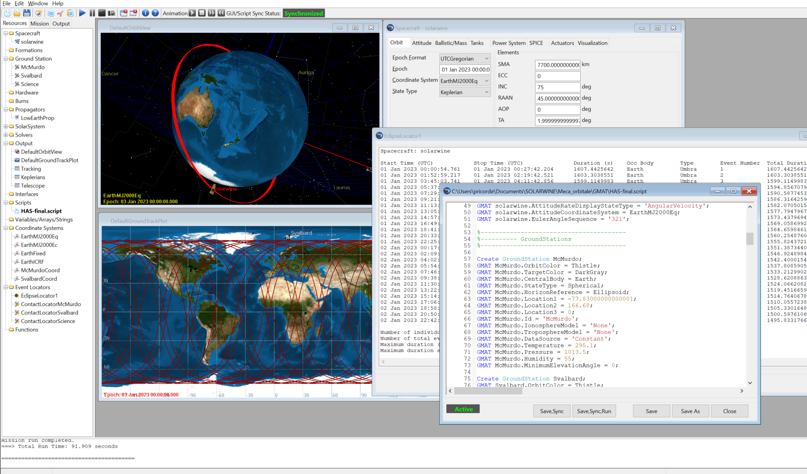

# HACK-A-SAT 3: Antenna Pointing

* **Category:** SLA
* **Points:** N/A
* **Description:**

Keep the satellite connection with the ground stations as much as possible.

## Alternate using GMAT

_Write-up by Solar Wine team_

GMAT (General Mission Analysis Tool) is a software developed by NASA. It can be used to perform orbit propagation and orbit determination. It has a GUI that helps to configure the mission and viewing the simulation results. It was used as an alternate orbit calculation method to verify the results obtained with SGP4.

### Satellite orbit
A new spacecraft is created in GMAT, using the Keplerian elements given by the organizers. This translates into the following parameters in GMAT:
- Epoch Format: UTCGregorian
- Epoch: 01 Jan 2023 00:00:00
- Coordinate System: EarthMJ2000Eq
- State Type: Keplerian

The elements are:
- SMA: 7700 km
- ECC: 0
- INC: 75 deg
- RAAN: 45 deg
- AOP: 0 deg
- TA: 2 deg (for the solarwine satellite)

Satellite mass and drag are left to default values, but this could be improved by using the mass given in the rules, and estimating the drag area.
### Propagator
The default propagator is modified in a similar way as the "Simulating an Orbit" tutorial of GMAT:
- The gravity model is JGM-2 of degree 10 and order 10
- The atmosphere model is JacchiaRoberts
- The following point masses are added: Luna and Sun
- No solar radiation pressure model was used, because of the uncertainties on the surface and reflectivity of the satellite

We will use this propagator to dump satellite positions at a regular time step. This step size is set in the "Max Step Size" field of the integrator. We set this value to 10 seconds.
Note that in order to point the telescope of our satellite toward a planet, we will need to know the position of the planet in space. In order to have this position updated at each step, it is necessary to add the planet into the point masses list (if you don't add the planet to the list, it will not move in space).
### Ground stations
Ground stations are created using the following parameters :
- Min. Elevation: 0 deg, except for the science station which has a 5 deg minimum elevation
- Central Body: Earth
- State Type: Spherical
- Horizon Reference: Ellipsoid
- Latitude: as indicated by the organizers
- Longitude: as indicated by the organizers, in the range 0..360
- Altitude: 0 km (as specified by the organizers)
### Coordinate Systems
In order to be able to generate satellite positions relative to ground stations, we need to define coordinates systems for each ground station. These coordinate systems are created with the following parameters, for each ground station :
- Origin: *ground station name*
- Axes type: Topocentric
### Event Locators
Event locators can be used to easily compute eclipse events and ground station contact events.
For eclipse, we use an Eclipse Locator with the following settings:
- Spacecraft: our spacecraft
- Occulting Bodies: Earth and Luna
- Eclipse types: Umbra

For ground station contact, we just have to select the corresponding Spacecraft and Observer, and use an appropriate output filename.
### Output Report Files
Output report files will allow us to dump trajectory positions into text files, ready for post-processing. Different datasets can be generated depending on our needs.
For example, to generate a ground station tracking data, we will need to create an output report file with the spacecraft cartesian coordinates in the ground station reference frame, with following fields:
- *spacecraft*.UTCGregorian
- *spacecraft*.*ground station coordinate*.X
- *spacecraft*.*ground station coordinate*.Y
- *spacecraft*.*ground station coordinate*.Z

If we want to generate data to point the satellite telescope, we will need to know the relative coordinates of the sun and the targeted planet in an earth centered reference frame (we neglect the satellite orbit parallax). Note that the targeted planet must be added to the list of point masses in the propagator. The report file will have the following fields:
- *spacecraft*.UTCGregorian
- Sun.EarthMJ2000Eq.X
- Sun.EarthMJ2000Eq.X
- Sun.EarthMJ2000Eq.X
- *planet*.EarthMJ2000Eq.X
- *planet*.EarthMJ2000Eq.X
- *planet*.EarthMJ2000Eq.X

Depending on the needs, it is also possible to generate report files with Keplerian or Cartesian state parameters. I could also be possible to generate data suitable to compute the doppler from any ground station.
### Mission
The mission sequence is set in the "Mission" tab of GMAT. We use our propagator on our spacecraft. As a stopping condition, we use the parameter *spacecraft*.ElapsedSecs with the condition 172800 which will do for 48 hours of simulation (we could use less, since the total game duration is 23h03, or 82980 seconds)
### Running the simulation
Once everything is set, we can launch the simulation and see the satellite turning around earth. Once it is done, the Events and Reports files are generated, and we are ready for post-processing
### Post processing
The generated text files are post-processed to translate the game time into the local time, and to perform geometrical computations. This post processing was made with a C program, and the results are written into CSV files.
#### Time translation
Game time started at 01/01/2023 00:00:00 UTC. The real time started at 22/10/2022 15:00:00 UTC (17:00:00 CET). Time difference between the two is -6076800 seconds (CET time). Using UTC to do this computation helps a lot, since there is an hour of difference in DST time! Fortunately, we had anticipated the need to compute the time difference and our Grafana displayed this difference. This was very useful for the second part of the game, which started 17 minutes and 46 seconds late after and 8 hour break. So for the second part of the game the time difference was reduced by 08:17:46, with the total time difference being -6046934 seconds (CET time).
#### Geometrical computations
In order to compute azimuth and elevation at the ground stations, we need to process the X, Y, Z cartesian coordinates given by GMAT, with the following code :

    d=sqrt(X*X+Y*Y+Z*Z);
    el=asin(Z/d)*180.0/PI;
    az=atan2(X, Y)*180.0/PI;
    if (az<0.0) az+=360.0;
### Further use and other possibilities
The post-processed CSV files can be ingested into a python script that controls the ground station antennas.
GMAT is also quite flexible: the mission is saved into a script text file that can also be processed by GMAT without the GUI. Because of the large number of ground stations and satellites in the game, time consuming manual tasks could have been automated using a GMAT script generator that calls GMAT automatically and post-process its results.
