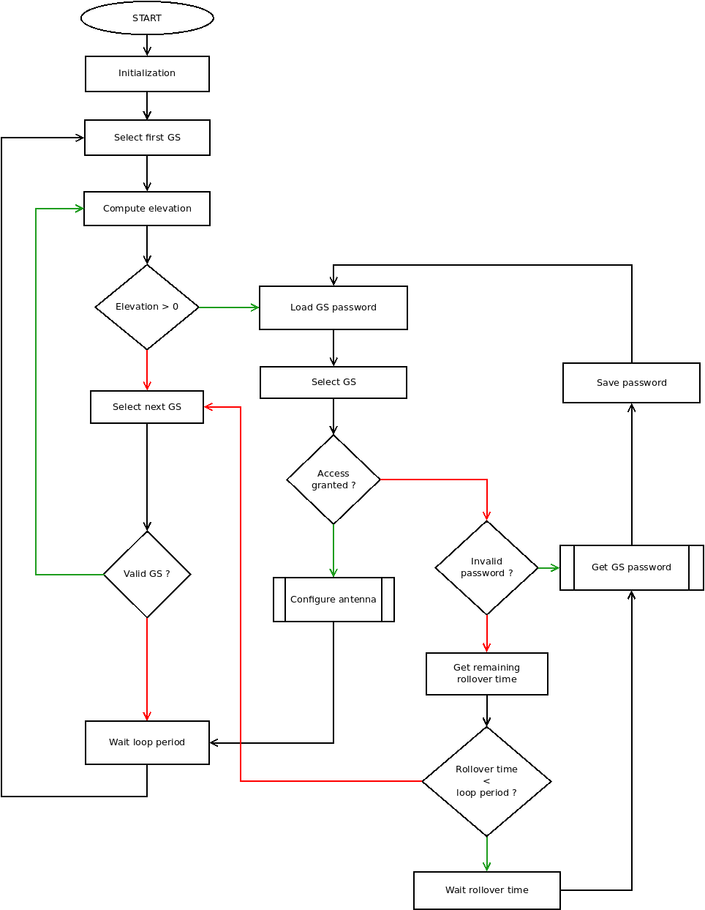
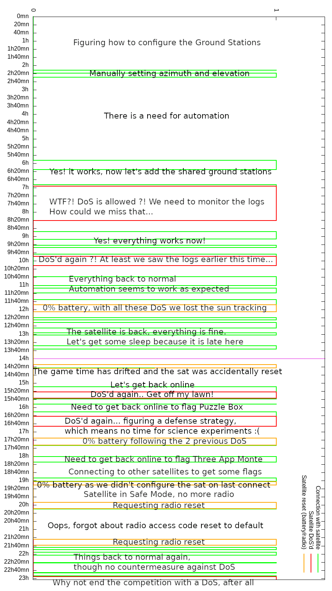

# HACK-A-SAT 3: Antenna Pointing

* **Category:** SLA
* **Points:** N/A
* **Description:**

Keep the satellite connection with the ground stations as much as possible.

## Write-up

_Write-up by Solar Wine team_

### Satellite propagator

Prior to the start of the game, we were given the orbital elements for our satellite. Every team had the same orbital elements except for the true anomaly which was separated by 2° for each satellite:

| Parameter        | Value                     |
| ---------------- | ------------------------- |
| semi-major axis  | $a=7700$ km               |
| eccentricity     | 0                         |
| RAAN[^RAAN]      | 45°                       |
| inclination      | 75.0°                     |
| argument of periapsis | 0°                         |
| true anomaly     | $f=14.0^{\circ}-(N-1)\times2.0^{\circ}$ |
|                  | with $N=7$ for Solar Wine |

[^RAAN]: Right Ascension of the Ascending Node

We chose the SGP4 perturbation model for the propagation. Because we were missing some parameters to compute all the inputs, we considered a constant mean motion (such that the first and second derivative were zero) and a null coefficient of drag (such that the B\* coefficient was zero).

Because the SGP4 model use the mean anomaly rather than the true anomaly and
the mean motion rather than the semi-major axis, we had to convert these two values.
With a null eccentricity, the conversion from true anomaly $f$ to mean anomaly $M$ is simplified to:

$$ M = \mathrm{atan2}(\sin f, \cos f) $$

The conversion from semi-major axis $a$ to mean motion $n$ is:

$$ n = \sqrt{\frac{μ_{earth}}{a^3}} $$

with $μ_{earth}$ being the standard gravitational parameter for Earth.

Finally, because the reference epoch for the SGP4 model is `1949-31-12T00:00:00`, the current date had to be converted to the number of days since that epoch.

The following code provides us with a [`Skyfield`](https://rhodesmill.org/skyfield/)
EarthSatellite object whose epoch is `2023-01-01T00:00:00`:

```python
from sgp4.api import Satrec, WGS84
from skyfield.api import load, EarthSatellite

earth_mu = 398600.436e9
a = 7700e3
e = 0
raan = math.pi / 4
i = (75 * math.pi) / 180
aop = 0
f = ((14.0-6*2) * math.pi) / 180
M = math.atan2(math.sin(f), math.cos(f))
n = math.sqrt(earth_mu / a**3) * 60
epoch0 = datetime(1949, 12, 31, tzinfo=UTC)
epochS = datetime(2023, 1, 1, tzinfo=UTC)
epoch = (epochS - epoch0).total_seconds() / 86400.0

sat = Satrec()
sat.sgp4init(WGS84, "i", 1, epoch, 0.0, 0.0, 0.0, e, aop, i, M, n, raan)
ts = load.timescale()
esat = EarthSatellite.from_satrec(sat, ts)
```

### Satellite position from Ground Stations

At the start of the game, we were provided with a number of Ground Stations:

| Groundstation | Latitude | Longitude | Beam | Type |
| -----| --- | --- | --- | ---|
| spacebits_svalbard | 78.23 | 15.37 | 10.0 | specificuser  |
| organizers_svalbard | 78.23 | 15.38 | 10.0 | specificuser  |
| perfectblue_svalbard | 78.23 | 15.39 | 10.0 | specificuser  |
| samurai_svalbard | 78.23 | 15.4 | 10.0 | specificuser  |
| poland_svalbard | 78.23 | 15.41 | 10.0 | specificuser  |
| singleevent_svalbard | 78.23 | 15.42 | 10.0 | specificuser  |
| solarwine_svalbard | 78.23 | 15.43 | 10.0 | specificuser  |
| weltalles_svalbard | 78.23 | 15.44 | 10.0 | specificuser  |
| spacebits_mcmurdo | -77.83 | 166.68 | 10.0 | specificuser  |
| organizers_mcmurdo | -77.83 | 166.69 | 10.0 | specificuser  |
| perfectblue_mcmurdo | -77.83 | 166.7 | 10.0 | specificuser  |
| samurai_mcmurdo | -77.83 | 166.71 | 10.0 | specificuser  |
| poland_mcmurdo | -77.83 | 166.72 | 10.0 | specificuser  |
| singleevent_mcmurdo | -77.83 | 166.73 | 10.0 | specificuser  |
| solarwine_mcmurdo | -77.83 | 166.74 | 10.0 | specificuser  |
| weltalles_mcmurdo | -77.83 | 166.75 | 10.0 | specificuser  |
| science-station | -82.4131 | 164.601 | 85.0 | specificuser  |
| LosAngeles | 34.0522 | -118.244 | 10.0 | rolling_password  |
| Guam | 13.4443 | 144.794 | 10.0 | rolling_password  |
| Mingenew | -29.1902 | 115.442 | 10.0 | rolling_password  |
| Mauritius | -20.3484 | 57.5522 | 10.0 | rolling_password  |
| Cordoba | -31.4201 | -64.1888 | 10.0 | rolling_password  |
| Melbourne | 28.0836 | -80.6081 | 10.0 | rolling_password  |
| Hawaii | 19.0136 | -155.663 | 10.0 | rolling_password  |
| Tokyo | 35.6762 | 139.65 | 10.0 | rolling_password  |
| Kathmandu | 27.7172 | 85.324 | 10.0 | rolling_password  |
| Maspalomas | 27.7606 | -15.586 | 10.0 | rolling_password  |

Based on these locations, we were able to compute the elevation and azimuth for our satellite at any given time:

```python
el, az, _ = (esat - gs_pos).at(ts.from_datetime(game_time)).altaz()
```

The elevation is in the range `[-90°, 90°]` while the azimuth is in the range `[0°, 360°)`. The satellite can be reached from the ground station when the elevation angle is positive or null.

### Game time vs current time

Because the Game time was different from the current time, we had to adjust the date given to the `at()` method of our satellite object. We defined two start times, one for each day of the competition.

On the first day, the competition started at `2022-10-22T15:00:00`. On the second day, the game was a little late and started at `2022-10-23T13:17:46`. Because the game had already progressed by 14 hours, this gives an equivalent start date of `2022-10-22T23:17:46`.

Since the script was launched from a computer configured in `UTC+2`, synchronized with an NTP server, the following two start times were defined:

```python
day1start = datetime(2022, 10, 22, 17)
day2start = datetime(2022, 10, 23, 1, 17, 46)
```

In order to convert the current time to the Game time, we need to subtract the start time to the current time,
then add the Game time epoch:

```python
cur_time = datetime.now()
delta = cur_time - day2start # day1start
game_time = epochS + delta
game_time = game_time.replace(tzinfo=UTC)
```

Another way of getting the Game time would have been to extract it from the timestamp provided in packets we receive from the Ground Stations. This method was actually used manually to estimate the 17mn46s delta from the theoretical start time for Day 2.


### Tracking the satellite

Two Ground Stations were assigned to our team while 10 others were shared among all the participating teams.

For the shared Ground Stations, a password had to be obtained, for some stations it was rather slow while for others it was rather straightforward.

In order to maximize the time during which we could control the satellite, we sorted the list of Ground Stations so that the one assigned to us were tested first. If none of these stations were in the line of sight, we then tried the other Ground Stations. For the shared ground stations, in order to be able to take them from other teams, we needed to check the time at which the password would be updated so that we could retrieve it and send it to the Ground Station.

The following flowchart was implemented to track the satellite and point Ground Stations antenna to our satellite.



#### Configure antenna

The configure antenna script was used to both configure the radio parameters and enabling the telemetry.

First the station needs to be selected, then the radio can be configured with an option to change the current radio access code. When changing the access code, the TX antenna of the Ground Station is configured with the old code while the RX antenna is configured with the new one, so it would have been possible to check we were correctly receiving data with the new access code. Finally, the TX antenna was configured with the new access code. Because of a lack of feedback check before configuring the TX antenna with the new code, we had to manually revert to the old code when not receiving any data from the satellite following a code change:
```python
def setup_station(station, password, oldcode, newcode):
    print(f"[+] Steering antenna through cosmos API {ARGS.COSMOS_API_URI}")
    print(f"[+] 1. Select ground station {station}")
    r = api_request(
        {
            "jsonrpc": "2.0",
            "method": "cmd",
            "params": ["GS", "SELECT_STATION", {"OPCODE": 1, "STATION_NAME": station}],
            "id": 11,
            "keyword_params": {"scope": "DEFAULT"},
        }
    )
    assert r.status_code == 200, r.status_code

    print(f"[+] 2. Request access to ground station {station}")
    payload = json.dumps({"password": password})
    r = api_request(
        {
            "jsonrpc": "2.0",
            "method": "cmd",
            "params": [
                "GS",
                "ACCESS_REQUEST",
                {"OPCODE": 2, "STATION_NAME": station, "PAYLOAD": payload},
            ],
            "id": 7,
            "keyword_params": {"scope": "DEFAULT"},
        },
    )
    assert r.status_code == 200, r.status_code

    print(f"[+] 3. Set ground station RX with access code", newcode)
    r = api_request(
        {
            "jsonrpc": "2.0",
            "method": "cmd",
            "params": [
                "GS",
                "SET_STATION_RX_CONFIG",
                {
                    "OPCODE": 5,
                    "CHANNEL": 7,
                    "CONSTELLATION": "BPSK",
                    "SAMPLE_PER_SYMBOL": 12,
                    "FEC_REPEAT": 4,
                    "ACCESS_BYTES": newcode,
                },
            ],
            "id": 9,
            "keyword_params": {"scope": "DEFAULT"},
        },
    )
    assert r.status_code == 200, r.status_code

    print(f"[+] 4. Set ground station TX with old code", oldcode)
    r = api_request(
        {
            "jsonrpc": "2.0",
            "method": "cmd",
            "params": [
                "GS",
                "SET_STATION_TX_CONFIG",
                {
                    "OPCODE": 4,
                    "CHANNEL": 7,
                    "CONSTELLATION": "BPSK",
                    "SAMPLE_PER_SYMBOL": 12,
                    "FEC_REPEAT": 4,
                    "ACCESS_BYTES": oldcode,
                },
            ],
            "id": 12,
            "keyword_params": {"scope": "DEFAULT"},
        },
    )
    assert r.status_code == 200, r.status_code

    if newcode != oldcode:
        print(f"[+] 5. Set sat radio with new code", newcode)
        r = api_request(
            {
                "jsonrpc":"2.0",
                "method":"get_cmd_hazardous",
                "params":[
                    "RADIO",
                    "UPDATE_RADIO_CONFIG",
                    {
                        "CCSDS_STREAMID":6547,
                        "CCSDS_SEQUENCE":49152,
                        "CCSDS_LENGTH":22,
                        "CCSDS_FUNCCODE":3,
                        "CCSDS_CHECKSUM":0,
                        "ACCESS_BYTES":newcode,
                        "FREQUENCY":0,
                        "SAMPLE_PER_SYMBOL":12,
                        "CONSTELLATION":0,
                        "PASSWORD":radio_password
                    }
                ],
                "id":8,
                "keyword_params":
                {
                    "scope":"DEFAULT"
                }
            }
        )
        assert r.status_code == 200, r.status_code

        print(f"[+] 6. Set ground station TX with new code", newcode)
        r = api_request(
            {
                "jsonrpc": "2.0",
                "method": "cmd",
                "params": [
                    "GS",
                    "SET_STATION_TX_CONFIG",
                    {
                        "OPCODE": 4,
                        "CHANNEL": 7,
                        "CONSTELLATION": "BPSK",
                        "SAMPLE_PER_SYMBOL": 12,
                        "FEC_REPEAT": 4,
                        "ACCESS_BYTES": newcode,
                    },
                ],
                "id": 12,
                "keyword_params": {"scope": "DEFAULT"},
            },
        )
        assert r.status_code == 200, r.status_code
```
Then the antenna can be steered:
```python
def steer_antenna(station: str, az: float, el: float):
    print(f"[+] 5. Steer station to {az=} {el=}")
    r = api_request(
        {
            "jsonrpc": "2.0",
            "method": "cmd",
            "params": [
                "GS",
                "STEER_ANTENNA",
                {"OPCODE": 3, "AZIMUTH": az, "ELEVATION": el},
            ],
            "id": 15,
            "keyword_params": {"scope": "DEFAULT"},
        }
    )
    assert r.status_code == 200, r.status_code

    print(f"[+] 6. Activate TLM")
    r = api_request(
        {
            "jsonrpc": "2.0",
            "method": "cmd",
            "params": [
                "KIT_TO",
                "ENABLE_TELEMETRY",
                {
                    "CCSDS_STREAMID": 6272,
                    "CCSDS_SEQUENCE": 49152,
                    "CCSDS_LENGTH": 17,
                    "CCSDS_FUNCCODE": 5,
                    "CCSDS_CHECKSUM": 0,
                    "IP_ADDR": "192.168.3.1",
                },
            ],
            "id": 18,
            "keyword_params": {"scope": "DEFAULT"},
        }
    )
    assert r.status_code == 200, r.status_code
    print(f"[+] 7. Send SAFE PING")
    r = api_request(
        {
            "jsonrpc": "2.0",
            "method": "cmd",
            "params": [
                "SAFE",
                "PING",
                {
                    "CCSDS_STREAMID": 6548,
                    "CCSDS_SEQUENCE": 49152,
                    "CCSDS_LENGTH": 2,
                    "CCSDS_FUNCCODE": 2,
                    "CCSDS_CHECKSUM": 0,
                    "DATA": 0,
                },
            ],
            "id": 51,
            "keyword_params": {"scope": "DEFAULT"},
        }
    )
    assert r.status_code == 200, r.status_code
```

It could also configure the PID and tracking control of the ADCS in order to follow the sun. Although, the PID parameters were less than optimal:
```python
def follow_the_sun():
    print(
        f"[+] Setting ADCS mode to quaternion, MEMS only (sufficient to follow the sun)"
    )
    r = api_request(
        {
            "jsonrpc": "2.0",
            "method": "cmd",
            "params": [
                "ADCS",
                "ALGO_SELECT",
                {
                    "CCSDS_STREAMID": 6544,
                    "CCSDS_SEQUENCE": 49152,
                    "CCSDS_LENGTH": 3,
                    "CCSDS_FUNCCODE": 2,
                    "CCSDS_CHECKSUM": 0,
                    "EST_ALGO": 1,
                    "CTRL_ALGO": 1,
                },
            ],
            "id": 21,
            "keyword_params": {"scope": "DEFAULT"},
        }
    )
    assert r.status_code == 200, r.status_code
    print(f"[+] Setting ADCS Q tracking gains")
    r = api_request(
        {
            "jsonrpc": "2.0",
            "method": "cmd",
            "params": [
                "ADCS",
                "SET_Q_TRACKING_GAIN",
                {
                    "CCSDS_STREAMID": 6544,
                    "CCSDS_SEQUENCE": 49152,
                    "CCSDS_LENGTH": 57,
                    "CCSDS_FUNCCODE": 5,
                    "CCSDS_CHECKSUM": 0,
                    "P_A": 0.05,
                    "I_A": 0.01,
                    "D_A": 0,
                    "P_W": 0.05,
                    "I_W": 0.01,
                    "D_W": 0,
                    "W_LIMIT": 0
                },
            ],
            "id": 5,
            "keyword_params": {"scope": "DEFAULT"},
        }
    )
    assert r.status_code == 200, r.status_code
    print(f"[+] Setting ADCS target quaternion")
    r = api_request(
        {
            "jsonrpc": "2.0",
            "method": "cmd",
            "params": [
                "ADCS",
                "SET_TARGET_QUATERNION",
                {
                    "CCSDS_STREAMID": 6544,
                    "CCSDS_SEQUENCE": 49152,
                    "CCSDS_LENGTH": 33,
                    "CCSDS_FUNCCODE": 6,
                    "CCSDS_CHECKSUM": 0,
                    "QX": 0,
                    "QY": 0,
                    "QZ": 0,
                    "QS": 1,
                },
            ],
            "id": 27,
            "keyword_params": {"scope": "DEFAULT"},
        }
    )
    assert r.status_code == 200, r.status_code
    print(f"[+] Setting PID gains target quaternion")
    r = api_request(
        {
            "jsonrpc": "2.0",
            "method": "cmd",
            "params": [
                "ADCS",
                "SET_CONST_W_GAINS",
                {
                    "CCSDS_STREAMID": 6544,
                    "CCSDS_SEQUENCE": 49152,
                    "CCSDS_LENGTH": 25,
                    "CCSDS_FUNCCODE": 3,
                    "CCSDS_CHECKSUM": 0,
                    "P": 0.05,
                    "I": 0.01,
                    "D": 0,
                },
            ],
            "id": 7,
            "keyword_params": {"scope": "DEFAULT"},
        }
    )
    assert r.status_code == 200, r.status_code
```

While configuring the radio, it was possible to change the current access code. However, because no feedback was implemented in this script, the locally stored access code would often differ from the last one the satellite received. This could have been fixed by first checking for some telemetry before configuring the radio with a new access code.

#### Getting Ground Stations passwords

The passwords for the shared ground stations were obtained by solving the Ground Coffee and Sacred Ground challenges.

The solvers for these challenges could be launched from the `solarwine-game` node after bouncing from the `solarwine-aws` node.
The output was then parsed so it could be added to the local password dictionary of the antenna pointing solver.

#### Result

The result was less than perfect due to several reasons. The main one being not protecting our radio access code after leaving a shared ground station, which resulted in our satellite being DoS'd. Since we didn't expect the first DoS for nearly one hour and a half, the impact on our battery was substantial. Due to tiredness, among other factors, the strategy devised to protect the access code ended up being almost worst than the actual DoS. Because of the mix-up of radio access code changing and forgetting that the safe mode would reset the code to its original setting, rather than the *new default* we devised at some point, we lost the satellite for around 2h on the second day.

Here is a summary, based on our logs, plotted with gnuplot:



### Further work

While the "Yay! Science!" was considered by adding special cases when either McMurdo or the Science Station where configured for our satellite, it was never finished.

Because our satellite was regularly DoS-ed due to a lack of protection of our
radio access code, the effort was redirected on finding a reliable
countermeasure to stop the attacks on our satellite, while having to regularly
wait for the space tug to recover our satellite and then for a ground station
to be available and in the line of sight of our satellite.
Eventually, the science missions were abandoned out of sheer frustration.


