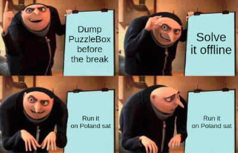

# HACK-A-SAT 3: Puzzle Box

* **Category:** Flight Software - turnstile
* **Points:** 10000
* **Description:**

We observe `PUZZLE_BOX` commands and telemetry in COSMOS:

* Command `PUZZLEBOX STAGE_1` takes $4\times4$ bytes,
* Command `PUZZLEBOX STAGE_2` takes $4\times4$ bytes,
* Command `PUZZLEBOX STAGE_3` takes $4\times4$ bytes and 4 encoding algorithm (1, 2 or 3),
* Command `PUZZLEBOX STAGE_4` takes $4\times4$ bytes.

After the first day, our team managed to dump `puzzlebox.so` using the FTP challenge (*150 File Status*).

## Write-up

_Write-up by Solar Wine team_

This challenge consists in sending commands to unlock each stages of a puzzlebox to receive a flag in telemetry.

### Emulation

We load `puzzlebox.so` in our emulated satellite (Risc-V QEMU user mode):

```text
1980-012-14:03:20.52771 ES Startup: Loading file: /cf/tcp_flags.so, APP: TCPFLAGS
Error loading shared library: ./cf/tcp_flags.so: cannot open shared object file: No such file or directory
1980-012-14:03:20.52793 ES Startup: Could not load cFE application file:/cf/tcp_flags.so. EC = 0xFFFFFFFF
```

It turned out that the `150 File Status` challenge didn't give us access to all the satellite file system.
We don't have `tcp_flags.so` and from its name we can guess that it is used to
load the flags from the game infrastructure.
This means that we won't get the flag without having a working radio to our team satellite.

### Building truth tables for encode functions

`puzzlebox.so` contains `encode1`, `encode2` and `encode3` which are used in stages.

We generated some truth tables to inverse these functions later:

```C
#include <stdint.h>
#include <stdio.h>

typedef uint8_t byte;
typedef uint16_t ushort;
typedef uint32_t uint;

// From Ghidra decompilation output
char encode1(byte param_1) {}
char encode2(byte param_1) {}
char encode3(byte param_1) {}

int main(void) {
  printf("rb_table_encode1 = {\n");
  for (uint i = 0; i < 256; i++) {
    printf("    %d: %d,\n", i, encode1(i)&0xFF);
  }
  printf("}\n\nrb_table_encode2 = {\n");
  for (uint i = 0; i < 256; i++) {
    printf("    %d: %d,\n", i, encode2(i)&0xFF);
  }
  printf("}\n\nrb_table_encode2_prim = {\n");
  // Special case for stage 2
  for (uint i = 0; i < 256; i++) {
    printf("    %d: %d,\n", i, encode2(i * 16 + (i >> 4))&0xFF);
  }
  printf("}\n\nrb_table_encode3 = {\n");
  for (uint i = 0; i < 256; i++) {
    printf("    %d: %d,\n", i, encode3(i)&0xFF);
  }
  printf("}\n\n");

  return 0;
}
```

We wrote the output of this program to `rainbow_tables.py`.

### Setup stage

When trying to send any `STAGE_...` command in the `PUZZLEBOX` target, the satellite replies with a `PUZZLEBOX STATUS_TLM_PKT` telemetry packet.
At first, it contains:

```text
STATUS: "Awaiting User Start"
STAGE_1: "It's Locked"
STAGE_2: "It's Locked"
STAGE_3: "It's Locked"
STAGE_4: "It's Locked"
TOKEN: ""
```

The interesting part of the program happens in `do_work` function, which validates the inputs sent through `STAGE_...` commands.
Static analysis shows that we first need to send a special payload to setup puzzlebox.

We send `PUZZLEBOX STAGE_1` command with `\x31\x00\x00\x00...\x00`.
The telemetry shows the reception of a `PUZZLEBOX STATUS_TLM_PKT` packet:

```text
STATUS: "Setup Complete"
STAGE_1: "It's Locked"
STAGE_2: "It's Locked"
STAGE_3: "It's Locked"
STAGE_4: "It's Locked"
TOKEN: ""
```

### Stage 1

We reverse `do_stage_1` to find the input (16 bytes) that causes `result=3333@@@@22225555`.
After analyzing the function, we write its inverse in Python:

```Python
functions_inv = [
    subFunc_inv, subFunc_inv, subFunc_inv, subFunc_inv,
    addFunc_inv, addFunc_inv, addFunc_inv, addFunc_inv,
    subFunc_inv, addFunc_inv, subFunc_inv, addFunc_inv,
    addFunc_inv, subFunc_inv, addFunc_inv, subFunc_inv,
]

def decode1(encoded):
    """Returns the key in the table that gives value `encoded`"""
    return [k for k, v in rb_table_encode1.items() if v == encoded]

stage_message = bytearray(16)
results = b"3333@@@@22225555"
for i in range(0, 4):
    encode1_c = results[i]
    possibilities = [c for c in decode1(encode1_c) if c < 0x80]
    assert len(possibilities) == 1
    stage_message[i] = functions_inv[i](differs_1[i], possibilities[0])
for i in range(4, 8):
    encode1_c = results[i]
    possibilities = [c for c in decode1(encode1_c) if c >= 127]
    assert len(possibilities) == 1
    stage_message[i] = functions_inv[i](differs_1[i], possibilities[0])
for i in range(8, 12):
    encode1_c = results[i]
    possibilities = [c for c in decode1(encode1_c) if c < 0x80]
    assert len(possibilities) == 1
    stage_message[i] = functions_inv[i](differs_1[i], possibilities[0])
for i in range(12, 16):
    encode1_c = results[i]
    possibilities = [c for c in decode1(encode1_c) if c <= 159]
    assert len(possibilities) == 1
    stage_message[i] = functions_inv[i](differs_1[i], possibilities[0])
print("stage 1:", stage_message)
```

Then, we send `PUZZLEBOX STAGE_1` command with `This_1snt_the_aN`.

### Stage 2

We reverse `do_stage_2` to find the input (16 bytes) that causes `result=3333EEEEDDDDyyyy`.

There is a trap: for all $i$-th byte respecting $i\mod 4=1$, the call to `encode2(i)` has been replaced by `encode2(i * 16 + (i >> 4))`.
This is why we implemented an additional `rb_table_encode2_prim` truth table.

Then, we send `PUZZLEBOX STAGE_2` command with `sWeR_cH3cK_7hE_t`.

### Stage 3

We reverse `do_stage_3` to find the input (16 bytes + 4 encode functions selection) that causes `result=+tQs+tQs+tQs+tQs`.
For this stage, we also need to reverse which encoder function had been used.

```python
results = b"+tQs+tQs+tQs+tQs"
for k in range(4):
    for j in range(3):
        dfn = decode_funcs[j]  # try encodeJ function
        for i in range(k, 16, 4):
            encode_fn_c = results[i]
            possibilities = [c for c in dfn(encode_fn_c) if not (0x6e < c and j == 1)]
            if len(possibilities) == 0:
                break
            assert len(possibilities) >= 1
            stage_message[i] = functions_inv[16-i-1](differs_3[i], possibilities[0])
            print(f"{k}-th encoder: {j}")
print("stage 3:", stage_message)
```

Then, we send `PUZZLEBOX STAGE_3` command with `0k3n_p@9e_pRoLly` and algorithms $(1, 0, 1, 2)$.

### Stage 4

We reverse `do_stage_4` to find the input (16 bytes) that causes `result=R;-ejh"y>6*h\"<(`.

Then, we send `PUZZLEBOX STAGE_4` command with `_s0meth!n_tH3re.`.
It does not work! The telemetry stays at:

```text
STATUS: "Setup Complete"
STAGE_1: "Unlocked"
STAGE_2: "Unlocked"
STAGE_3: "Unlocked"
STAGE_4: "It's Locked"
TOKEN: ""
```

The four solutions look right though:

```text
This_1snt_the_aNsWeR_cH3cK_7hE_t0k3n_p@9e_pRoLly_s0meth!n_tH3re.
```

There is a trick in `do_stage_4`: when `STAGE_4` command is first received, only half of it is processed.
Then, to make the function process the second half, at least one other stage needs to be locked.
This can be achieved by resetting the puzzle, sending `RESET_CTRS` command.
After this command, sending `STAGE_4` solves the 4th stage.
We also need to send the other stages again, to make the flag appear on our telemetry, in the `TOKEN` field.

### Attack automation

We made a script executing the following strategy:

1. Enable telemetry (`KIT_TO ENABLE_TELEMETRY`),
2. Setup PuzzleBox,
3. Solve PuzzleBox stage 1,
4. Solve PuzzleBox stage 2,
5. Solve PuzzleBox stage 3,
6. Solve PuzzleBox stage 4,
7. Reset PuzzleBox (`RESET_CTRS`),
8. Solve PuzzleBox stage 4,
9. Solve PuzzleBox stage 1,
10. Solve PuzzleBox stage 2,
11. Solve PuzzleBox stage 3,
12. Wait for flag on telemetry then reset.

We got the following flags on our satellite and others: `flag{IIvsmngM}`, `flag{CT06HsbyHGWR8vFY}`, `flag{+ovUO548}` and `flag{nKFGFUhG}`.
We only learned after the event that we were not supposed to scavenge these flags from our competitors.


