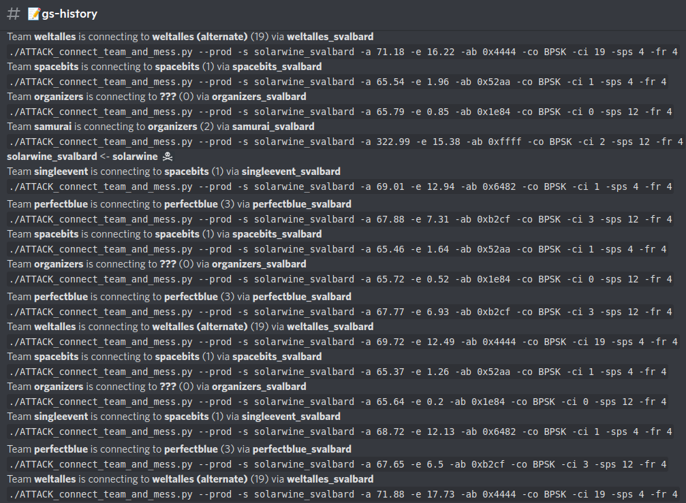

# HACK-A-SAT 3: Radio Settings

* **Category:** Satellite Hijacking
* **Points:** N/A
* **Description:**

Each team has radio access codes and specific settings.
As part of the attack-defense game, we had to explore how to connect to other
teams satellite.

## Write-up

_Write-up by Solar Wine team_

Using another challenge, we fetch Ground Stations settings.
By analyzing the evolution of this data, we create a notification channel to analyze
other teams behavior and to get their radio settings.

### Logging Ground Stations settings evolution

Using the directory path traversal of the Web challenge (*403 Forbidden*), we get access to
the `/server/www/html/groundstations` folder which contains HTML and JSON files for each Ground Station.

We can run the following Bash script repetitively to mirror these files locally:

```bash
#!/usr/bin/env bash
# Before running this script: ssh -L 8088:10.23.223.25:80 solarwine-game
URL="http://localhost:8088/assets%20|cat%20/server/www/html/groundstations/"
curl -s --path-as-is "${URL}index.html/"> index.html &\
curl -s --path-as-is "${URL}index_Cordoba.html/"> index_Cordoba.html &\
# [...]
curl -s --path-as-is "${URL}rx_settings_Cordoba.json/"> rx_settings_Cordoba.json &\
# [...]
```

We extract the current *User*, *Azimuth* and *Elevation* of each Ground Station from the HTML files.
We extract all current radio settings of each Ground Station from the JSON files.

By analyzing the connections patterns, we can map channels identifier to each team:

* 1: SpaceBitsRUs,
* 2: organizers,
* 3: perfect blue,
* 4: Samurai,
* 5: Poland Can Into Space,
* 6: SingleEventUpset,
* 7: Solar Wine,
* 9: WeltALLES! (also sometimes 19).

By combining these data, we observe Ground Stations settings changes and have
all the required data to connect to other teams satellite.



Using this technique, we were able to connect multiple times to other teams until they managed to protect themselves.
For example, we were able to leak telemetry from *Poland Can Into Space*:

```text
[17:32:17 GS/2] solarwine_mcmurdo GRANTED (1)
[17:32:22 TELESCOPE/1.4] Telescope App: Exposure sent
[17:32:31 KIT_CI/202.3] Command length 8 does not match packet length 24
[17:32:31 SAFE/1.2] Safe Ping Msg Received
```
