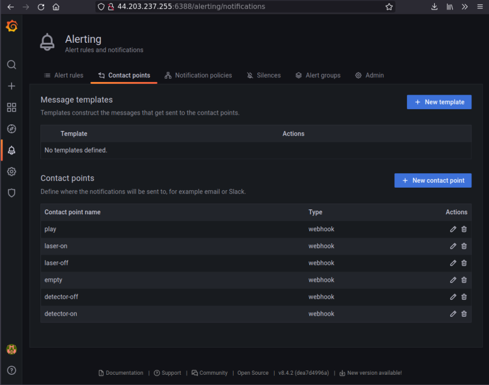
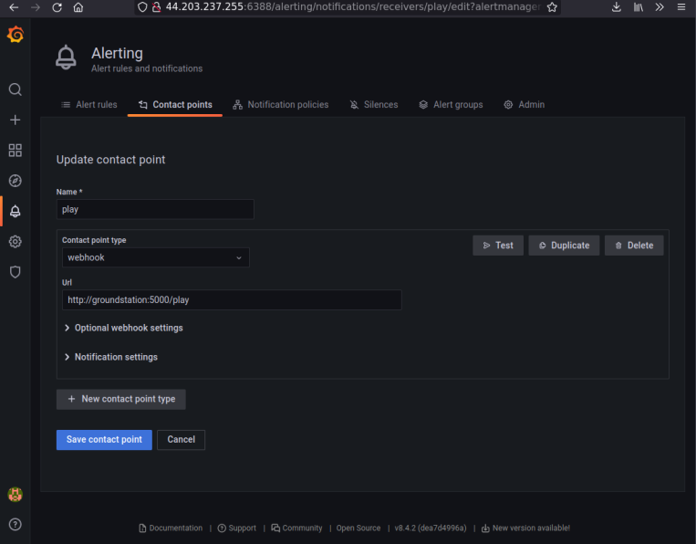
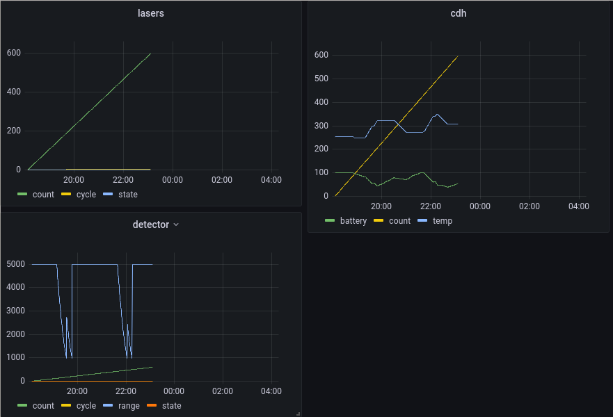

# HACK-A-SAT 3: Red Alert

* **Category**: I Can Haz Satellite
* **Points:** 54
* **Solves:** 82
* **Description:**

## Problem description

This challenge starts by connecting to a TCP service at
`red_alert.satellitesabove.me:5100`, which first asks for our team ticket, and
then provides us with an HTTP endpoint where a Grafana instance is reachable. Credentials for the
  instance is provided in the problem description

The problem description indicates that the satellite is controlled through an
API server, which the Grafana server can reach at `groundstation:5000`. It has
5 commands:

* one called `play` to start the mission, 
* two commands called `laser-on` and `laser-off` to enable/disable obstacle
  detection, 
* two commands called `detector-on` and `detector-off` to enable/disable
  lasers, which will pulverize obstacles and clear the path

## Recon

At first, we noticed that the Grafana instance was provisionned with:

 * one PostgreSQL data source,
 * only one custom dashboard showing a single graph where the battery level is displayed.

That reminded us of the battery management problem during Hack-a-Sat2 finals :)


### Situational awareness
We modified the dashboard to add more data, which autocompletion on Grafana
helped us discover:

* from the `lasers` table: `count`, `cycle`, `state`
* from the `cdh` table: `count`, `battery`, `temp`. `cdh` probably stands for
  Command & Data Handling; the most interesting metric was `battery`
* from the `detector` table: `count`, `cycle`, `range`, `state`. The most
  interesting metric was `range`.

The dashboard we created is available [here](dashboard.json) if you are reading
this from the GitHub repository.

### Interacting with the API server

From the problem description, we knew that we had to issue queries to
`groundstation:5000`. We had to make grafana somehow issue those requests. We
first tried adding new data sources, looking for a type that would allow
querying an HTTP server, even though the Data Source would not be valid. This
did not work with any of the available data types!

Then, looking more carefully at the grafana server's configuration, we found
out that the "Alerting" section was conveniently provisioned to send alerts to
"contact points", 5 of which were configured, one for each API endpoint. Cherry
on top: a "test" button makes Grafana issue queries. We're ready to start!





We then queried the `play` endpoint... After some time, this message appeared
on the console where `nc red_alert.satellitesabove.me 5100` was running:

```
groundstation  | Satellite destroyed
groundstation  | MISSION FAILED
```
## Game plan

After experimenting, we understood that:

* the detector and lasers both use battery,
* the battery recharges when lasers are not used, and recharges faster when the
  detector is not used either,
* the detector reports a distance to the next obstacle, starting when the
  obstacle is less than 5000 units away,
* lasers can destroy obstacles when it is closer than 1000 units,
* it takes about 21 simulated minutes for obstacles to move from a distance of
  5000 units to a distance of 1000 units.

Our strategy was then as follows:

* start the game,
* periodically enable the detector, at least once every 20 simulated minutes,
* if it reports a distance of 5000: there is no obstacle, wait,
* if it reports a distance of less than 1000: wait for the distance to drop
  down to about 2000, then enable lasers until a message indicating that an
  obstacle was destroyed appears on the console.

This strategy allows us to save enough energy for batteries to recharge while
we destroy all obstacles.

## Execution

We noticed that this strategy can be automated by creating a few clever
alerting rules in grafana. Of course, manually executing it was much quicker
than writing automated rules. Here is our dashboard after a winning attempt:



After about 5 simulated hours, a flag appeared on the console:

```
groundstation  | You survived!
groundstation  | flag{delta692703victor3:GBYwGCd_rt-oltlvIe3WfWP_RKR_mB5NBahrGIFTcyKSLvXtyMXSidYxGEKZzs6huo_jXrzAFv4zKW9328ig67s}
```

