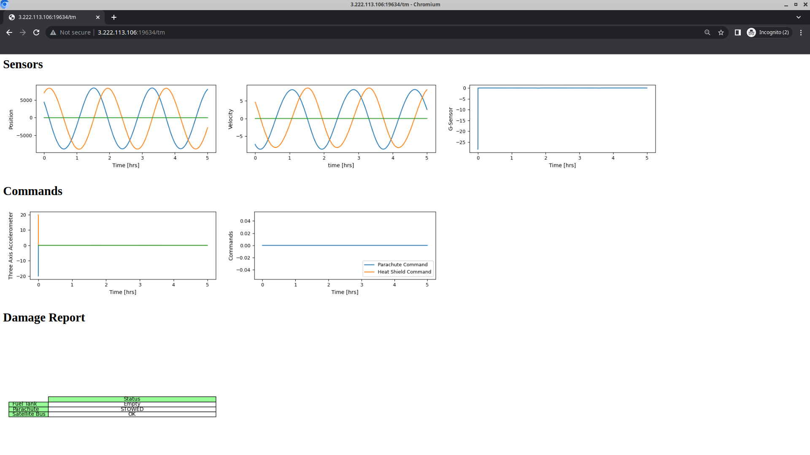
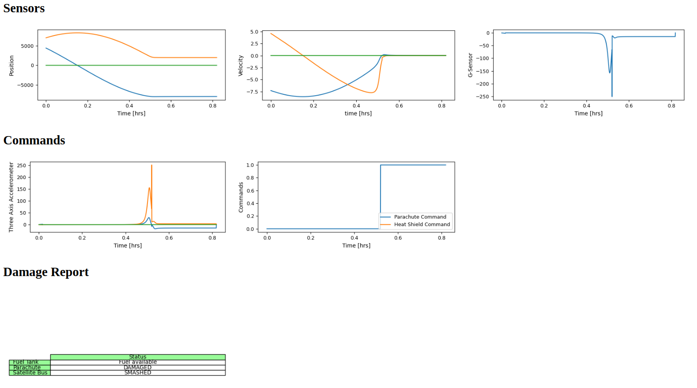

# HACK-A-SAT 3: The Wrath of Khan

* **Category**: Rocinante Strikes Back
* **Points:** 234
* **Solves:** 10
* **Description:**

> You thought Khan was defeated and you were safe. Wrong! He messed with the hardware on the Genesis probe and now its going to crash. Can you patch the software so that it safely lands on Seti-Beta VII. Seti-Beta VII is an M class planet with:
>
> Radius: 13120 km
>
> Gravitational Constant: 2527105.1264 (km3/s2)
>
> You'll need these files to solve the challenge.
>
> - https://static.2022.hackasat.com/d85oddam8vndqco336q5gvnf0orh

## Write-up

_Write-up by Solar Wine team_

The challenge provides an ARM64 firmware and a way to upload it to a remote server:

```text
Ticket please:
Upload binary at: 3.222.113.106:19634

Simulation complete
Try again...
Telemetry available for  at 3.222.113.106:19634/tm
```

When we go on the telemetry, we see nice sinusoidal curves.



So it seems the probe is still orbiting around the planet and its fuel tank was emptied after trying to accelerate too much at the beginning of the simulation.
Why did it behave like this?

The firmware is a C++ program which can be in 4 states, represented by C++ classes:

- `DeOrbit`: compute a deceleration vector to make the satellite lose altitude, until it reaches 100km above the radius (13120 km).
- `WaitCool`: wait for the velocity of the satellite to be below 1.0. It then triggers the parachute.
- `WaitChute`: wait for some sensor to be below 15.0. It then triggers the heat shield (according to the telemetry).
- `Touchdown`: stay at this state.

As the probe is decelerating too much, the issue could be in the first state.
The deceleration vector is computed using the following algorithm:

- Read the position $r$ from the sensors
- Read the velocity $v$ from the sensors
- Compute $H = r \times v$ (this is a vector product)
- Compute $e = \frac{v \times H}{2527105.1264} - \frac{r}{|r|}$
- Compute $a = \frac{|H|^2}{2527105.1264} (1 - |e|^2) (1 - |e|)$
- Compute $\delta = a - (100 + 13120)$
- If $|\delta| < 1$, go to `WaitCool` state
- Feed $\delta$ into a [PID controller](https://en.wikipedia.org/wiki/PID_controller) which outputs a value $accel$
- Send an acceleration command according to the vector $-accel \frac{v}{|v|}$

What do these equations compute? The parameters of a [Kepler orbit](https://en.wikipedia.org/wiki/Kepler_orbit)!
$H$ is the angular momentum, $e$ the eccentricity vector of the conical section and $a$ is something like a distance... $\frac{|H|^2}{2527105.1264}$ is the parameter $p$ of the conical section, but multiplying it with $1 - |e|^2$ or $1 - |e|$ does not really seem to make sense: the minimal radius would be $\frac{p}{1 + |e|}$, the maximal radius $\frac{p}{1 - |e|}$ and the large radius of the ellipse $\frac{p}{1 - |e|^2}$.

Anyway, as the eccentricy is small (the orbit seems to be quite circular in the telemetry), this does not seem important.
A more important issue seems to be that the value given by the telemetry does not match the radius at all!
Indeed the position oscillates between -9000 and 9000, which is far below the radius of the planet, 13120 km.

Moreover, using a quick approximation considering that the orbit is circular, with a radius of 9000 and a velocity of 9, the period should be:

$$T = \frac{2 \pi 9000}{9} = 6283$$

The telemetry shows a period of 2 hours, which matches $T$ in seconds.

Then, the gravitational constant of the observed orbit is:

$$\mu = |r| |v|^2 = 9000 \times 9^2 = 729000$$

This is not 2527105.1264 km3/s2 at all. Or is it, using another unit?

Let's suppose that the probe is orbiting at 9000 units from the center of the planet, with a speed of 9 units per seconds.
We know that the time scale seems to be correct thanks to the observed period of the orbit, 2 hours.
The gravitational constant is 729000 unit3/s2 so there is an equation:

$$729000 \mbox{ unit3/s2} = 2527105.1264 \mbox{ km3/s2}$$

$$1 \mbox{ unit3} = \frac{2527105.1264}{729000} \mbox{ km3}$$
$$1 \mbox{ unit} = \sqrt[3]{\frac{2527105.1264}{729000}} \mbox{ km} = 1.51 \mbox{ km}$$

In the common unit systems, 1 mile is 1.60934 km. This seems to match the unit used here!

In short, the firmware was writing with kilometers and the probe reads its position and velocity using miles.
There are two way to fix this issue: converting everything to kilometers, or everything to miles.

We decided to convert everything to miles, using the Gravitational Constant: $\frac{2527105.1264}{1.60934^3} = 606289.28285$ miles3/s2 and the radius $\frac{13120}{1.60934} = 8152.4103$ miles.
In practice, we replaced the Gravitational Constant located at address 0xba28 and the instructions located at address 0x1c6c and 0x1c70 from:

```text
00001c6c   00 00 d4 d2          mov        x0,#0xa00000000000
00001c70   20 19 e8 f2          movk       x0,#0x40c9, LSL #48
```

to

```text
00001c6c   20 0d db d2          mov        x0,#0xd86900000000
00001c70   e0 17 e8 f2          movk       x0,#0x40bf, LSL #48
```

Using this modified firmware, the simulator reported:

```text
Parachute damaged at 0.5208333333333334
You hit the planet and destroyed the probe at 28.752938935315463 m/s
Simulation complete
Try again...
```



The telemetry curves clearly show that the satellite is no longer orbiting, but the parachute was triggered too early.
Maybe the test "wait for the velocity to be below 1.0" in the `WaitCool` state should be updated as well?
By modifying the instruction located at 0x792c to use 0.25 insted of 1.0 worked:

```text
What a great landing
Simulation complete
Here is your flag:
flag{zulu930957foxtrot3:GD2pdM5-IYaeDN2DUe9nhkW-yb4izm3iDsKEa9HpyxShPY4pPmYhJolr9LH23VLWNKhQlDbsCi7g17FNHWX4OFg}

Congrats!
```
