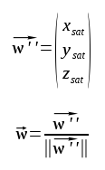
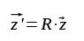
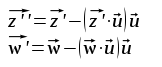
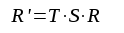
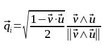

# SPACE SECURITY CHALLENGE 2020 HACK-A-SAT: Finals Write-up

_Write-up by Solar Wine team_

## On-orbit Challenge

Given a TLE for a satellite and a window of opportunity to take a shot of the Moon, we were asked to give a rotation quaternation that aligns the satellite camera with the moon with an error less than half a degree while aligning the Z- panel with the center of mass of the Earth.

The quaternion had to be computed in the [J2000 referential](https://en.wikipedia.org/wiki/Earth-centered_inertial#J2000).

During the challenge we used [`Skyfield`](https://rhodesmill.org/skyfield/), which is actually using coordinates in the GCRS referential. We ended up being stuck at the conversion from GCRS to J2000 and couldn't provide the correct solution in time to meet the acceptance criteria.

## Moon and satellite position

Using [`PyEphem`](https://rhodesmill.org/pyephem/), which gives coordinates in the J2000 referential, we can obtain the declination and right ascension of objects in the solar system as well as their distance. The right ascension is usually noted with the greek letter `alpha` and the declination `delta`. We can use the letter `rho` for the object distance.
To obtain cartesian coordinates, the formula to convert from spherical to cartesian can be used:


The distance of the Moon needs to be converted from AU to meters in order to have all our distances in the same unit system.
For the satellite, we have to convert the satellite elevation to the distance to the center of mass of the Earth by adding the Earth radius.

## Aligning the camera to the Moon

Using the previously obtained coordinates of the Moon and satellite we can compute the unit vector between the satellite and the Moon by subtracting the Moon coordinates to the satellite coordinates and dividing by the norm:


Let's `v` be the camera boresight unit vector. We want to compute the rotation axis and angle of rotation between vectors `v` and `u`. The rotation axis can be described by a vector that is normal to the plane on which both `v` and `u` reside. The vector direction gives the counterclockwise direction of the rotation when seen from above.

The cross product of two unit vectors will generate a vector normal to the plane defined by the two vectors and its norm will be the sine of the angle between them. The norm being always positive, such is the sine.
The scalar product of two unit vectors will give the cosine of the angle between them. Since the cross product gave us a rotation axis with a direction which ensures that the sine of the angle is positive, we can directly use the inverse cosine function to get the angle of rotation that matches the rotation axis direction.

A rotation vector is a vector whose norm is equal to the angle of rotation and whose direction gives the rotation axis. The rotation vector can be directly converted to a quaternion at the end. We can compute such rotation vector to align the camera with the Moon. Here the cross product is denoted by the operator `^`:


## Aligning the Z- panel with the center of the Earth

We now want to minimize the angle of the Z- panel with the Earth while pointing perfectly at the Moon.

Let's call `w` the unit vector that points from the center of the Earth to the satellite:



The `z` vector of the satellite in its referential must first be rotated. The rotated `z` vector can be obtained by applying the Rodrigues' rotation formula with the rotation vector we previously computed to align the camera with the Moon: 


While we did it manually during the finals, it was actually a waste of time as it can be easily obtained with `scipy`.

For conciseness, we will be using the matrix representation corresponding to a rotation vector. Applying the matrix multiplication between a rotation matrix and the `z` vector will give us the rotated vector `z'`. 

Let's call R the rotation matrix that corresponds to the rotation vector `r` we previously obtained. Here the matrix multiplication is denoted by the `.` operator:



In order to minimize the angle between `z'` and `w` while still pointing at the Moon, we need to project them on the plane defined by the target unit vector `u` so we will not modify our previous rotation to align the camera and the Moon:



Now we can use the same method to align the projected vector `z''` and `w'`. Let's call `s` the rotation vector for this one. We already have the rotation axis but we need to check the sign of the angle by applying the scalar product between the rotation axis defined by the target vector `u` and the cross product of vectors `z''` and `w'`:


## Maximizing the error with the Moon to minimize the error on the Z- panel:

Since we are allowed an error on the Moon alignment, we can use it to reduce the error on the Z- panel alignment. The current error on Z- can be obtained by using the cross product between the rotated `z` vector and the `w` vector, which is the Earth-satellite unit vector.

Let's call S the rotation matrix associated with the `s` rotation vector. The current rotation can be obtained by applying the matrix multiplication between S, then R, then the `z` vector:


Let's call `θerr` the allowed error on the Moon. In order to minimize the error on the Z- panel, we can apply a rotation whose axis is the normal to the plane defined by the vectors `z'''` and `w`, since `u` is on the same plane following our previous rotation. The rotation angle is the minimum between `θerr` and `Zerr` that we previously computed. Since `Zerr` is higher than `θerr`, the rotation angle will be `θerr` (converted to radians).

We can use the same method to obtain the final rotation vector as before:


Let's call T the rotation matrix associated with the rotation vector `t`. We can obtain the full rotation by applying the matrix multiplication on T, S then R:



## Converting to quaternions

A rotation quaternion is actually close to a rotation vector except that it uses half the angle. The conversion can be made manually, but since we are using `scipy` we can juste use it to make the conversion so we will not make errors.

As an example, using the same method for computing the first rotation vector, we could have directly obtained a quaternion, with `qr` being the real part and `qi` the imaginary part, using the following formula, and some well known trigonometric identities:





## The solution

We have a window of opportunity of 10 minutes and a resolution of 1 second for the command timestamping, so we can iterate over the 600 possible timestamps to find the rotation matrix that will minimize the error on the Z- panel:

```
Z error: 0.4987837916318105
Moon error: 0.4999625045528612
2020-08-09 00:20:00
0.3627334030967909, -0.2836670119809, 0.7224360361951401, 0.5157942207880029
```

The best time happens to be at the start of the window of opportunity.

## The code that should have been used during the on-orbit challenge

```python
from scipy.spatial.transform import Rotation
import numpy as np
import ephem as j2000
import math

# Problem parameters
window_time = "2020-08-09 00:%02d:%02d"
MAX_ERROR = 0.5
TLE = (
    "DEFCON28 SAT",
    "1 46266U 19031D   20218.52876597 +.00001160 +00000-0 +51238-4 0  9991",
    "2 46266 051.6422 157.7760 0010355 123.0136 237.1841 15.30304846055751"
)
sat = j2000.readtle(TLE[0], TLE[1], TLE[2])
boresight  = np.array([0.007196099926469, -0.999687104708689, -0.023956394240496])
boresight /= np.linalg.norm(boresight)
moon = j2000.Moon()

# Function to convert from right ascension, declination and distance to
# cartesian coordinates.
def radec2cart(ra, dec, dist):
    x = math.cos(dec) * math.cos(ra)
    y = math.cos(dec) * math.sin(ra)
    z = math.sin(dec)
    return np.array([x, y, z]) * dist

# Initialize Z best angle
best_angle = 2 * math.pi
z_vector  = np.array([0, 0, 1])

# The window of opportunity is 600 seconds
for i in range(600):
    time = window_time % (i / 60 + 20, i % 60)

    # Compute Moon and satellite position at current time
    moon.compute(time)
    sat.compute(time)

    # Use cartesians coordinates
    moon_xyz = radec2cart(moon.ra, moon.dec, moon.earth_distance * j2000.meters_per_au)
    sat_xyz  = radec2cart(sat.ra, sat.dec, sat.elevation + j2000.earth_radius)

    # Compute unit vectors for the target (Moon) and satellite position relative to Earth
    target   = np.array(moon_xyz - sat_xyz)
    target  /= np.linalg.norm(target)
    sat_unit = sat_xyz / np.linalg.norm(sat_xyz)

    # Generate the rotation axis with a cross product
    axis = np.cross(boresight, target)
    axis /= np.linalg.norm(axis)

    # Get the angle using the dot product
    arc = np.dot(boresight, target)
    angle = np.arccos(arc)
    R = Rotation.from_rotvec(axis * angle).as_dcm()

    # Compute the position of the satellite Z vector after our initial rotation
    z_rotated = np.dot(R, z_vector)

    # Project the rotated Z vector and the satellite to Earth vector onto the plane defined by
    # the target vector
    z_rot_proj = z_rotated - np.dot(z_rotated, target) * target
    sat_proj   = sat_unit  - np.dot(sat_unit,  target) * target

    # Use dot product to find the angle between them
    arc = np.dot(z_rot_proj, sat_proj)
    angle = np.arccos(arc)

    # We need to check the sign against the orientation of the target
    if np.dot(target, np.cross(z_rot_proj, sat_proj)) < 0:
        angle -= angle

    # Get the rotation matrix defined by the target vector and angle previously computed to
    # align the satellite Z vector with the center of the Earth
    Rp = Rotation.from_rotvec(target * angle).as_dcm()

    # Get the final rotation matrix by multiplying the previously computed matrices
    Rr = np.dot(Rp, R)
    
    # Compute the angle between the Z satellite vector and the satellite to Earth vector
    z_rotated = np.dot(Rr, z_vector)
    arc = np.dot(z_rotated, sat_unit)
    z_angle = (np.arccos(arc) * 180) / math.pi
 
    # Find the minimal angle during the window of opportunity
    if z_angle < best_angle:
        best_angle  = z_angle
        best_time   = time
        best_matrix = Rr
        best_target = target

# Reset the satellite to the best found time
sat.compute(best_time)
sat_xyz  = radec2cart(sat.ra, sat.dec, sat.elevation + j2000.earth_radius)
sat_unit = sat_xyz / np.linalg.norm(sat_xyz)

# Z and the Earth to satellite vectors are now on the same plane as the target vector.
# Rotate to lower the error on the Z axis based on the allowed error on the target.
z_rotated = np.dot(best_matrix, z_vector)
axis = np.cross(z_rotated, sat_unit)
axis /= np.linalg.norm(axis)

# Keep a small margin to avoid being too far from the Moon
MARGIN = 1e-6
angle = min(MAX_ERROR *(1 - MARGIN), best_angle) * math.pi / 180
Rq = Rotation.from_rotvec(axis * angle).as_dcm()
best_matrix = np.dot(Rq, best_matrix)

# Compute the final angle errors
z_rotated = np.dot(best_matrix, z_vector)
arc = np.dot(z_rotated, sat_unit)
z_angle = (np.arccos(arc) * 180) / math.pi
print("Z error:", z_angle)
target_optz = np.dot(best_matrix, boresight)
arc = np.dot(target_optz, best_target)
target_err = (np.arccos(arc) * 180) / math.pi
print("Moon error:", target_err)

print(best_time)
print(', '.join([str(x) for x in Rotation.from_dcm(best_matrix).as_quat()]))
```
